[toc]


# Difference Between 3 Methods of MST

## Difference

1. Dijkstra’s algorithm finds the single-source shortest path, but Prim’s algorithm and Kruskal's algorithm find the MST.
2. Kruskal's algorithm can work on **disconnected graph,** while Prim's algorithm can't.
3. Prim's algorithm and Dijstra's algorithm generate the minimum spanning tree **starting from** the root vertex. While Kruskal's algorithm starts from the least weighted edge.
4. P and D travel one node more than one time while K travels one node only **one time.**
5. Dijkstra’s algorithm can work on both **directed and undirected graphs**, but Prim’s algorithm only works on undirected graphs.
6. Prim’s algorithm can handle **negative edge weights**, but Dijkstra’s algorithm may fail to accurately compute distances if at least one negative edge weight exists.

## Similarity

1. Both greedy algorithm. The edges they choose is always with the least weight.
2. All three algorithms are used to **explore a graph** and find a solution to a specific problem.
3. They all use some form of **priority queue** to determine which nodes to explore next.

# Comparison of BFS and DFS

|                    | BFS                                   | DFS                                  |
| ------------------ | ------------------------------------- | ------------------------------------ |
| Algorithm          | vertex-based                          | edge-based                           |
| Data Structure     | queue                                 | stack                                |
| Memory Consumption | inefficient                           | efficient                            |
| Strategy           | oldest vertex will be visited first   | vertex being visited alongside edges |
| Optimality         | optimal for finding the shortest path | not optimal                          |


# Comparison of Greedy, Divide-and-conquer and Dynamic Programming

## Key word

Greedy: local optimality  -> global optimality.

Divide-and-conquer: Break up a problem into **independent** sub-problems.

Dynamic programming: Break up a problem into a series of **overlapping** sub-problems.

# Pseudocode 

## DFS

### Code

```pseudocode
CreateStack(S)
Push (S, v)
Mark v as visited ; found = false //search starts at vertex v
While (not (isempty(S) and not found) do
Begin
	If (stacktop(s) = destination) //destination = vertex being searched
		found = true
	Else
		Begin
			If all vertices adjacent to the vertex on the top of the
			stack had been visited then
				Pop (S)
			Else
			Begin
				Select an unvisited vertex u adjacent to the vertex on
				the top of the stack
				Push (S, u)
				Mark u as visited
			End
		End
End

```

### Time complexity

adjacency matrices: Θ(V^2 )  

adjacency lists: Θ(|V|+|E|)

## BFS

### Code

```pseudocode
CreateQueue(Q)
Add(Q,v)
Mark v as visited //traversal to start at vertex v
While (not Queueisempty(Q)) do
	Begin
	w = QueueFront(Q)
	Remove (Q)
	For each unvisited vertex u adjacent to w do
	Begin
		Mark u as visited
		Add (Q, u)
	End
End
```

### Time complexity

adjacency matrices: Θ(V^2 )  

adjacency lists: Θ(|V|+|E|)

## Coin-Row Problem - Dynamic Programming

### Code

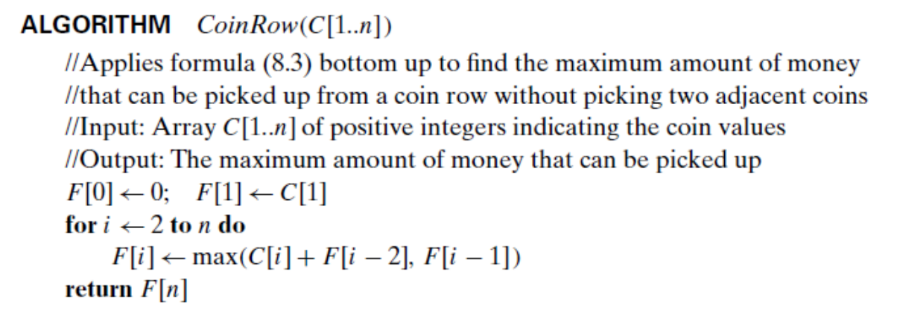

### Time complexity

time efficiency and space efficiency:  Θ(n)

## Change-Making Problem

### Code

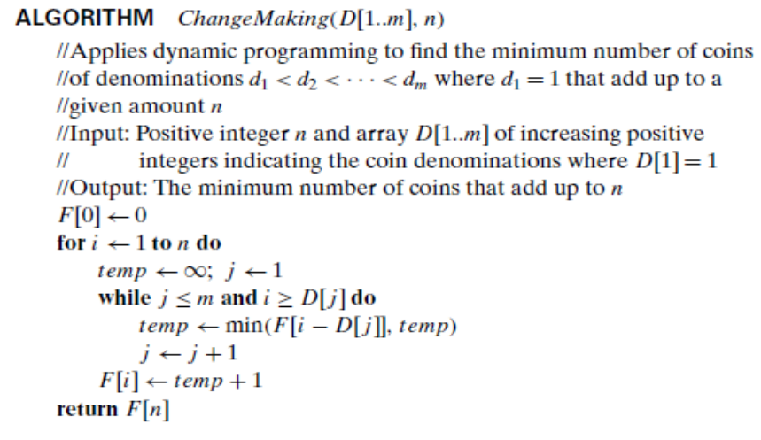

### Time complexity

Time efficiency:  Θ(nm)

Space efficiency: Θ(n)

## Knapsack Problem

### Code

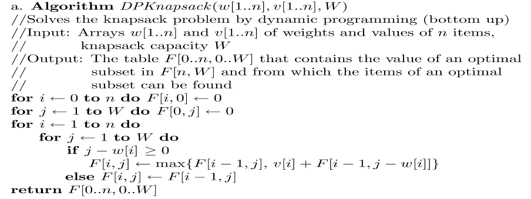

### Time complexity

The algorithm fills a table with 𝑛 + 1 rows and 𝑊 + 1 columns, spending Θ(1) time to fill one cell. Hence, its time efficiency and its space efficiency are in Θ(𝑛𝑊).

In order to identify the composition of an optimal subset, **the algorithm repeatedly compares values at no more than two cells in a previous row.** Hence, its time efficiency class is in 𝑂(𝑛).

##Coin-Row Problem - Greedy

### Code

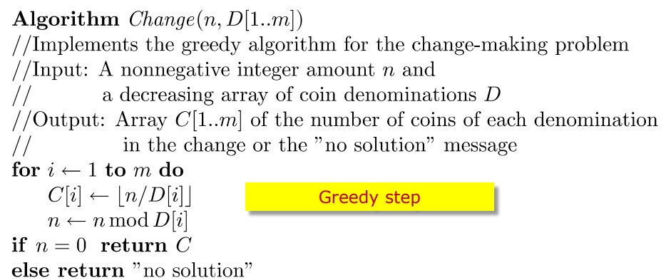

## Prim's Algorithm

### Code

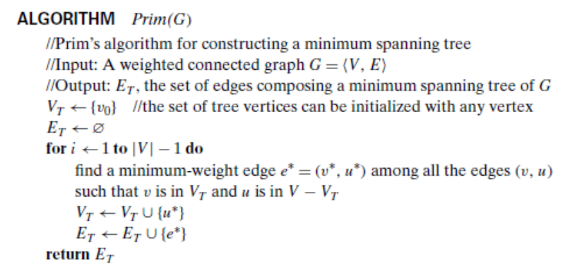


### Time complexity

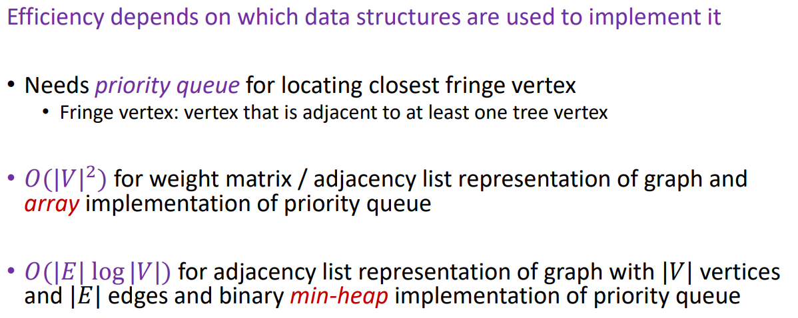

## Kruskal's Algorithm

### Code

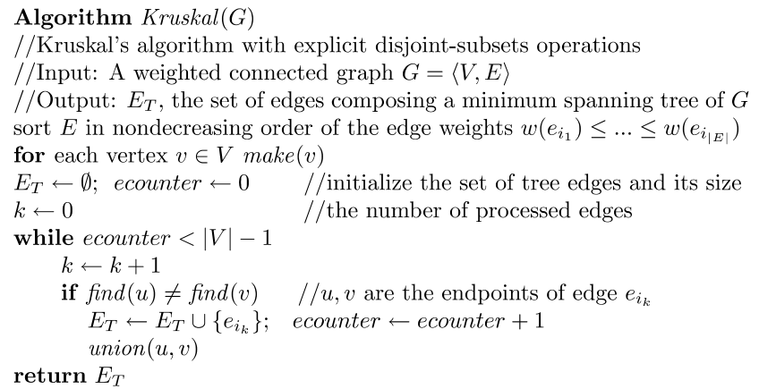

### Time complexity

**Perform union operation** by attaching a smaller tree to the root of a larger one 

• Union by size – based on number of nodes

 • Union by rank – based on its height 

• Can execute **find** in 𝑂(log |𝑉|) time for either case.

**Total of at most |V| − 1 𝑢𝑛𝑖𝑜𝑛 and 2|𝐸| 𝑓𝑖𝑛𝑑 operations** 

• 𝑂( 𝑉 + |𝐸|log |𝑉|) 

• Can further improve using **path compression** 

Total running time is still dominated by sorting edge weights 

• 𝑂(|𝐸|log |𝐸|) or 𝑂(|𝐸|log |𝑉|) (since 𝐸 ≤ |𝑉|^2 )

## Dijkstra’s Algorithm

### Code

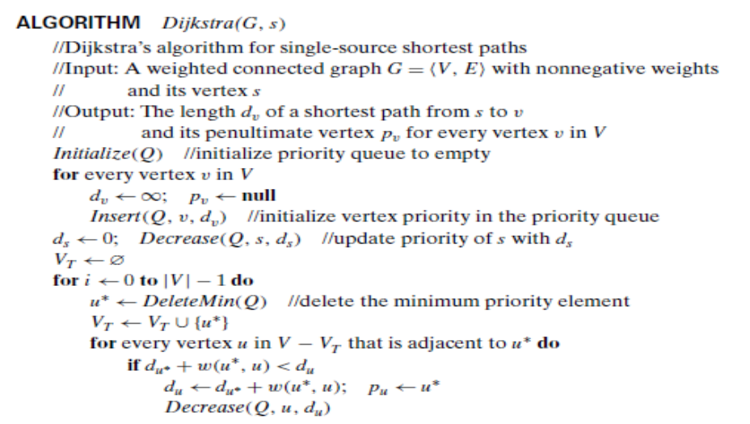

### Time complexity

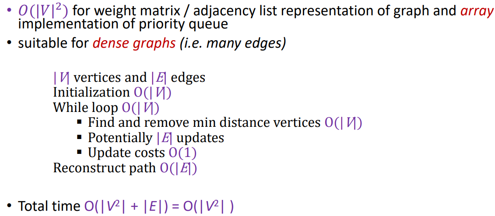

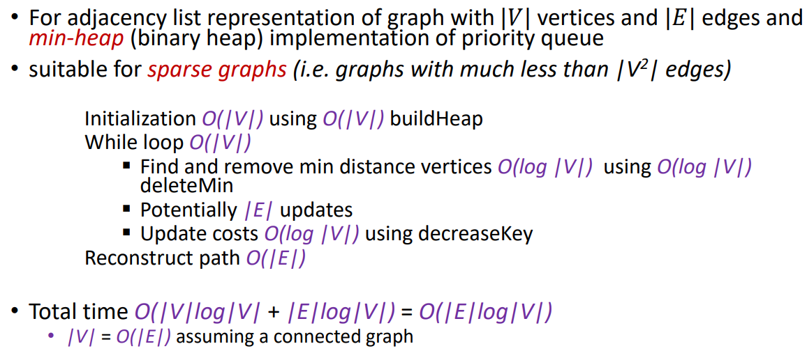

## Quick Sort

### Code

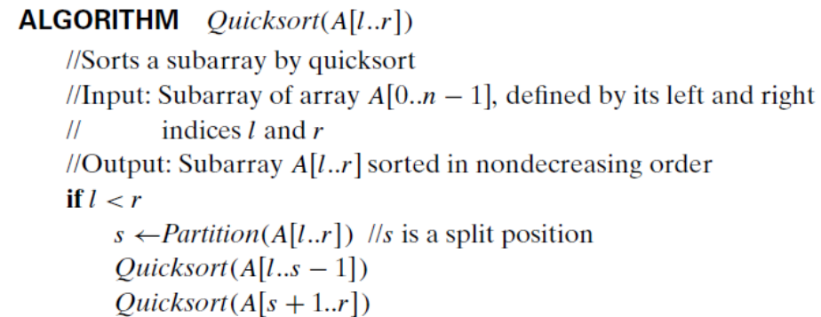

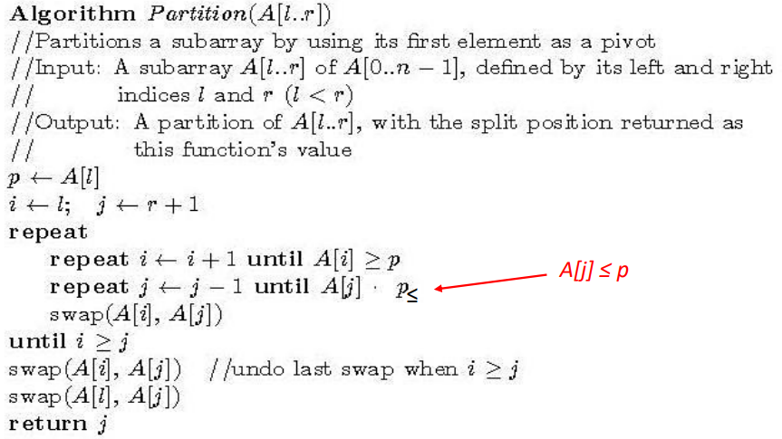

### Time complexity

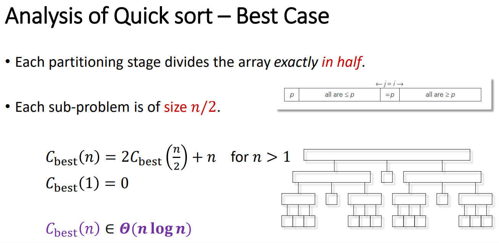

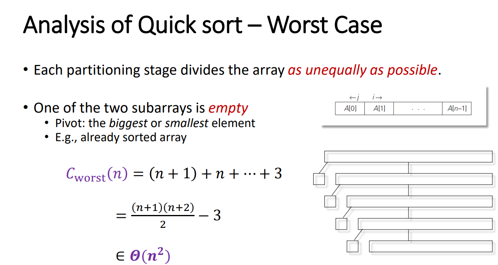

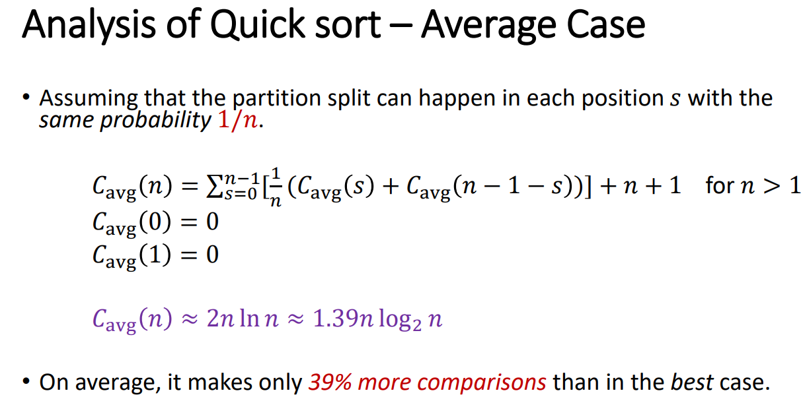

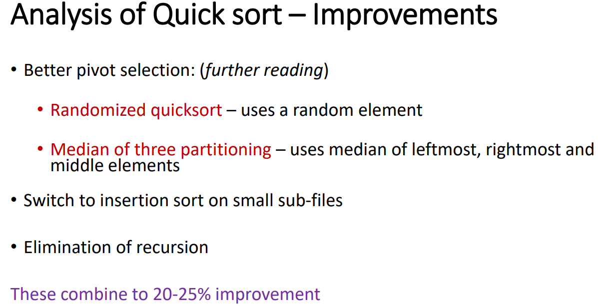

## Merge Sort

### Code

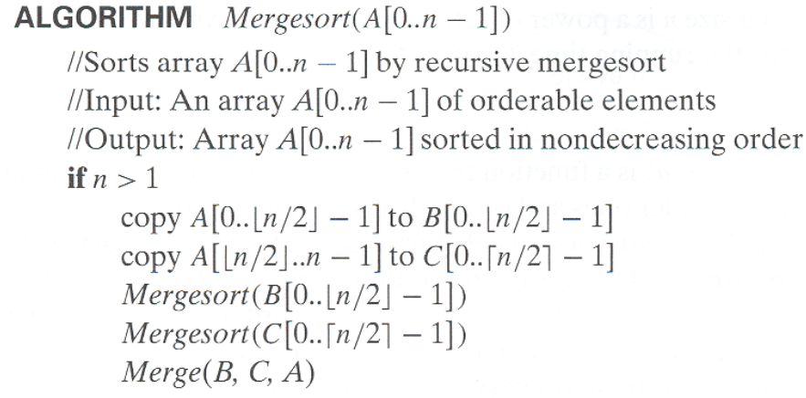

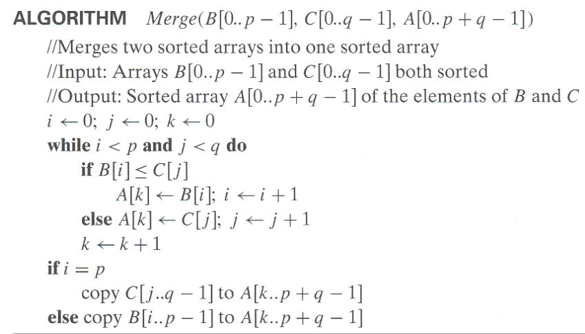

### Time complexity

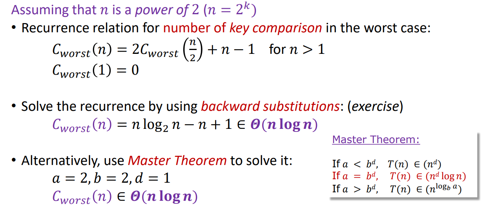

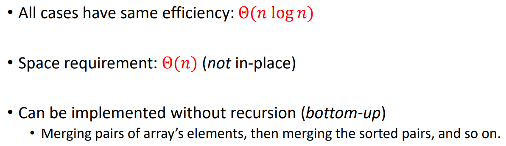

## First Divide-and-Conquer Algorithm

strategy: substitute multiplication with addition and subtraction.

### Time complexity

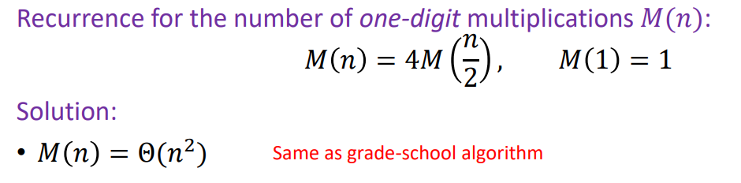

## Second Divide-and-Conquer Algorithm (Karatsuba’s algorithm)

### Code

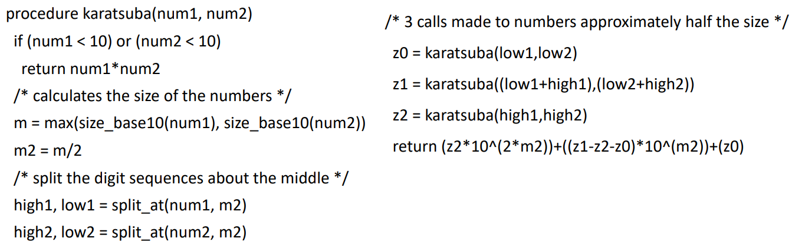

### Time complexity

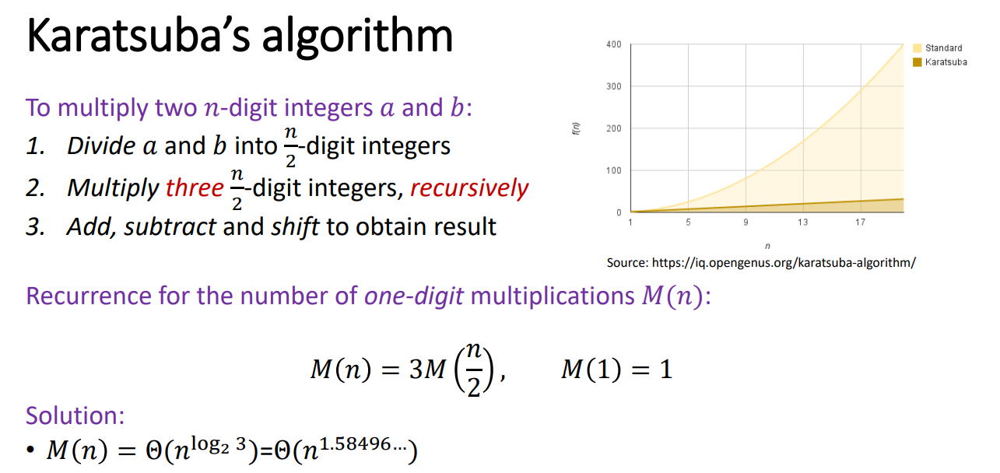

## Closest-Pair Problem

### Code


### Time complexity

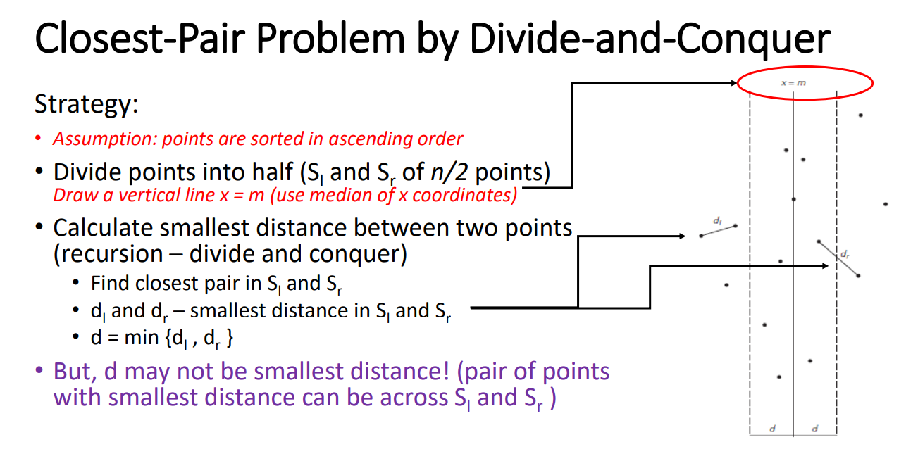

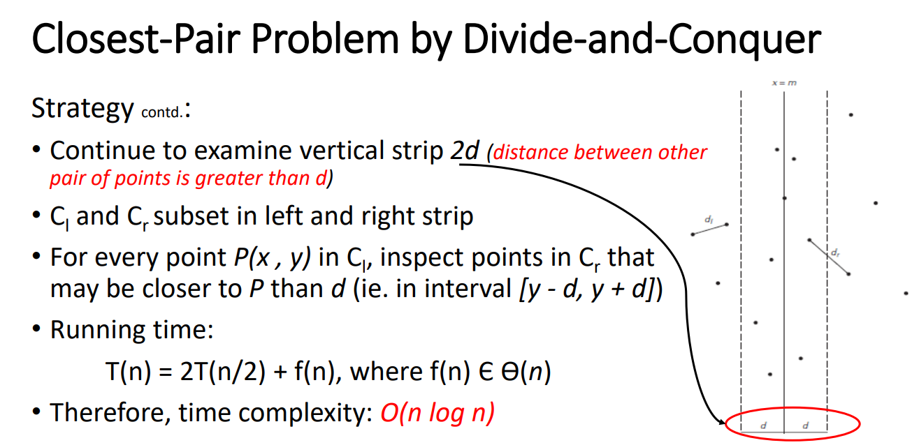