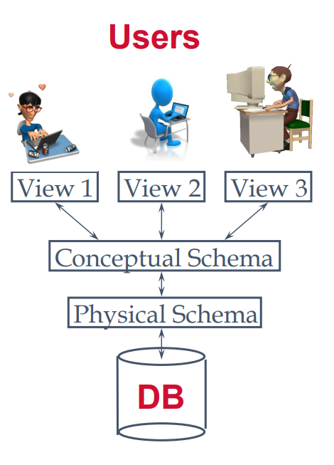
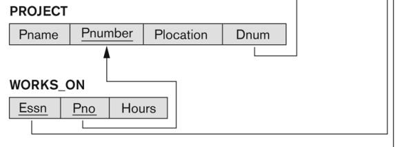
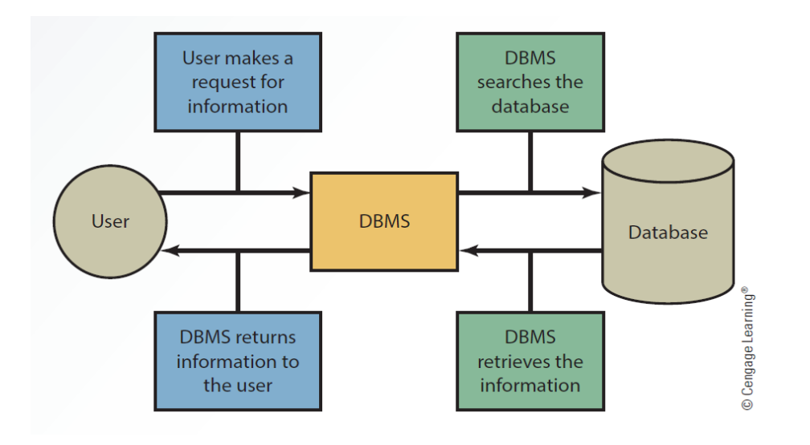
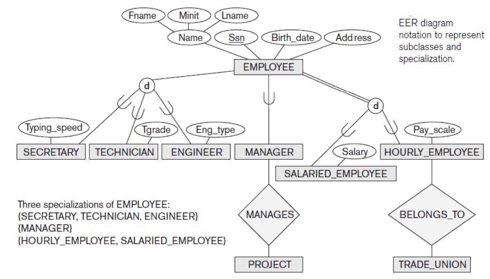
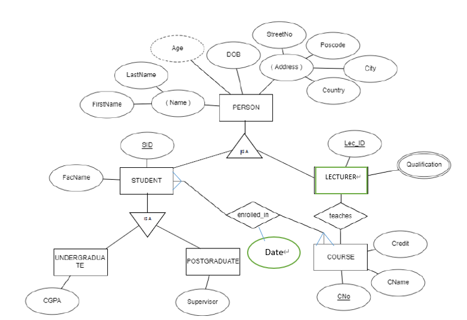
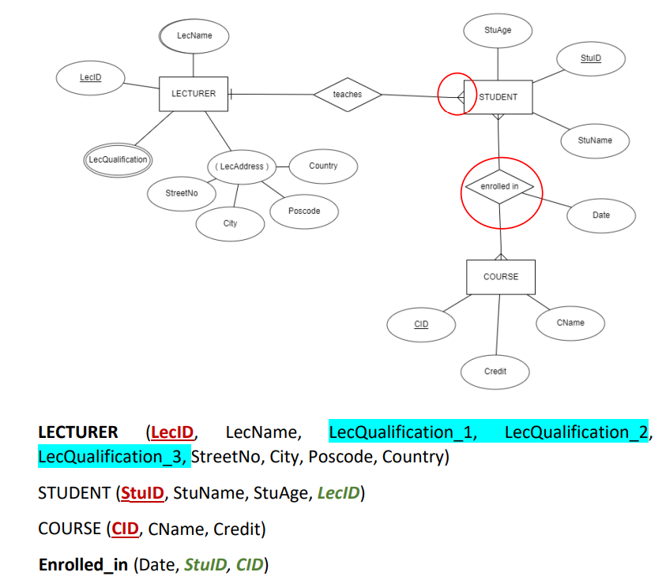
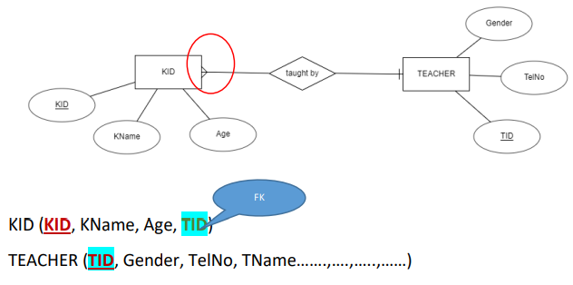
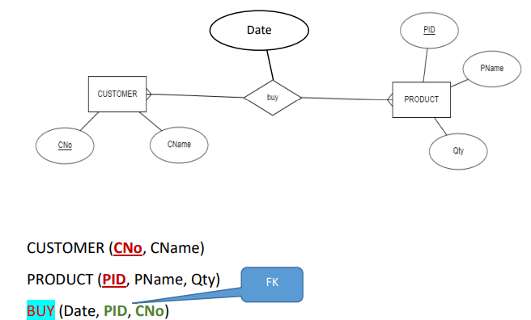
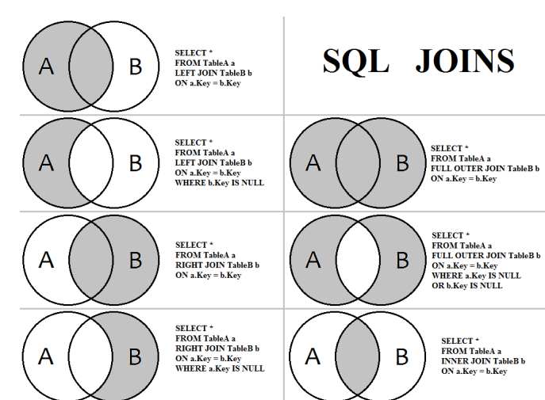

[toc]

# Definition

## Terminology

Database: A large collection of related data.

DMBS: A **software system** that **facilitates** the process of manipulating, sharing databases among various users and applications.

Phases of database design: requirement analysis, conceptual design (E-R model), logical design (Relational model), physical design.

Entity: a box with round corner.

Attributes: ovals

* composite attributes

* multivalued attributes: double ellipse

* derived attributes: dashed ellipse

Relationship: diamond box

Data Model: **set of concepts** for display data. Most used: Relational Model

* Entity-Relationship model

* Relational model

Schema:  A **description** of a specific set of data using a specific **data model**. **Description** of the columns and keys in relation.

Level of abstraction: views, logical (relationship between data), physical (how data is stored)

Relational Model: **represent** data **as** a collection of relations.

Relational Database Schema：

 

Query Language: a language used to **store and retrieve** data from database.

* procedural query language: user give direction, tell what data to be retrieved
* non-procedural query language: user tell the system to give output without telling how to do it. user tell what data to be retrieved without telling how to do it. 

Relational Algebra: Relational algebra is a conceptual procedural query language used on relational model.

Relational Calculus:  Relational calculus is a conceptual non-procedural query language used on relational model.

Difference between Relational Algebra, Calculus, RDBMS & SQL:

• Relational algebra and calculus are the theoretical concepts used on relational model.

• RDBMS is a practical implementation of relational model. 

• SQL is a practical implementation of relational algebra and calculus.

key: A minimal set of attributes that uniquely identifies the tuple (example: there is no pair of tuples with the same values for the key attributes).

Superkey: a set of attributes that contains a key. Any set of attributes that includes a key is a superkey. A minimal superkey is also a key.

Composite Key： composite key is a primary key that is made up of several columns.

Relational Model: 

* 描述DB数据的基本结构形式
* 描述Table之间的各种操作（关系运算）
* 描述这些操作之间遵循的约束条件（完整性约束）

## Relation between user, DMBS, DB

# Enhanced ERD

# Constraints

* Key Constraints: primary key, unique
* Referential Constraints: foreign key ( ) references ( )
* Tuple Constraints: check

# SQL

SELECT (DISTINCT) (MIN(), MAX(), AVG(), COUNT()) AS

FROM (INNER JOIN) AS

(ON)

WHERE (NOT LIKE) (NOT IN) (BETWEEN AND) (IS NULL)

GROUP BY

HAVING

ORDER BY (DESC, ASC)

LIMIT

UNION/INTERSECT/EXCEPT

ALTER TABLE( )

(ADD/DROP/MODIFY)

UPDATE

SET =

WHERE D in 

(

SELECT D FROM Dept WHRE Dname = 'ddd';

)

DROP TABLE ( )

RENAME TABLE ( ) TO ( ) 

DELETE FROM ( )

WHERE( )

DELETER FROM Student Where D in

(

SELECT D FROM Dept WHRE Dname = 'ddd';

)

CREATE TRIGGER () AFTER INSERT ON ()

FOR EACH ROW (SELECT...) (SET...)

GRANT INSERT 

ON book_info.customer

TO Clerk@localhost;

REVOKE SELECT ON crashcourse.* FROM Clerk@localhost

SET PASSWORD FOR Clerk@localhost = PASSWORD()

SHOW GRANTS FOR Clerk@localhost

USE mysql

SELECT user, host FROM mysql.user

INSERT INTO CUSTOMER

VALUES ('A500','MOHAMMED','30','KL','60888888','mohamed@yahoo.com');

INSERT INTO St(S, Sname)

​	SELECT S, Sname FROM student

​	WHERE Sname like 'ellie%'

CREATE TABLE PRODUCT

( 

Product_No INT DEFAULT 60 AUTO_INCREMENT CHECK(SIZE >= 90)

FOREIGN KEY( ) REFERENCES ()

)

CREATE DATABASE ABC@localhost IDENTIFIED BY '123'

USE ABC

DROP TABLE CUSTOMER

CREATE USER BEN  IDENTIFIED BY '123'

# Database Security

Database security includes a variety of **measures** used to **secure** DMBS from malicious cyber-attacks and illegitimate use.

## Threats

* Loss of integrity

  **Changing data values** for reasons of sabotage 

  • Data must not be altered in transit, and steps must be taken to ensure that unauthorized people cannot alter data (for example, in a breach of confidentiality). 

  • Example: Student changing grades for a class they’re taking

* Loss of confidentiality

  • Data or system **cannot be accessed**. 

* Loss of availability

  • “Denial of service”

  • The ability for authorized parties to **access** information on **a consistent and timely basis** is referred to as "availability".

## Level of Security

no access, partial access, emergency access

## Countermeasures

1. Database and web servers should be kept apart
2. Use firewalls for web applications and databases
3. Limit the number of people to access
4. Update the operating system and patches on a regular basis
5. Database activity should be audited and monitored on a regular basis
6. **Validate the safety of your database**
7. Data and backups must be encrypted

## Access Control Mechanisms

* DAC

  • **Providing access** to a **specific** piece of data to a specific user in a specific way. 

  • For example, “allow John to enter employees data into the Employee table.”

* MAC

  • This is a **security model** in which a **central authority manages access rights** based on multiple levels of security. 

  • Used in Military applications.

* RBMC

  • Users assigned roles. 

  • Roles **entitled to specific permissions** on specific data 

  • Example: “emergency physician can update any patient record”

# Database Integrity

## Required data

null values

## Domain Constraint

建表操作跟在每一行后面的

## Key Constraint

 The primary key attributes are underlined. Unique and not null.

## Entity Constraint

primary key, foreign key, unique.

## Referential constraints

If a foreign key contains a value, that value must refer to a row in the parent (Referenced) table that exists and is true

# Trigger

a trigger is a series of **actions** that are executed **automatically**.

# Normalization

Applying a set of rules to your database design in order to **reduce data redundancy.**

## 1NF

Every attribute is single valued.

Each record must be unique

## 2NF

如果一个主属性，它不能单独作为一个候选码，那么他也不能确定任何一个非主属性

## 3NF

消除了非主属性对**候选码**的传递函数依赖

# Relational Database Design

## Conceptual database design

Entities , Relationships , Attributes (simple, no composite, no derived) , Attribute domains,  Primary and candidate key attributes

## Logical database design 

**Draw ER model, Add constraints**

**Referential integrity** (delete & update) , Cascade , Set null , Set default , Set Check

## Physical database design

 Implementing physical representation 

 Analysis transactions 

 File organization 

Indexes 

 Security 

 Policy & procedure 

 **User view** 

 **Access rules**

# Join Query

INNER JOIN

LEFT OUTER JOIN

RIGHT OUTER JOIN

UNION

MINUS

# Transactions

Transaction: a **program** (process) under execution that comprises one or more database **access operations.**

Begin End Commit Rollback Savepoint

## Why We Need Transactions

A database is a **shared resource** that is used by multiple users and processes at the same time.  There will be issues if this **concurrent access** to a shared resource is **not managed.**

## ACID Properties

Atomicity Consistency Isolation Durability.

Each transaction's actions are either executed in full or not at all.

Each transaction's completion **maintains** the database in the proper **state**.

There are no concurrent transaction executions between any two transactions that are being carried out.

When a transaction is successfully executed, the database permanently records its results. (Write).

# Database Failure Type/Fault

* System crash

  It can **halt transaction processing** and potentially result in the **loss of content** stored on volatile storage such as main memory, cache memory, RAM

  corrupt database software.

  Rebooting the entire system.

* Media failure

  Database systems are typically **inaccessible** for several hours after a media failure.

  Failure to read data.

  Faulty hardware.

  begin the recovery process.

* Errors in Application Software

  When a resource limit is exceeded, bad input occurs, logical or internal problems occur, or any other **component** connected to the application program is **compromised,** transactions might fail.

# Relational Algebra

projection + select + join

not，and , or ， 减号的画法 ，以及<>

注意自己rename后和自己链接

擅用join

# Notice

笛卡尔积无顺序！结果中可以有相同

数据类型： DATE VARCHAR (10) CHAR(5) INT DECIMAL(10,9), Boolean

