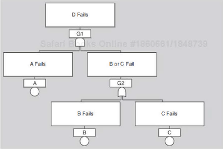
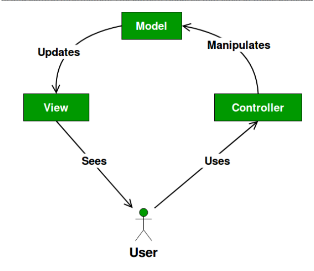
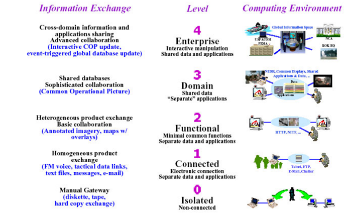
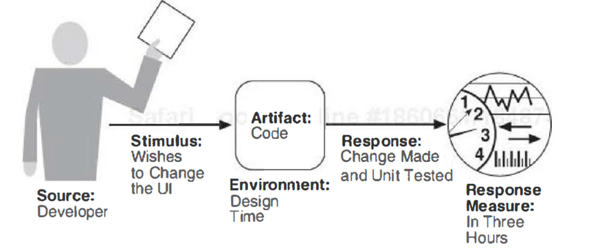

[toc] 

# Purposes of SW testing 

In general, the purposes of software testing are to find out the **extent** to which the software under test:

* is **usable**.

* responds correctly to all types of inputs with the **appropriate outputs**.

* has acceptable **GUI**.

* is free of **bug**s.

* is **executable** under the intended system environment, with the **desired level of interoperability.**

* has acceptable **response time**.

#Tactics for Testability

## Goal

**Allow for easier testing** (in **locating faults**) when an increment of software development is completed at a particular stage.

## Two categories

1. **controllability and observability of the system**

   The simplest form: provide a software component with a set of inputs, let it do its work, and then observe its outputs.

   **These tactics cause a component to maintain state information, allow testers to assign a value, and make that information accessible to testers.**

   The state information might be an operating state, the value of some key variable, performance load, intermediate process steps, or anything else useful to re-creating component behavior.

   **Specific tactics include**

   **(1) Specialized testing interfaces.** Allows you to **capture variable values** for a component either **through a test suite** or through normal execution. 

   Specialized testing interfaces should be clearly identified or kept separate from the access methods and interfaces for required functionality, so that they can be removed if needed.

   **(2) Record/playback.** The state that caused a fault is often difficult to **re-create**. Recording the state when it crosses an interface allows that state to be used to "play the system back" and to recreate the fault.

   **(3) Abstract data sources.** To design the software architecture to **point** the test suite **at the target** software.

   **(4) Sandbox.** It refers to **isolating** an instance of the system from the real world to enable experimentation that is unconstrained by the worry about having to undo the consequences of the experiment. 

   **(5) Executable assertions.** Assertions are hand-coded and placed at desired locations to indicate when and where a program is in a faulty state. 

2. **limiting complexity in the system's design.**

   **Complex software is harder to test because its operating state space is very large and it is more difficult to re-create an exact state** in a large state space than to do so in a small state space.

   **Two tactics to limit the complexity**:

   **(1) Limit structural complexity:** This tactic includes avoiding or resolving cyclic dependencies between components, isolating and encapsulating dependencies on the external environment, and **reducing dependencies** between components in general.

   In object-oriented systems, this can be achieved by simplifying the inheritance hierarchy.

   **(2) Limit nondeterminism:** It is all about limiting behavioural complexity.

   To make sure the behaviors under test are specific, predictable and deterministic.

   Some sources of nondeterminism are unavoidable.

# Scalability

## Category

**Horizontal scalability** refers to adding more resources to **logical units**, such as adding another server to a cluster of servers.

**Vertical scalability** refers to adding more resources to a **physical unit**, such as adding more memory to a single computer.

## Introduction

**The problem is how to effectively utilize the additional resources.** Being effective means that the additional resources **result in an improvement of some system quality,** did not require undue effort to add, and did not disrupt operations.

In cloud environments, horizontal scalability is called elasticity. Elasticity is a property that enables a customer to add or remove virtual machines from the resource pool.

# Hazard Analysis and Fault Tree Analysis

1. **Hazard Analysis**

   It is a technique to **categorize the hazards** that can occur during the operation of a system **according to its severity.**

   **Five factors are examined in the light of software hazard:**

   Normal performance, Operational degradation, functional failure, unintended functions, and inadvertent function (proper function but performed at wrong time or in wrong order)

   **Five failure condition levels:** Catastrophic, hazardous, major, minor, no effect.

2. **Fault Tree Analysis**

   It **specifies a state** of the system that negatively impacts safety or reliability, and then analyses the system’s context and operation to find **all the ways that the undesired state could occur.**

   The technique **uses a graphic aid (the fault tree) that helps identify all sequential and parallel sequences of contributing faults,** which might be hardware failures, human errors, software errors, and etc.

   A fault tree can be used in system design and failure diagnosis.

   **If the top event has occurred, it means that one or more of the contributing failures has occurred.** A fault tree can be used to track down these failures and initiate repair.

   ## Example

   Below is a fault-tree, showing that component D can fail if component A and either B or C fails.

   

#Queueing Model of Performance for the Model-View-Controller Pattern

For example, to analyze a queuing model of performance for model-view-controller pattern, the following details need to be known:

The **frequency of arrivals** from outside the system

The time to process a message within the view (note: this view refers to the view of a model-view-controller pattern)

The **number and size of messages** that the view sends to the controller

The bandwidth of the network that connects the view and the controller

The **time to process** a message within the controller

The number and size of messages that the controller sends back to the view

The time to process a message within the model

The number and size of messages the model sends to the view

The **bandwidth of the network** connecting the model and the view

# Module Patterns: Layered Pattern

## Context

**All complex systems** experience the **need to develop portions of the system independently.** For this reason the **developers** of the system need a **clear separation of concerns**, so that modules of the system may be independently developed.

## Problem

The software needs to be **segmented** in such a way that the **modules can be developed and evolved separately** with little interaction among the parts, supporting portability, modifiability, and reuse.

## Solution

To achieve these concerns, **the layered pattern divides the software into units called layers**. **Each layer is a grouping of modules** that offers a cohesive set of services.  The upper layer depends the lower layer, and not another way round. A program in layer *2* calls a program in a lower layer *1*. Layers completely partition a set of software, and **each partition is exposed through a public interface**. Every software is allocated to exactly one layer.

## Weakness

The addition of too many layers may **add complexity** to a system.

# Interoperability Models

## Levels of Information System Interoperability (LISI)

### Introduction

**LISI focuses on technical interoperability and the complexity of interoperations between systems.** It does not address the environmental and organizational issues that contribute to the construction and maintenance of interoperable systems.

### Levels

**Level 0** – **Isolated** interoperability in a **manual environment** between **stand-alone systems**: Interoperability at this level consists of the **manual extraction and integration of data** from multiple systems. 

**Level 1** – **Connected** interoperability in a **peer-to-peer environment**: This relies on **electronic links** with some form of simple electronic exchange of data. Simple, **homogeneous data types**, such as voice, text email, and graphics (e.g., Graphic Interface Format files) are shared. There is little capacity to fuse information. 

**Level 2** – **Functional** interoperability in a **distributed environment**: **Systems reside on local area networks** that allow data to be passed from system to system. This level provides for increasingly **complex media exchanges**. Logical **data models are shared across systems.** Data is generally heterogeneous-containing information from many simple formats fused together (images with annotations). 

**Level 3** – **Domain**-based interoperability in an **integrated environment**. **Systems are connected via wide area networks.** Information is exchanged between **independent applications** using **shared domain-based data models**. This level enables direct database-to-database interactions.

**Level 4** – **Enterprise**-based interoperability in a **universal environment**: Systems are capable of using a global information space across multiple domains. **Multiple users can access complex data simultaneously.** Data and applications are **fully shared and distributed.** Advanced forms of collaboration are possible. Data has a common interpretation regardless of format. 

## NATO

### Introduction

Focuses on **technical interoperability** and **establishes interoperability degrees.**

### Degree

**Degree 1** - Unstructured Data Exchange: **exchange of human-interpretable unstructured data** such as **texts.**

**Degree 2** - Structured Data Exchange: **exchange of human-interpretable structured data** intended for manual and/or automated handling, but requires manual compilation.

**Degree 3** - Seamless (无缝的）Sharing of Data: **automated sharing of data** amongst systems based on a common exchange **model.** 

**Degree 4** - Seamless Sharing of Information: **universal interpretation of information** through data processing based on cooperating **applications.** 

## OIM (Organizational Interoperability Maturity Model)

### Introduction

**Extends the LISI model** into the **more abstract layer**s of command and control support

### Five levels of organizational maturity 

**Level 0: independent**

**no formal framework** is in place for interoperation at this level.

**Level 1: ad hoc**

**Level 2: collaborative**

**Level 3: integrated**

**Level 4: unified** 

**common goals**, value systems, **command structure** and **knowledge** bases exist at this level.

# Characteristics of Security

## Confidentiality

Is the property that data or services are **protected from unauthorized access**. For example, a hacker cannot access your income tax returns on a government computer.

## Integrity

Is the property that data or services are **not subject to unauthorized manipulation**. For example, your grade has not been changed by an unauthorized third party since your instructor assigned it.

## Availability

Is the property that the system will be **available for legitimate use**. For example, a denial-of-service attack won't prevent you from ordering book from an online bookstore.

## Authentication

**Verifies the identities** of the parties to a transaction and **checks if they are truly who they claim to be.** For example, when you get an email purporting to come from a bank, authentication guarantees that it actually comes from the bank.

## Nonrepudiation 不可否认性

Guarantees that the **sender of a message cannot later deny having sent the message, and that the recipient cannot deny having received the message.** For example, you cannot deny ordering something from the Internet, or the merchant cannot disclaim getting your order.

## Authorization

**Grants a user the privileges to perform a task**. For example, an online banking system authorizes a legitimate user to access his account.

# Modifiability

About change, and our interest in it centers on the **cost and risk of making changes.**

##Two Approaches to Changes

Cost is always the main concern.

**Passive change**—wait for a change request.

**Proactive change**—identify the potential risks and opportunities, and plan the necessary change ahead of time.

## General Scenario

**Stimulus** (驱动力）—specifies the **change to be made**. A change can be the addition of a function, the modification of an existing function, or the deletion of a function. A change can also be made to the qualities of the system: making it more responsive, increasing its availability, and so forth.

**Artefact** （一个对象）—specifies **what is to be changed** (e.g., specific components or modules, GUI, the system’s platform, tables in the database, etc)

**Environment**—specifies **when the change can be made**: **design time, compile time, run time**, etc.

**Response**—Make the change, test it, and deploy it.

**Response measure**—the measure of the change. **Usually time and money** are the most common response measures. Other measures include the extent of the change (number of modules or other artefacts affected) or the number of new defects introduced by the change, or the effect on other quality attributes.

### Example

Given this concrete modifiability scenario: The developer wishes to change the user interface by modifying the code at design time. The modifications are made with no side effects within three hours.

## Tactics for Modifiability

Three factors : **cohesion, coupling, and module size.**

**Cohesion** measures how strongly the **responsibilities** of **a module** are related.

The higher the cohesion, the lower the probability that a given change will affect multiple responsibilities.

**Coupling** refers to how strongly **two modules** or components are **dependent on** each other in order to function.

**High coupling can be achieved through encapsulation**

**Low coupling is desirable over high coupling, which can be achieved through encapsulation**

**Refactoring is a decoupling tactic** undertaken when two modules are affected by the same change because they are (at least partial) duplicates of each other.

**A small-size module is relatively more maintainable (the cost of making modification is lower).**

## Design Checklist for Modifiability

**Allocation** of responsibilities

Coordination model

Data model

**Mapping** among architectural elements

Resource management

Binding time

Choice of technology