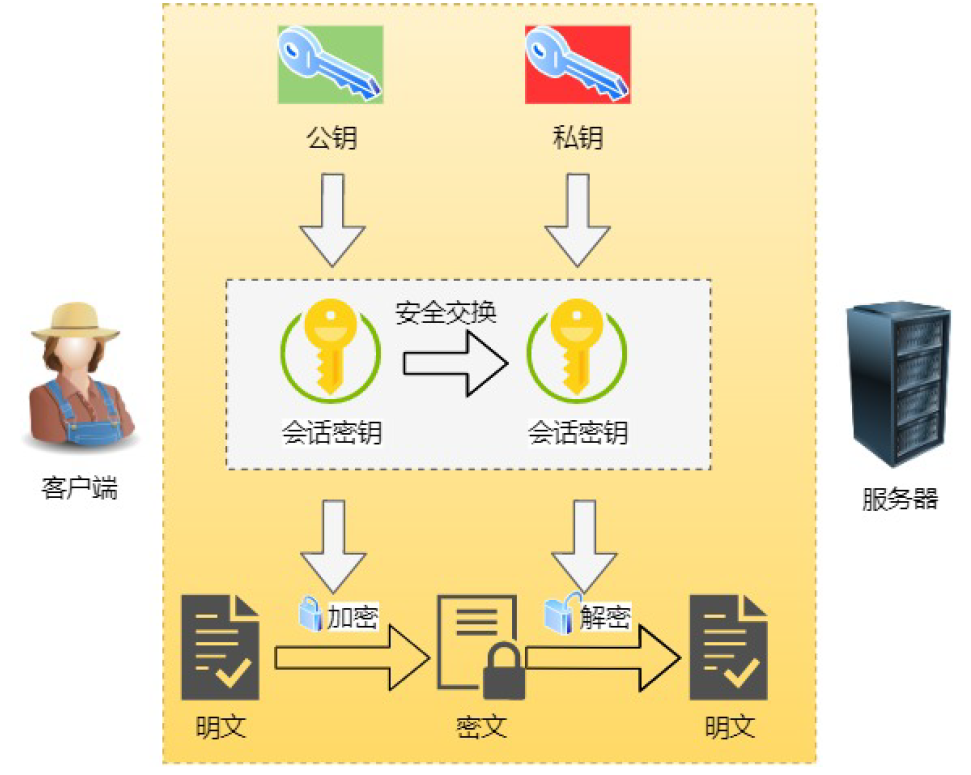

# 应用层

## HTTP(Hyper Text Transfer Protocol)

HTTP 是一个在计算机世界里专门在「两点」之间「传输」文字、图片、音频、视频等「超文本」数据
的「约定和规范」。

基于TCP/IP，采用请求-应答的通信模式

文本：字符、图片、视频、压缩包等

超文本：文字、图片、视频等的混合体，超链接可以从一个超文本跳转到另一个超文本，HTML是最常见的超文本

* 进程与进程之间通信，具体来说，是客户的浏览器进程和WEB服务器进程间的通信，通过TCP连接，互相发送HTTP请求报文和HTTP响应报文

* 建立在TCP连接（熟知端口号80）之上
* 两点之间传输的双向协议

### 不同版本的HTTP

* HTTP1.0

采用非持续连接方式，即浏览器每次请求一个文件，都要与服务器建立TCP连接，收到响应后立即关闭TCP连接

每请求一个文档就要有两倍的RTT的开销。若一个网页上有很多引用对象（例如图片等），那么请求每一个对象都需要花费2RTT的时间

为了减小时延，浏览器通常会建立多个并行的TCP连接同时请求多个对象。但是，这会大量占用万维网服务器的资源，特别是万维网服务器往往要同时服务于大量客户的请求，这会使其负担很重。

* HTTP1.1

采用持续连接方式

万维网服务器在发送响应后仍然保持这条连接

HTTP/1.1的持续连接还可以使用流水线方式工作(浏览器在收到HTTP的响应报文之前就能够连续发送多个请求报文)

* HTTP报文格式

HTTP是面向文本的，其报文中的每一个字段都是一些ASCII码串，并且每个字段的长度都是不确定的。

方法和字段：

Host字段（首部字段）：用来指定服务器的域名、

Content-Length 字段：表明本次回应的数据长度

Connection 字段：要求服务器使用 TCP 持久连接，以便其他请求复用

正因为HTTP1.1以长连接为基础，所以在一个TCP连接中，客户端可以同时发出多个请求，可以采用管道传输

Content-Type 字段：用于服务器回应时，告诉客户端，本次数据是什么格式

### Get和Post有什么区别？

Get：请求从服务器**获取**资源

Post：向 URI 指定的资源**提交**数据，数据就放在报文的 body 里。

### GET 和 POST 方法都是安全和幂等的吗？

安全: 请求方法不会「破坏」服务器上的资源

幂等: 多次执行相同的操作，结果都是「相同」的

GET 方法就是安全且幂等的，因为它是「只读」操作，无论操作多少次，服务器上的数据都是安全的，且每次的结果都是相同的。
POST 因为是「新增或提交数据」的操作，会修改服务器上的资源，所以是不安全的，且多次提交数据就会创建多个资源，所以不是幂等的。

### HTTP的缺点

1. 无状态。解决方法：cookie
2. 明文传输，容易被窃取
3. 不安全 解决方法：TLS/SSL

## HTTPS

HTTPS 采用的是对称加密和非对称加密结合的「混合加密」方式

### HTTP与HTTPS有什么区别

1. HTTP 是超文本传输协议，信息是明文传输，存在安全风险的问题。HTTPS 则解决 HTTP 不安全
的缺陷，在 TCP 和 HTTP 网络层之间加入了 SSL/TLS 安全协议，使得报文能够加密传输。
2. HTTP 连接建立相对简单， TCP 三次握手之后便可进行 HTTP 的报文传输。而 HTTPS 在 TCP
三次握手之后，还需进行 SSL/TLS 的握手过程，才可进入加密报文传输。
3. HTTP 的端口号是 80，HTTPS 的端口号是 443。
4. HTTPS 协议需要向 CA（证书权威机构）申请数字证书，来保证服务器的身份是可信的。

### HTTPS的解决方案

* HTTP的**窃听**危机——**机密性**——HTTPS解决：采用**混合加密**

**混合加密**：保证信息的机密性，解决了窃听的风险

在通信建立**前**采用**非对称加密**的方式交换「会话秘钥」，后续就不再使用非对称加密。
在通信过程**中**全部使用**对称加密**的「会话秘钥」的方式加密明文数据。

**为什么采用混合加密？**

对称加密只使用一个密钥，运算速度快，密钥必须保密，无法做到安全的密钥交换。
非对称加密使用两个密钥：公钥和私钥，公钥可以任意分发而私钥保密，解决了密钥交换问题但
速度慢。

* HTTP的**篡改**风险——**完整性**——HTTPS解决：采用**摘要算法**

**摘要算法**：用来实现完整性，能够为数据生成独一无二的「指纹」，用于校验数据的完整性，解决了篡改的风险。

* HTTP**的冒充风险**——**实体鉴别**——HTTPS解决：将服务器**公钥放入数字证书**中

客户端先向服务器端索要公钥，然后用公钥加密信息，服务器收到密文后，用自己的私钥解密

有一个问题：如何保证公钥不被篡改和信任度？——解决方法：CA （数字证书认证机构），将服务器公钥放在数字证书（由数字证书认证机构颁发）中，只要证书是可信的，公钥就是可信的。

## Cookie

背景：HTTP是无状态协议，需要Cookie来保留状态，需要万维网服务器能够识别用户，对无状态的HTTP进行状态化的技术

工作流程

3. 这个HTTP响应报文包含有一个首部字段“Set-Cookie"的首部行

# 运输层

# 网络层

# 数据链路层

# 物理层

