[toc]


#数据库

## 数据库基础

### 数据库与数据库管理系统的关系

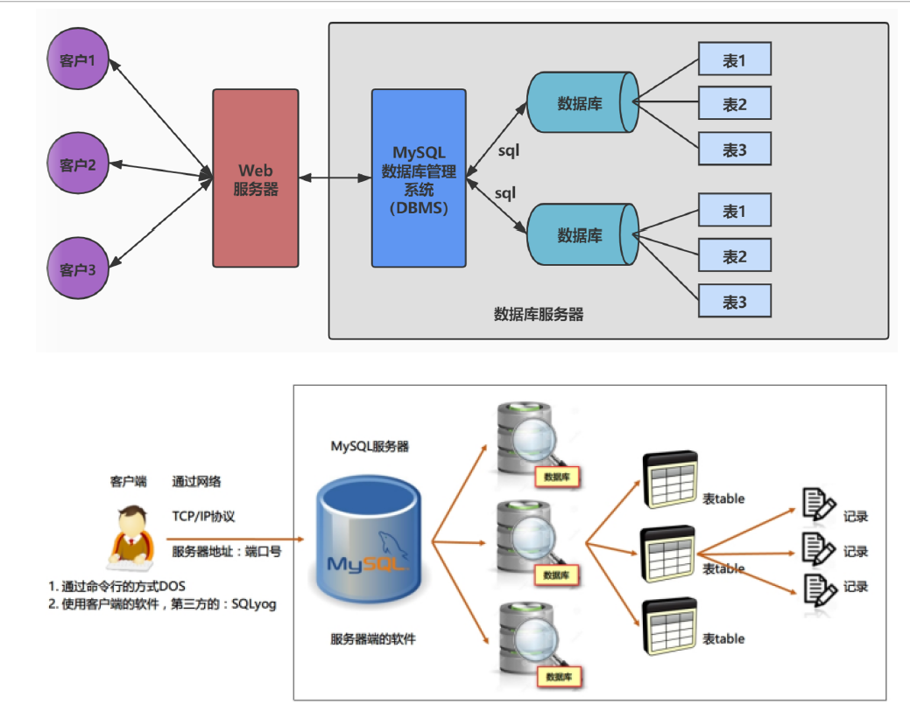

### MySQL配置和登录

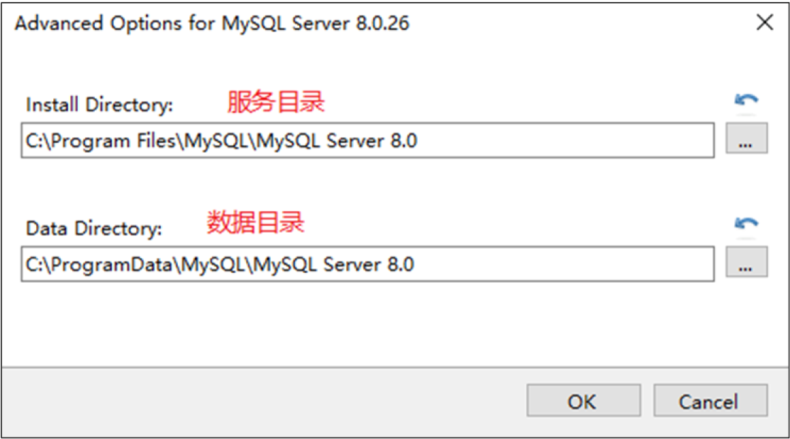

**配置环境变量**

如果不配置MySQL环境变量，就不能在命令行直接输入MySQL登录命令

**启动服务器**

MySQL安装完毕之后，需要启动服务器进程，不然客户端无法连接数据库

以管理员身份启动shell

```
# 启动 MySQL 服务命令：
net start MySQL服务名 	//net start mysql80
# 停止 MySQL 服务命令：
net stop MySQL服务名	//net stop mysql80
```

**登录客户端**

当MySQL服务启动完成后，便可以通过客户端来登录MySQL数据库

* 通过MySQL 8.0 Command Line Client

* 通过命令行登录

```
mysql -h 主机名 -P 端口号 -u 用户名 -p密码
mysql -h localhost -P 3306 -u root -pabc123 # 这里我设置的root用户的密码是abc123
```

3306是服务器端口号，localhost是服务器的IP地址（这个是本地服务器）

需要注意：

1. -p与密码之间不能有空格，其他参数名与参数值之间可以有空格也可以没有空格

2. 密码建议在下一行输入，保证安全

3. 客户端和服务器在同一台机器上，所以输入localhost或者IP地址127.0.0.1。同时，因为是连接本机 -localhost就可以省略，如果端口号没有修改：-P3306也可以省略
   简写成：

   ```mysql
   mysql -u root -p 
   Enter password:
   ```
   
   
   
4. 连接成功后，有关于MySQL Server服务版本的信息，还有第几次连接的id标识。也可以在命令行通过以下方式获取MySQL Server服务版本的信息：

   ```mysql
   c:\> mysql -V
   c:\> mysql --version
   ```

   或者登录后，通过以下方式查看当前版本信息：

   ```mysq
   mysql> select version();
   ```

   

### 各种工具

   1. MySQL Workbench

   MySQL官方提供的图形化管理工具

   

### MySQL语言规范

每条命令以 ; 或 \g 或 \G 结束

字符串型和日期时间类型的数据可以使用单引号（' '）表示
列的别名，尽量使用双引号（" "），而且不建议省略as

MySQL 在 Linux 环境下是大小写敏感的

数据库名、表名、表别名、字段名、字段别名等都小写
SQL 关键字、函数名、绑定变量等都大写

必须保证你的字段没有和保留字、数据库系统或常用方法冲突。如果坚持使用，请在SQL语句中使
用`（着重号）引起来

```mysql
#其中order使用``飘号，因为order和系统关键字或系统函数名等预定义标识符重名了
CREATE TABLE `order`( );
```


### 子查询

子查询（内查询）在主查询之前一次执行完成。
子查询的结果被主查询（外查询）使用

#### 注意

* 子查询要包含在括号内
* 将子查询放在比较条件的右侧
* 单行操作符对应单行子查询，多行操作符对应多行子查询
* 子查询不返回任何行

#### 分类

**分类方式1**

我们按内查询的结果返回一条还是多条记录，将子查询分为 单行子查询 、 多行子查询 

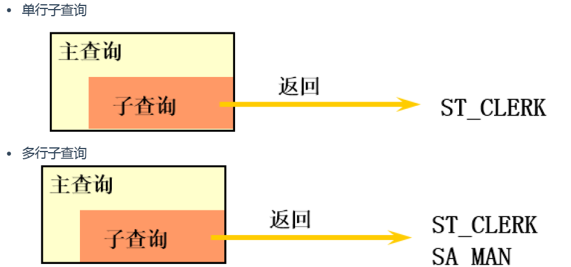

**分类方式2**

按内查询是否被执行多次，将子查询划分为 相关(或关联)子查询 和 不相关(或非关联)子查询 。

子查询从数据表中查询了数据结果，如果这个数据结果只执行一次，然后这个数据结果作为主查询的条件进行执行，那么这样的子查询叫做不相关子查询。
同样，如果子查询需要执行多次，即采用循环的方式，先从外部查询开始，每次都传入子查询进行查询，然后再将结果反馈给外部，这种嵌套的执行方式就称为相关子查询。

#### 单行子查询

* 返回公司工资最少的员工的last_name,job_id和salary

```mysql
SELECT last_name, job_id, salary FROM   employees
WHERE  salary = (SELECT MIN(salary)   
                 FROM   employees);
```

* 查询与141号或174号员工的manager_id和department_id相同的其他员工的employee_id， manager_id，department_id

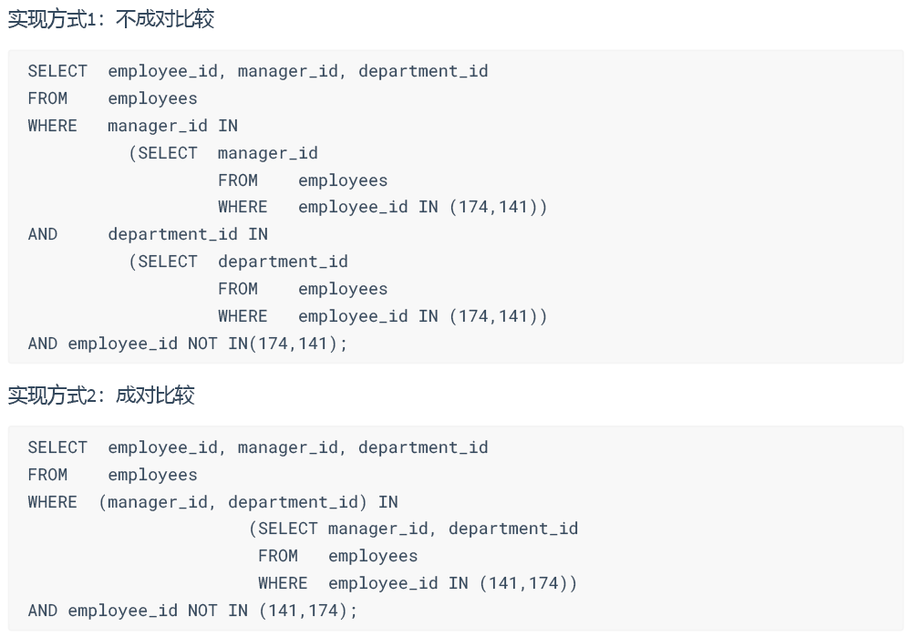

* HAVING 中的子查询

  * 首先执行子查询
  * 向主查询中的HAVING 子句返回结果

  查询最低工资大于50号部门最低工资的部门id和其最低工资

  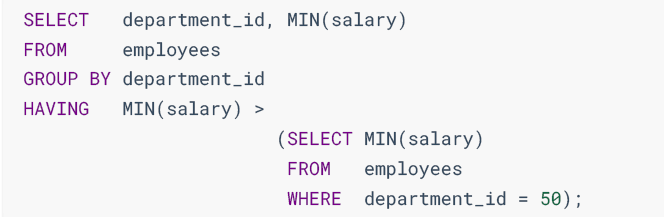

* CASE中的子查询

题目：显式员工的employee_id,last_name和location。其中，若员工department_id与location_id为1800
的department_id相同，则location为’Canada’，其余则为’USA’。

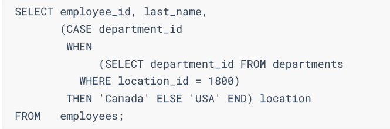


#### 多行子查询

也称为集合比较子查询
内查询返回多行
**使用多行比较操作符，多行比较操作符如下**

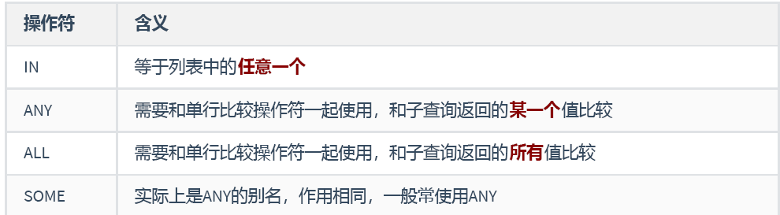

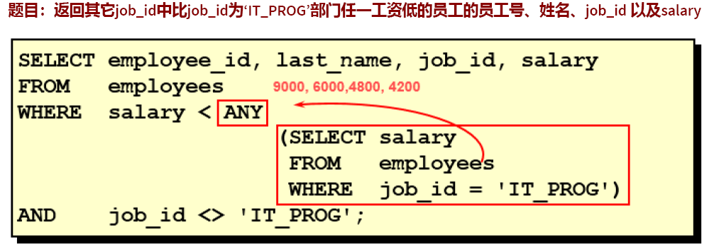

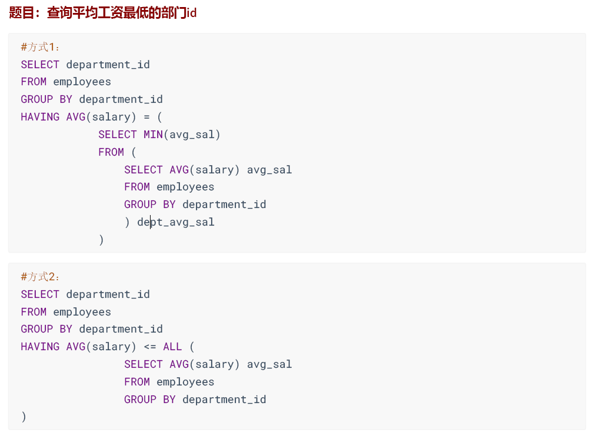

#### 相关子查询

如果子查询的执行依赖于外部查询，通常情况下都是因为子查询中的表用到了外部的表，并进行了条件关联，因此每执行一次外部查询，子查询都要重新计算一次，这样的子查询就称之为相关子查询

**执行顺序**

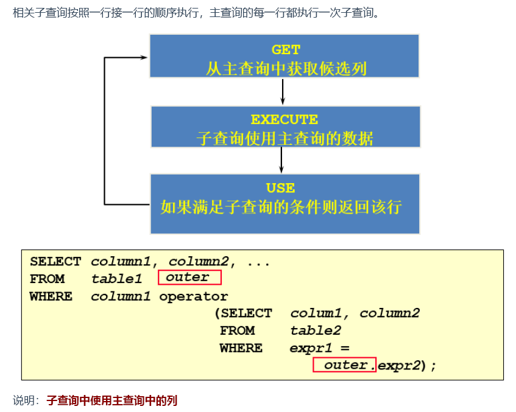

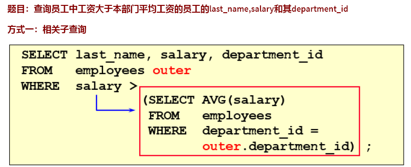

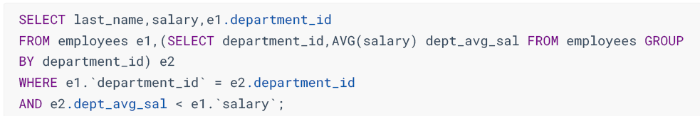

**SELECT返回的是一张虚拟表！**

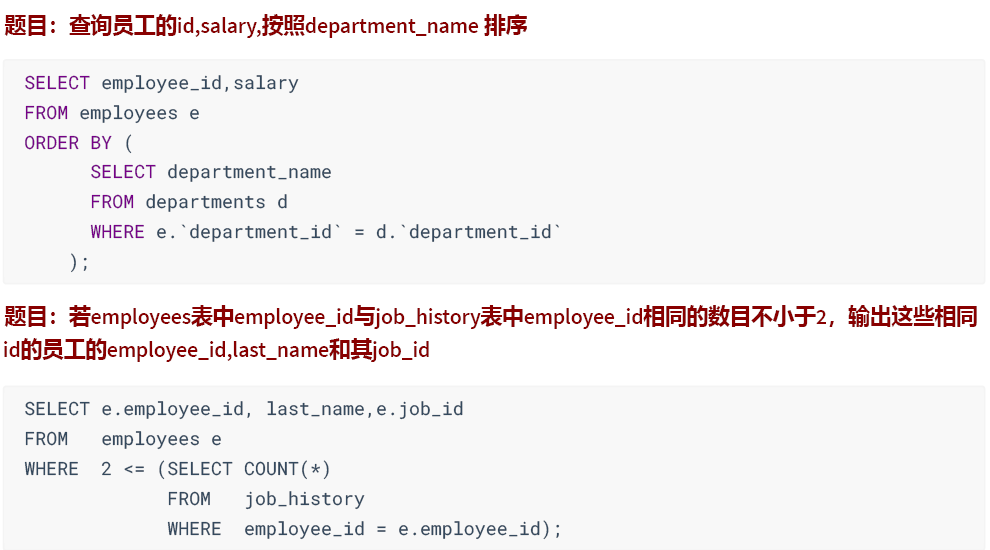

##### Exist 和 Not Exist 关键字

关联子查询通常也会和 EXISTS操作符一起来使用，用来检查在子查询中是否存在满足条件的行。
如果在子查询中不存在满足条件的行：

* 条件返回 FALSE
* 继续在子查询中查找

如果在子查询中存在满足条件的行：

* 不在子查询中继续查找
* 条件返回 TRUE

NOT EXISTS关键字表示如果不存在某种条件，则返回TRUE，否则返回FALSE。

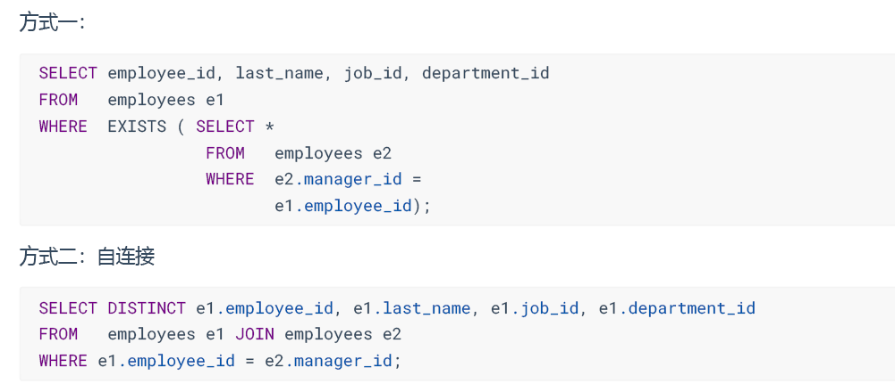

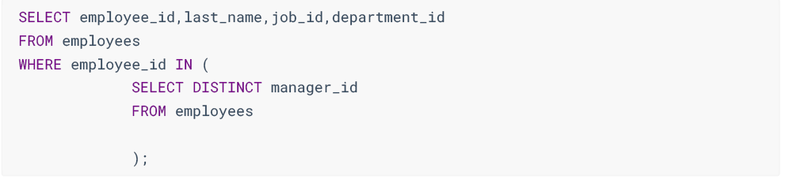

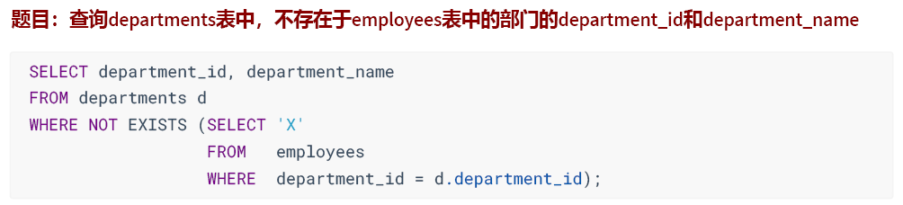

**对于每一个departments下的行，在employees中寻找，找到了就停止，返回true，因为exist不关心返回值，所以用‘X'表示**，SELECT得到的是一个表！

##### 相关更新

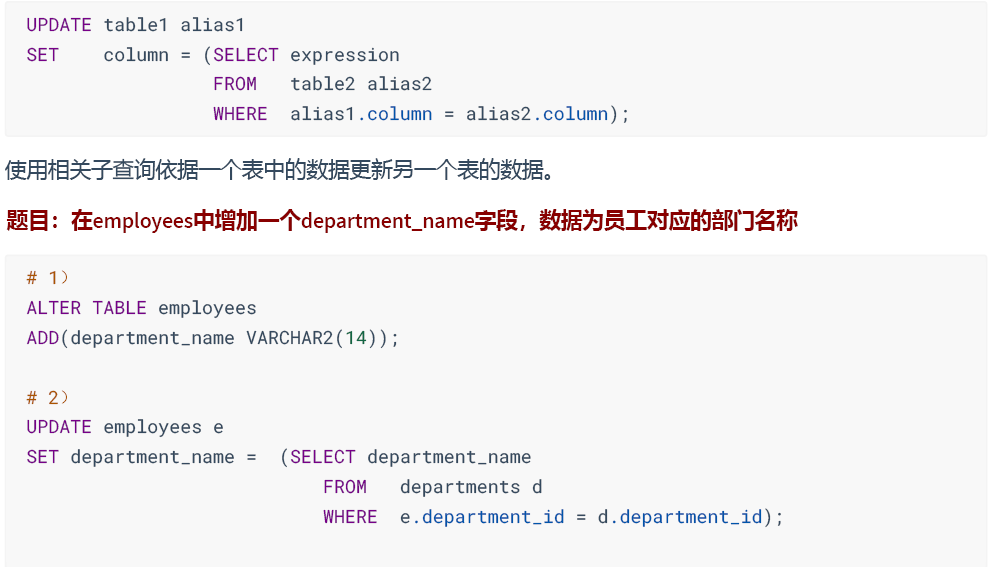

##### 相关删除

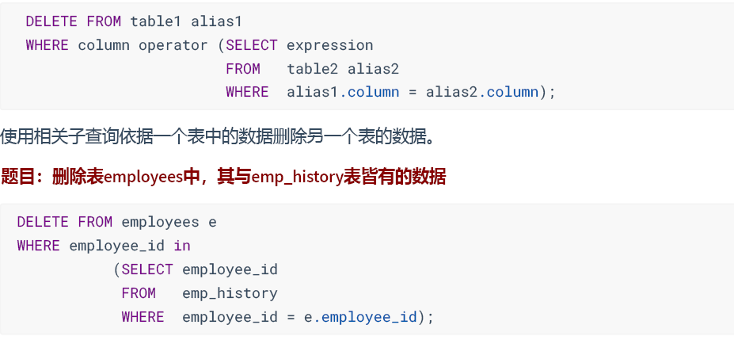

##### 子查询和自连接的比较

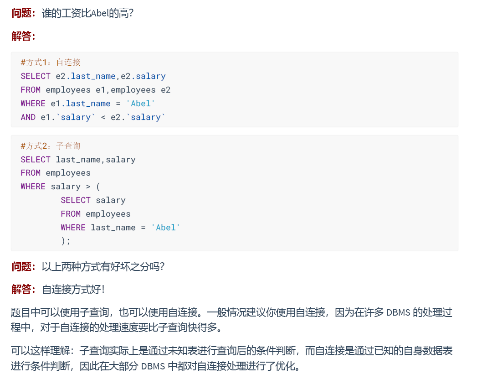


   ### MySQL目录结构与源码

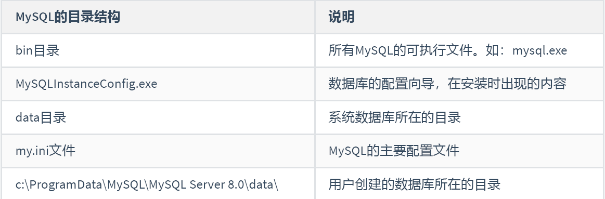

 ### MySQL语句


```mysql
#导入数据（导入目录下的sql文件）
mysql> source d:\mysqldb.sql
#展示employee表
mysql> desc employees;
#去除重复行
SELECT DISTINCT department_id
FROM employees;
#Distinct对后面所有的列名组合去重
SELECT DISTINCT department_id,salary
FROM employees;
#所有运算符或列值遇到null值，运算的结果都为null。比如下面salary字段有一个字段值是空，在 MySQL 里面，空值是占用空间的
SELECT employee_id,salary,commission_pct,
12 * salary * (1 + commission_pct) "annual_sal"
FROM employees;
#对于保留字（比如下面的order)，要用着重号限定
SELECT * FROM `ORDER`;
#使用DESCRIBE 或 DESC 命令，表示表结构
DESCRIBE employees;
或
DESC employees;
#下面两句是一样的
SELECT 100 FROM dual;
SELECT 100;
#安全等于运算符,前者为1，后者为NULL。使用安全等于运算符时，两边的操作数的值都为NULL时，返回的结果为1而不是NULL，其他
返回结果与等于运算符相同。
SELECT NULL <=> NULL;
SELECT NULL = NULL;
#最小值运算符，有一个为NULL，返回NULL
SELECT LEAST (1,0,2), LEAST('b','a','c'), LEAST(1,NULL,2);
#最大值运算符，有一个为NULL，返回NULL
SELECT GREATEST(1,0,2), GREATEST('b','a','c'), GREATEST(1,NULL,2);
#Between And 返回0或1
SELECT 1 BETWEEN 0 AND 1；
#in，not in运算符，返回0或1
SELECT 'a' NOT IN ('a','b','c')
#like运算符
“%”：匹配0个或多个字符。
“_”：只能匹配一个字符。
SELECT last_name
FROM employees
WHERE last_name LIKE '_o%';
#使用转义，ESCAPLE和\
SELECT job_id
FROM jobs
WHERE job_id LIKE ‘IT\_%‘;
SELECT job_id
FROM jobs
WHERE job_id LIKE ‘IT$_%‘ escape ‘$‘;
#分页操作
-- 第21至30条记录：
SELECT * FROM 表名 LIMIT 20,10;
-- MySQL 8.0中可以使用“LIMIT 3 OFFSET 4”，意思是获取从第5条记录开始后面的3条记录
#分页显示
-- 分页显式公式：（当前页数-1）*每页条数，每页条数
SELECT * FROM table
LIMIT(PageNo - 1)*PageSize,PageSize;


#修改用户密码加密规则并更新用户密码
#修改'root'@'localhost'用户的密码规则和密码
ALTER USER 'root'@'localhost' IDENTIFIED WITH mysql_native_password BY 'abc123';
#刷新权限
FLUSH PRIVILEGES;

#查看创建表的详细创建信息
show create table 表名称\G
   
#查看atguigudb数据库的详细创建信息
 show create database atguigudb\G
   
select id as "编号", `name` as "姓名" from t_stu; #起别名时，as都可以省略
select id as 编号, `name` as 姓名 from t_stu; #如果字段别名中没有空格，那么可以省略""
select id as 编 号, `name` as 姓 名 from t_stu; #错误，如果字段别名中有空格，那么不能省略""


```

#### 非等值连接

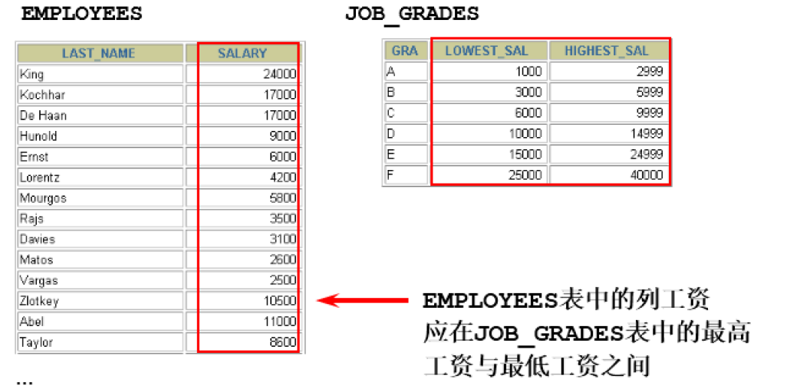

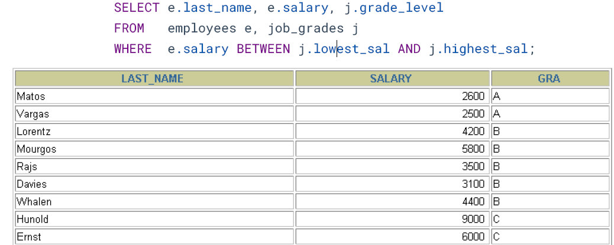

#### REGEXP运算符

语法格式为： expr REGEXP 匹配条件；

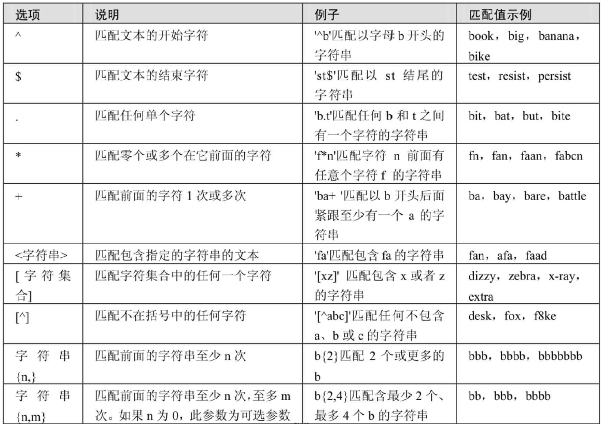

#### 位运算符

以二进制进行计算

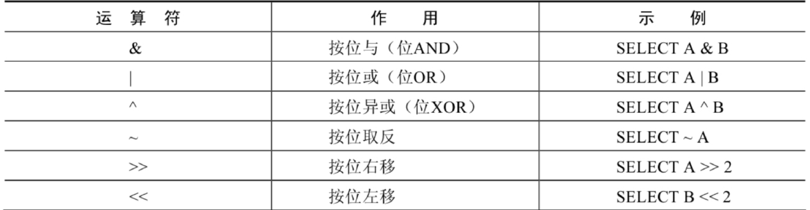

#### Join

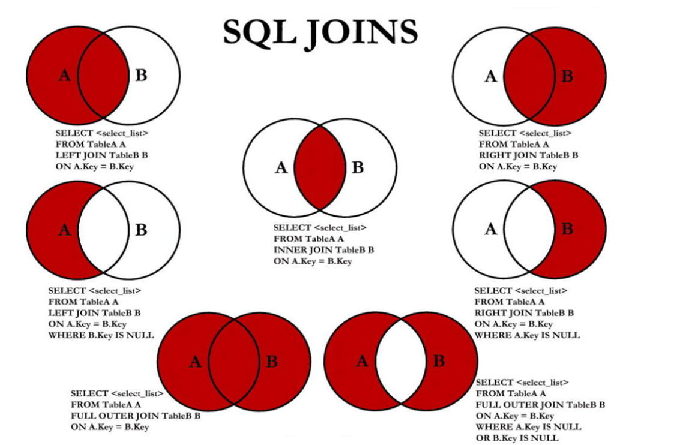

#### using连接

当我们进行连接的时候，SQL99还支持使用 USING 指定数据表里的**同名字段**进行等值连接。但是只能配
合JOIN一起使用

```mysql
SELECT employee_id,last_name,department_name
FROM employees e JOIN departments d
USING (department_id);

等价于

SELECT employee_id,last_name,department_name
FROM employees e ,departments d
WHERE e.department_id = d.department_id;
```

#### 各种单行函数

[尚硅谷单行函数](F:\Caoyan\program\java\MySQL\basic\课件\第07章_单行函数.pdf)

#### with rollup

使用WITH ROLLUP 关键字之后，在所有查询出的分组记录之后增加一条记录，该记录计算查询出的所
有记录的总和，即统计记录数量。

```mysql
SELECT department_id,AVG(salary)
FROM employees
WHERE department_id > 80
GROUP BY department_id WITH ROLLUP;
```

当使用ROLLUP时，不能同时使用ORDER BY子句进行结果排序，即ROLLUP和ORDER BY是互相排斥
的

#### Where VS. Having

区别1：WHERE 可以直接使用表中的字段作为筛选条件，但不能使用分组中的计算函数作为筛选条件；
HAVING 必须要与 GROUP BY 配合使用，可以把分组计算的函数和分组字段作为筛选条件。

区别2：如果需要通过连接从关联表中获取需要的数据，**WHERE 是先筛选后连接，而 HAVING 是先连接**
**后筛选**


#### 查询结构总结

```mysql
#方式1：
SELECT ...,....,...
FROM ...,...,....
WHERE 多表的连接条件
AND 不包含组函数的过滤条件
GROUP BY ...,...
HAVING 包含组函数的过滤条件
ORDER BY ... ASC/DESC
LIMIT ...,...
#方式2：
SELECT ...,....,...
FROM ... JOIN ...
ON 多表的连接条件
JOIN ...
ON ...
WHERE 不包含组函数的过滤条件
AND/OR 不包含组函数的过滤条件
GROUP BY ...,...
HAVING 包含组函数的过滤条件
ORDER BY ... ASC/DESC
LIMIT ...,...
#其中：
#（1）from：从哪些表中筛选
#（2）on：关联多表查询时，去除笛卡尔积
#（3）where：从表中筛选的条件
#（4）group by：分组依据
#（5）having：在统计结果中再次筛选
#（6）order by：排序
#（7）limit：分页
```

#### SELECT的执行顺序

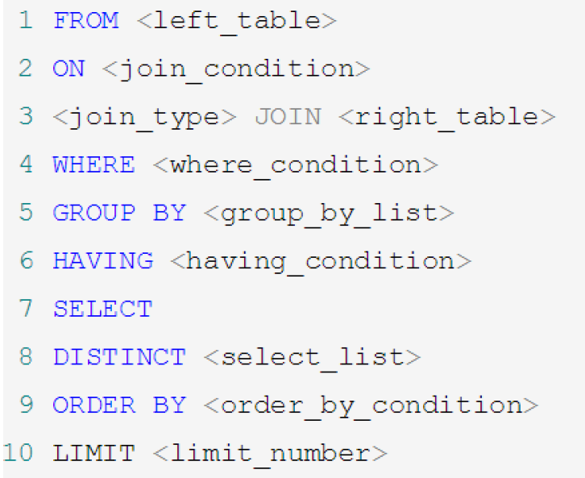

举个栗子

```mysql
SELECT DISTINCT player_id, player_name, count(*) as num # 顺序 5
FROM player JOIN team ON player.team_id = team.team_id # 顺序 1
WHERE height > 1.80 # 顺序 2
GROUP BY player.team_id # 顺序 3
HAVING num > 2 # 顺序 4
ORDER BY num DESC # 顺序 6
LIMIT 2 # 顺序 7
```


### 各种报错或问题

1. root用户密码忘记，重置的操作

1: 通过任务管理器或者服务管理，关掉mysqld(服务进程) 2: 通过命令行+特殊参数开启mysqld mysqld --defaults-file="D:\ProgramFiles\mysql\MySQLServer5.7Data\my.ini" --skip-grant-tables
3: 此时，mysqld服务进程已经打开。并且不需要权限检查 4: mysql -uroot 无密码登陆服务器。另启动一个客户端进行 5: 修改权限表 （1） use mysql; （2）update user set authentication_string=password('新密码') where user='root' and Host='localhost'; （3）flush privileges; 6: 通过任务管理器，关掉mysqld服务进程。 7: 再次通过服务管理，打开mysql服务。 8: 即可用修改后的新密码登陆。

2. mysql命令报“不是内部或外部命令”

把mysql安装目录的bin目录配置到环境变量path中。如下：

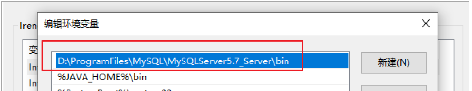

3. 命令行客户端的字符集问题

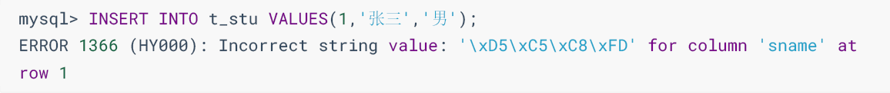

原因：服务器端认为你的客户端的字符集是utf-8，而实际上你的客户端的字符集是GBK

查看所有字符集：SHOW VARIABLES LIKE 'character_set_%';
解决方案：设置当前连接的客户端字符集 “SET NAMES GBK;”

3. 修改数据库和表的字符编码

（1) 先停止服务，（2) 修改my.ini文件 （3) 重新启动服务

说明：
如果是在修改my.ini之前建的库和表，那么库和表的编码还是原来的Latin1，要么删了重建，要么使用
alter语句修改编码。

```mysql
mysql> create database 0728db charset Latin1;
Query OK, 1 row affected (0.00 sec)

mysql> use 0728db;
Database changed

mysql> show create table student\G
*************************** 1. row ***************************
Table: student
Create Table: CREATE TABLE `student` (
`id` int(11) NOT NULL,
`name` varchar(20) DEFAULT NULL,
PRIMARY KEY (`id`)
) ENGINE=InnoDB DEFAULT CHARSET=latin1
1 row in set (0.00 sec)

mysql> alter table student charset utf8; #修改表字符编码为UTF8
Query OK, 0 rows affected (0.01 sec)
Records: 0 Duplicates: 0 Warnings: 0
mysql> show create table student\G
*************************** 1. row ***************************
Table: student
Create Table: CREATE TABLE `student` (
`id` int(11) NOT NULL,
`name` varchar(20) CHARACTER SET latin1 DEFAULT NULL, #字段仍然是latin1编码
PRIMARY KEY (`id`)
) ENGINE=InnoDB DEFAULT CHARSET=utf8
1 row in set (0.00 sec)
mysql> alter table student modify name varchar(20) charset utf8; #修改字段字符编码为UTF8
Query OK, 0 rows affected (0.05 sec)
Records: 0 Duplicates: 0 Warnings: 0
mysql> show create table student\G
*************************** 1. row ***************************
Table: student
Create Table: CREATE TABLE `student` (
`id` int(11) NOT NULL,
`name` varchar(20) DEFAULT NULL,
PRIMARY KEY (`id`)
) ENGINE=InnoDB DEFAULT CHARSET=utf8
1 row in set (0.00 sec)
mysql> show create database 0728db;;
+--------+-----------------------------------------------------------------+
|Database| Create Database |
+------+-------------------------------------------------------------------+
|0728db| CREATE DATABASE `0728db` /*!40100 DEFAULT CHARACTER SET latin1 */ |
+------+-------------------------------------------------------------------+
1 row in set (0.00 sec)
mysql> alter database 0728db charset utf8; #修改数据库的字符编码为utf8
Query OK, 1 row affected (0.00 sec)
```

4. MySQL中，字符串的位置是从1开始的


## 数据库高级

