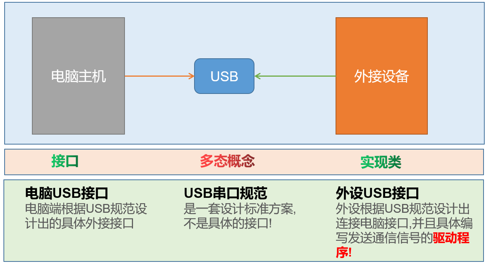
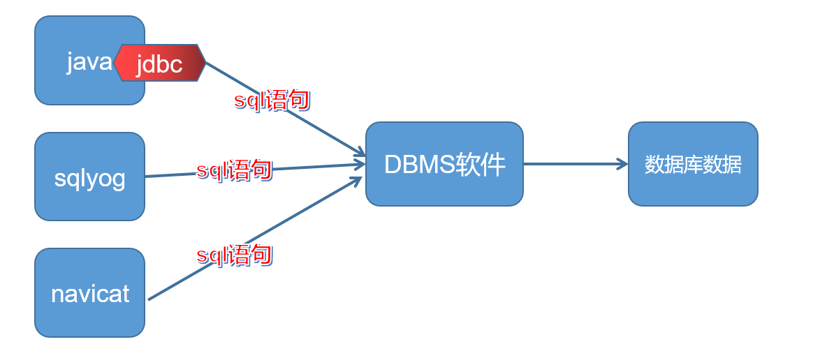
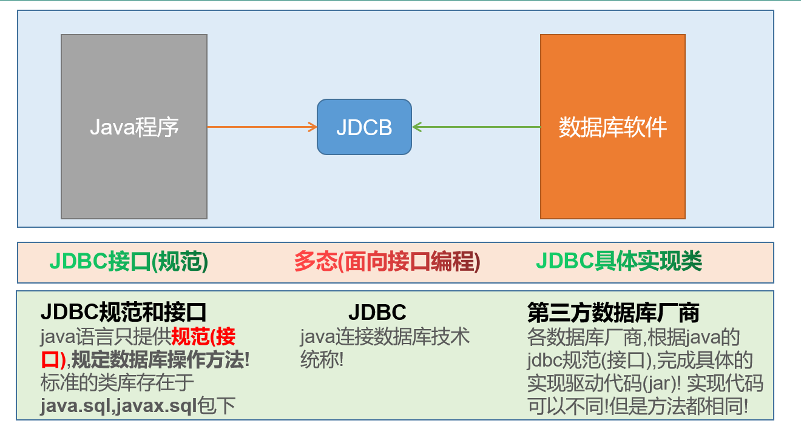
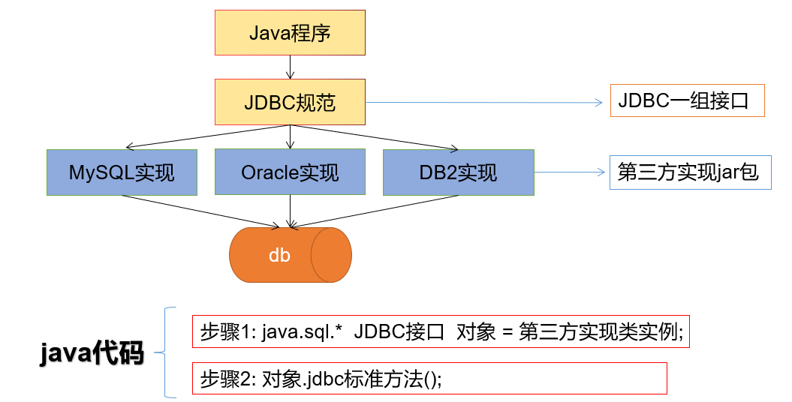
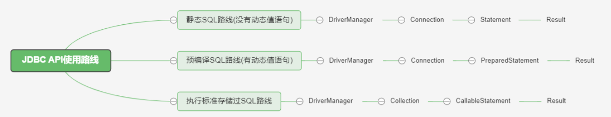
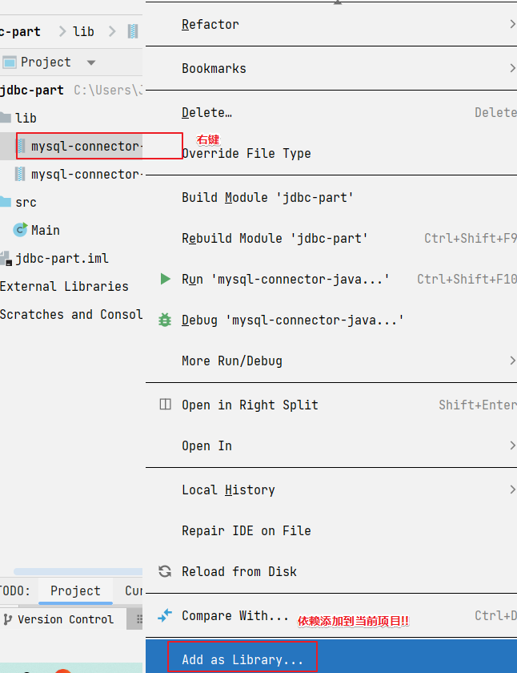

# JDBC

[网页教材点击这里](https://www.wolai.com/atguigu/dEhsfqP4RazGM2fr2wpSeX)

## 基本知识

### 技术概念理解

Java和数据库连接的手段

1. jdbc是(Java Database Connectivity)单词的缩写,翻译为java连接数据库
2. jdbc是java程序连接数据库的**技术统称**
3. jdbc由**java语言的规范(接口)**和**各个数据库厂商的实现驱动(jar)组成**
4. **jdbc是一种典型的面向接口编程**
5. jdbc优势
   1. 只需要学习jdbc规范接口的方法,即可操作**所有的数据库软件**
   2. 项目中期切换数据库软件,只需要更换对应的数据库驱动jar包,不需要更改代码



JDBC：Java Database Connectivity | Java **连接数据库技术**!

通俗点说,在Java代码中,使用**JDBC**提供的方法**,可以**发送**字符串类型的**SQL**语句到**数据库管理软件**(MySQL,Oracle等),并且获取**语句执行结果!进而实现数据库数据CURD操作的技术!早期通过sqlyog这些客户端操纵DBMS，现在要直接通过Java发送SQL








### JDBC核心API以及使用路线

#### JDBC技术组成

1. 为了项目代码的可移植性，可维护性，SUN公司从最初就制定了Java程序连接各种数据

   > 为了项目代码的可移植性，可维护性，SUN公司从最初就制定了Java程序连接各种数据库的统一**接口规范**。这样的话，不管是连接哪一种DBMS软件，Java代码可以保持一致性。

2. 各个数据库厂商提供的驱动jar包

    > 因为各个数据库厂商的DBMS软件各有不同，那么内部如何通过sql实现增、删、改、查等管理数据，只有这个数据库厂商自己更清楚，因此把接口规范的实现交给各个数据库厂商自己实现。

    jar包是什么?

    > java程序打成的一种压缩包格式，你可以将这些jar包引入你的项目中，然后你可以使用这个java程序中类和方法以及属性了!

#### 涉及具体核心类和接口

- DriverManager
  1. 将第三方数据库厂商的实现驱动jar注册到程序中
  2. 可以根据数据库连接信息获取connection

- Connection

  - 和数据库建立的连接,在连接对象上,可以多次执行数据库curd动作

  - 可以获取statement和 preparedstatement,callablestatement对象

- Statement | **PreparedStatement** | CallableStatement

  - 具体发送SQL语句到数据库管理软件的对象

  - 不同发送方式稍有不同! **preparedstatement **使用为重点!

- Result

  - **面向对象思维的产物**(抽象成数据库的查询结果表)

  - 存储DQL查询数据库结果的对象

  - 需要我们进行解析,获取具体的数据库数据



## 全新JDBC核心API

###引入mysql-jdbc驱动jar

1. 驱动jar版本选择

     我们选择版本 8.0.27版本

|             |              |                                                   |
| ----------- | ------------ | ------------------------------------------------- |
| mysql版本   | 推荐驱动版本 | 备注                                              |
| mysql 5.5.x | 5.0.x        | com.mysql.jdbc.Driver                             |
| mysql 5.7.x | 5.1.x        | com.mysql.jdbc.Driver                             |
| msyql 8.x   | 8.0.x        | 建议: 8.0.25+省略时区设置com.mysql.cj.jdbc.Driver |

2. java工程导入依赖
    1. 项目创建lib文件夹
    2. 导入驱动依赖jar包
    3. jar包右键-添加为项目依赖

        


.jar就是依赖驱动的jar包(有驱动功能)，下面的压缩包是jar包的源码包(可以查看源码和注释)

### jdbc使用步骤分析(6步)

1. **注册驱动** 

   安装依赖的jar包，允许远程连接

2. **建立连接 connection**

3. **创建发送sql语句对象** 

   创建发送SQL语句对象statement

4. **发送sql语句，并获取返回结果**

   statement对象(小汽车)，发送SQL语句到数据库并获取返回结果，获取resultset结果对象(把数据拉回来)

5. **结果集解析**

6. **销毁资源**

   需要先关闭连接，再释放statement对象，再释放resultset对象

```mysql
​```SQL
/**
 * @Author 赵伟风
 * Description: 利用jdbc技术,完成用户数据查询工作
 *
 * TODO: 步骤总结 (6步)
 *    1. 注册驱动
 *    2. 获取连接
 *    3. 创建statement
 *    4. 发送SQL语句,并获取结果
 *    5. 结果集解析
 *    6. 关闭资源
 */
public class JdbcBasePart {

    public static void main(String[] args) throws SQLException {

        //1.注册驱动
        /**
         * TODO: 注意
         *   Driver -> com.mysql.cj.jdbc.Driver
         */
        DriverManager.registerDriver(new Driver());

        //2.获取连接
        /**
         * TODO: 注意
         *   面向接口编程
         *   java.sql 接口 = 实现类
         *   connection 使用java.sql.Connection接口接收
         */
        Connection connection = DriverManager.getConnection("jdbc:mysql://localhost:3306/atguigu",
                "root",
                "root");

        //3.创建小车
        Statement statement = connection.createStatement();

        //4.发送SQL语句
        String sql = "select id,account,password,nickname from t_user ;";
        ResultSet resultSet =  statement.executeQuery(sql);

        //5.结果集解析
        while (resultSet.next()){
            int id = resultSet.getInt("id");
            String account = resultSet.getString("account");
            String password = resultSet.getString("password");
            String nickname = resultSet.getString("nickname");
            System.out.println(id+"::"+account+"::"+password+"::"+nickname);
        }

        //6.关闭资源  【先开后关】
        resultSet.close();
        statement.close();
        connection.close();

    }

}
```

