`

# Java基础

[toc]

## 基本常识

### 工程，模块，包和类

结构如下

* 工程
  * 模块
    * 包
      	* 类

**工程(project)**


**包(packet)**

在src文件下面右键创立package，package中有.java文件，各种类，接口

**类(class)**

在package底下就可以创建类了，我们在类里面写属性、方法

**模块(module)**

如果想要在这个工程的平行的再建立一个工程，可以右键打开我们的工程存放的文件夹，然后新建module就可以

**关系**

* 一个包下面的资源都是共享的（除非是private），不同包下的资源相互使用的时候，需要引入包

  引入包：import

* 不同的项目之间的资源是不共享的

### 各种文件

#### out 文件

存放javac编译后的字节码的

#### .idea文件

这个是编译的配置文件，编译的内容包括可以控制编译之后的类的位置，工作空间的相关配置，库的配置，编码配置和其他的插件配置等等。如果没有这个配置文件，程序就很难正常的跑起来，即使环境是配置良好的。

##基本语法

### 背景

####Java技术平台

1. Java SE （Java Standard Edition） 标准版

   支持面向**桌面级应用**（如Windows 下的应用程序）的 Java 平台，提供了完整的 Java 核
   心 API ，此版本以前称为 J2SE

2. Java EE    (Java Enterprise Edition) 企业版

   是为开发企业环境下的应用程序提供的一套解决方案。该技术体系中包含的技术如
   Servlet 、 Jsp 等，**主要针对于 Web 应用程序开发**。版本以前称为 J2EE

3. Java ME(Java Micro Edition) 小型版

   支持Java 程序运行在移动终端（手机、 PDA ）上的平台

#### 跨平台

因为JVM


#### 核心机制

1. Java 虚拟机 (Java Virtal Machine）

   

   

2. 垃圾收集机制 (Garbage Collection）

#### 环境配置


**简单而言，使用JDK 的开发工具完成的 java 程序，交给 JRE 去运行。**

* JDK (Java Development Kit）

   Java 开发工具包 包括了JRE

* JRE (Java Runtime Environment)

   Java 运行环境 包括JVM和各种库

  运行只要有JRE就行

* 环境变量 

  path： windows 系统执行命令时要搜寻的路径。正常来说，执行一个程序，需要进入程序所在的目录，设置环境变量，可以全局执行程序

  

  windows中的查找规则就是首先在当前目录中查找，没有，就在环境变量中查找

* Javac

  编译时使用

* Java

  运行时使用

* Javadoc 

  网页文档

###程序如何执行？

1. 把Java代码编写到.java文件中 (使用记事本)

   

2. 通过 javac 命令对该 java 文件进行编译 （使用命令行 + javac）

   切换文件目录

   

   注意：class的文件名要和代码中一致

   

   

3. 通过 java 命令对生成的 class 文件进行运行, 在这一步，可以通过cmd向main函数传参


### 文档注释（Java特有）

格式：/**
		@author 指定java程序的作者
		@version 指定源文件的版本
*/

注释内容可以被JDK提供的工具javadoc所解析，生成一套以网页文件形式体现的该程序的说明文档。单行多行注释不可以被javadoc解析

### 变量的分类


成员变量：在方法体外，类体内声明的变量

局部变量：在方法体内部声明的变量

成员变量是在对象创建以后存在于堆中，对象回收时，成员变量消失
局部变量是在方法被调用时存在于栈中，方法调执行结束，从栈中清除

成员变量：随对象的创建而创建，对象回收时，成员变量消失
局部变量：随着方法的调用被创建，方法执行结束后，从栈中清除

### Java命名规范

包名 ：多单词组成时所有字母都小写 xxxyyyzzz
类名、接口名 ：多单词组成时，所有单词的首字母大写 XxxYyyZzz
变量名、方法名 ：多单词组成时，第一个单词首字母小写，第二个单词开始每个单词首字母大写： xxxYyyZzz
常量名 ：所有字母都大写。多单词时每个单词用**下划线**连接 XXX_YYY_ZZZ

### 关键字和保留字

Java中的关键字都是小写的

保留字：goto和const

### 标识符

严格区分大小写，数字不能作为开头，不包含空格

### 基本数据类型

#### 整型和浮点型


java 的整型常量默认为 int 型，声明 long 型常量须后加‘ l’ 或‘ L’
Java 的浮点型常量默认为 double 型 声明 float 型常量，须后加‘ f’ 或‘ F’ 

#### 字符型

char：1字符 = 2字节

Java 中的所有字符都使用 Unicode 编码, 故一个字符可以存储一个字母，一个汉字，或其他书面语的一个字符

字符型变量的三种表现形式:

1. 字符常量是用单引号括起来的单个字符。 例如： char c1 = 'a'; char c2 = '中';
2. Java 中还允许使用转义字符‘ ‘\\’来 将其后的字符转变为特殊字符型常量。例如： char c3 = ‘ \n';
3. 直接使用 **Unicode** 值来表示字符型常量：'\uXXXX', 其中， '\uXXXX' 代表一个十六进制整数。如：\u000a 表示 \n ;

char类型是可以进行运算的。因为它都对应有Unicode码

#### 布尔型

1. 不可以使用0或非 0 的整数替代false和true，这点和C语言不同

2. 在编译之后都使用java虚拟机中的int数据类型来代替：true用1表示，false用0表示

### 数据类型转换

#### 自动类型转换

容量小的类型自动转换为容量大的数据类型。数据类型按容量大小排序为：


注意

1. 有多种类型的数据混合运算时，系统首先自动将所有数据转换成容量最大的那种数据类型，然后再进行计算
2. byte,short,char之间不会相互转换，他们三者在计算时首先转换为int类型
3. boolean类型不能与其它数据类型运算
4. **当把任何基本数据类型的值和字符串(String)进行连接运算时(+)，基本数据类型的值将自动转化为字符串(String)类型**

例子


#### 强制类型转换

* 将容量大的数据类型转换为容量小的数据类型，使用时要加上强制转换符：()，但可能造成精度降低或溢出,格外要注意

* 通常，字符串不能直接转换为基本类型，但通过基本类型对应的包装类则可以实现把字符串转换成基本类型
* boolean类型不可以转换为其它的数据类型


### 运算符

“+”除字符串相加功能外，还能把非字符串转换成字符串.例如：System.out.println(“5+5=”+5+5); //打印结果： 5+5=55 

#### instanceof 

检查是否是类的对象

```java
if("ellie" instanceof String)
            System.out.println("YES");
else
            System.out.println("No");
```

#### 逻辑运算符


* “&”和“&&”的区别：
  单&时，左边无论真假，右边都进行运算；
  双&时，如果左边为真，右边参与运算，如果左边为假，那么右边不参与运算。

#### 位运算符

**位运算是直接对整数的二进制进行的运算**


右移和无符号右移的区别：


### 数组

* 数组一旦初始化，其长度是不可变的

* 每个数组都有一个属性length指明它的长度，例如：a.length 指明数组a的长度(元素个数)

* 数组是引用类型，它的元素相当于类的成员变量，因此数组一经分配空间，其中的每个元素也被按照成员变量同样的方式被隐式初始化

* 对于基本数据类型而言，默认初始化值各有不同
  对于引用数据类型而言，默认初始化值为null (注意与0不同)

* 比如 int[] arr = new int{3,4,5}; 这里arr就是指向堆区中分配3，4，5元素的首地址的指针

  

#### 声明方式

type var [] 或 type[] var

注意：**Java 语言中声明数组时不能指定其长度** 数组中元素的数 例如： int a[5]; 非法

#### 初始化

* 动态初始化

  数组声明且为数组元素分配空间 与 赋值的操作 分开进行

  ```java
  int[] arr = new int[3];
  arr[0] = 3;
  arr[1] = 9;
  arr[2] = 8;
  ```

  

* 静态初始化

  在定义数组的同时就为数组元素分配空间并赋值

  ```java
  int arr[] = new int[]{3, 9, 8};
  int[] arr = {3,9,8};
  String names[] = {"ellie", "joel"};
  ```

#### 二维数组

内存解析


* 动态初始化 

  **int\[][] arr = new int \[3][2];**

  定义了名称为arr的二维数组
  二维数组中有3个一维数组
  每一个一维数组中有2个元素
  一维数组的名称分别为arr[0], arr[1], arr[2]
  给第一个一维数组1脚标位赋值为78写法是：arr\[0][1] = 78;

  **int\[][] arr = new int\[3][];**

  二维数组中有3个一维数组
  每个一维数组都是默认初始化值null (注意：区别于格式1）可以对这个三个一维数组分别进行初始化

  arr[0] = new int[3];    arr[1] = new int[1];   arr[2] = new int[2];

  **int\[][] arr = new int\[][3];  //非法**

* 静态初始化

  **int\[][] arr = new int\[][]{{3,8,2},{2,7},{9,0,1,6}};**

  定义一个名称为arr的二维数组，二维数组中有三个一维数组每一个一维数组中具体元素也都已初始化
  第一个一维数组 arr[0] = {3,8,2};
  第二个一维数组 arr[1] = {2,7};
  第三个一维数组 arr[2] = {9,0,1,6};
  第三个一维数组的长度表示方式：arr[2].length

  * **注意特殊写法情况：int[] x,y[]; x是一维数组，y是二维数组。**
  * **Java中多维数组不必都是规则矩阵形式**

#### 数组中的常见异常


**编译时，不报错**

### 零碎

* 一个源文件中最多只能有一个public类。其它类的个数不限，如果源文件包含一个public类，则文件名必须按该类名命名

* Java中定义成员变量时采用合法的 前向引用

  ```java
  public class Test{
  	int num1 = 12;
  	int num2 = num1 + 2;
  }
  错误形式：
  public class Test{
  	int num2 = num1 + 2
  	int num1 = 12;
  }
  
  ```

  

* switch( 表达式）中 表达式的值 必须 是下述几种类型之一： byte short char int 枚举 (jdk String (jdk 7.0)

  case 子句中的值必须是常量

  ```Java
  String season = "summer";
  switch (season){
              case "spring":
                  System.out.println("Ellie");
                  break;
              case "summer":
                  System.out.println("Joel");
                  break;
              default:
                  System.out.println("Wolf");
   }
  ```

  

* 什么是Unicode？

  一种编码，将世界上所有的符号都纳入其中。每一个符号都给予一个独一无二的编码，使用 Unicode 没有乱码的问题

* 为什么会产生乱码？

  乱码：世界上存在着多种编码方式，**同一个二进制数字可以被解释成不同的符号**。因此，要想打开一个文本文件，就必须知道它的编码方式，否则用错误的编码方式解读，就会出现乱码 。

* UTF_8

  互联网上使用最广的**一种 Unicode 的实现方式**，变长的编码方式。它可以使用 1-6 个字节表示一个符号，根据不同的符号而变化字节长度。


## 面向对象

### 基本概念

#### 属性（成员变量）

修饰符 数据 类型 属性 名 = 初始化值 ;

在方法体外，类体内声明的变量

```java
private int age;
```


**在堆或静态域中！！！**

前面可以有修饰符

#### 局部变量

在方法体内部声明的变量

栈区或静态区域内

**前面没有修饰符**

#### 方法（函数）

行 为：对应类中的成员方法（方法就是函数）

方法前面有修饰符

##### 可变参数形参

```java
public static void test(int a ,String…books);//基本语法

public class OOPTest {//例子
    public static void main(String[] args) {
        String[] arr = {"ellie", "joel"};
        test(arr);
        test("joel","ellie");
        test(new String[]{"joel", "ellie"});
    }
    public static void test(String...arg){
        for (int i = 0; i != arg.length; ++i){
            System.out.println(arg[i]);
        }
    }
}
```

可变参数方法的使用与方法参数部分使用数组是一致的

方法的参数部分有可变形参，需要放在形参声明的最后

##### 参数传递

Java里方法的参数传递方式只有一种： 值传递

* 形参是基本数据类型：将实参基本数据类型变量的“数据值”传递给形参

* 形参是引用数据类型：将实参引用数据类型变量的“地址值”传递给形参


**Java里的方法不能独立存在，所有的方法必须定义在类里**


### 类的基本语法格式

堆区：此内存区域的唯一目的就是**存放对象实例**，虚拟机规范中的描述是：所有的
对象实例**以及数组**都要在堆上分配

栈区：自动释放

方法区：用于存储已被虚拟机加载的类信息 、 常量 、 静态变量 、 即时编译器编译后的代码等数据 


### 对象的内存解析


### 类与类之间的关系

1. 依赖关系（Dependency）

   对象之间最弱的一种关联方式，是临时性的关联。代码中一般指由局部变量、函数参数、返回值建立的对于其他对象的调用关系。 

   

2. 关联关系（Association）

   对象之间一种引用关系，比如客户类与订单类之间的关系。这种关系通常使用类的属性表达。

   关联表示类之间的“持久”关系，这种关系一般表示一种重要的业务之间的关系，需要保存的，或者说需要“持久化”的，或者说需要保存到数据库中的。

   

3. 聚合（Aggregation）

   聚合（关联关系的一种）：表示has - a的关系。

   ```java
   Class Car{
       private Engine engine;//引擎 
       private Tyre[] tyres;//轮胎 
   }
   ```

   

4. 组合（Composite） 

   表示contains - a的关系，是一种强烈的包含关系。组合类负责被组合类的生命周期。

   ```java
   class Window{ 
       private Menu menu;//菜单 
       private Slider slider;//滑动条 
       private Panel panel;//工作区
   }
   ```

   

5. 继承（Generalization，又称为泛化，is-a 的关系） 

   

   

### 封装继承多态

#### 封装

隐藏细节，使用方法来访问数据

**四种访问权限修饰符以及权限（类成员前面的）**


四种权限都可以用来修饰类的内部结构：属性，方法，构造器和内部类

修饰类的话，只能使用：default或者public

#### 继承

**基本知识**

* 子类中继承了父类的方法和变量，但是不能访问父类中的私有成员变量和方法
* Java中不允许多重继承


**Overwrite（方法的重写）**

* 定义

  在子类中可以根据需要对从父类中继承来的方法进行改造，也称为方法的重置、覆盖。在程序执行时，子类的方法将**覆盖**父类的方法

* 要求

  1.	子类重写的方法必须和父类被重写的方法具有相同的方法名称、参数列表
  2.	子类重写的方法的返回值类型不能大于父类被重写的方法的返回值类型（返回值类型更严格）
  3.	子类重写的方法使用的访问权限不能小于父类被重写的方法的访问权限（访问权限更宽松）
  	子类不能重写父类中声明为private权限的方法
  4.	子类方法抛出的异常不能大于父类被重写方法的异常

* 注意

  子类与父类中同名同参数的方法必须同时声明为非static的(即为重写)，或者同时声明为static的（不是重写）。**因为static方法是属于类的**，子类无法覆盖父类的方法。


**注意**

```java
public Circle(double radius, String color, double weight) {
   super(color, weight);
   this.radius = radius;
}
```

要把子类特有的属性放在构造器参数的前面

#### 多态

多态性：父类的引用指向子类的对象

Java**引用变量**有两个类型：**编译时类型**和**运行时类型**。编译时类型由声明该变量时使用的类型决定，运行时类型由实际赋给该变量的对象决定。简称：编译时，看左边；运行时，看右边

若编译时类型和运行时类型不一致，就出现了对象的多态性

**成员变量不具有多态性！**

一个例子：比如有继承关系：Animal - Wolf - BabyWolf

```java
Creature[] arr = new Creature[]{new Animal(), new Wolf(), new Animal(), new BabyWolf()};
        for(int i = 0; i < arr.length; ++i){
            if(arr[i] instanceof BabyWolf){
                System.out.println("No." + i + " is a BabyWolf");
            }
            else if(arr[i] instanceof Wolf){
                System.out.println("No." + i + " is a Wolf");
            }
            else
                System.out.println("No." + i + " is a Animal");
        }
```


**虚拟方法调用**


**重载和重写**


**对象类型转换**

Java对象的强制类型转换称为造型

* 从子类到父类的类型转换可以自动进行
  从父类到子类的类型转换必须通过造型(强制类型转换)实现
  无继承关系的引用类型间的转换是非法的
  在造型前可以使用instanceof操作符测试一个对象的类型

**和c++一模一样！**

必看的图


* 若子类重写了父类**方法**，就意味着子类里定义的方法彻底覆盖了父类里的同名方法，系统将不可能把父类里的方法转移到子类中

* 对于**实例变量**则不存在这样的现象，即使子类里定义了与父类完全相同的实例变量，这个实例变量依然不可能覆盖父类中定义的实例变量

### 构造器 (Constructor)

* 不能被 static 、 final 、 synchronized 、 abstract 、 native 修饰，不能有return 语句返回值

* 前面有修饰符
* 默认构造器的修饰符和所属类的修饰符一致
* 一旦显示提供构造器，系统不再提供默认构造器
* 可以创建多个重载的构造器
* 父类的构造器不能被子类继承

语法格式：

```java
public class Animal {
	private int legs;
	//构造器
	public Animal() {
    	legs = 4;
	}
	public void setLegs( int i )
		legs = i;
	}
	public int getLegs() {
		return legs;
	}
}
```

**JavaBean**

一种Java语言写成的可重用组件

所谓javaBean，是指符合如下标准的Java类：

1. 类是公共的
2. 有一个无参的公共的构造器
3. 有属性，且有对应的get、set方法

**UML类图**


#### 关键字this

* 它在方法内部使用，即这个方法所属对象的引用

* 它在构造器内部使用，表示该构造器正在初始化的对象

* 使用 this 访问属性和方法时，如果在本类中未找到，会从父类中查找

* **this可以作为一个 类中构造器相互调用的特殊格式**

  "this(形参列表)"必须声明在类的构造器的首行！

  在类的一个构造器中，最多只能声明一个"this(形参列表)"

  

#### 构造器调用顺序综合

```java
package com.atguigu.java3;
//总结：由父及子，静态先行
class Root{
	static{
		System.out.println("Root的静态初始化块");
	}
	{
		System.out.println("Root的普通初始化块");
	}
	public Root(){
		super();
		System.out.println("Root的无参数的构造器");
	}
}
class Mid extends Root{
	static{
		System.out.println("Mid的静态初始化块");
	}
	{
		System.out.println("Mid的普通初始化块");
	}
	public Mid(){
		super();
		System.out.println("Mid的无参数的构造器");
	}
	public Mid(String msg){
		//通过this调用同一类中重载的构造器
		this();
		System.out.println("Mid的带参数构造器，其参数值："
			+ msg);
	}
}
class Leaf extends Mid{
	static{
		System.out.println("Leaf的静态初始化块");
	}
	{
		System.out.println("Leaf的普通初始化块");
	}	
	public Leaf(){
		//通过super调用父类中有一个字符串参数的构造器
		super("尚硅谷");
		System.out.println("Leaf的构造器");
	}
}
public class LeafTest{
	public static void main(String[] args){
		new Leaf(); 
		System.out.println();
		new Leaf();
	}
}

//输出
Root的静态初始化块
Mid的静态初始化块
Leaf的静态初始化块
Root的普通初始化块
Root的无参数的构造器
Mid的普通初始化块
Mid的无参数的构造器
Mid的带参数构造器，其参数值：尚硅谷
Leaf的普通初始化块
Leaf的构造器

Root的普通初始化块
Root的无参数的构造器
Mid的普通初始化块
Mid的无参数的构造器
Mid的带参数构造器，其参数值：尚硅谷
Leaf的普通初始化块
Leaf的构造器


```

静态代码块和数据在编译的时候就完成执行了，NEW是运行时执行的，意味着运行时和静态代码块没关系

```java
package com.atguigu.java3;

class Father {
   static {
      System.out.println("11111111111");
   }
   {
      System.out.println("22222222222");
   }

   public Father() {
      System.out.println("33333333333");

   }

}

public class Son extends Father {
   static {
      System.out.println("44444444444");
   }
   {
      System.out.println("55555555555");
   }
   public Son() {
      System.out.println("66666666666");
   }


   public static void main(String[] args) { // 由父及子 静态先行
      System.out.println("77777777777");
      System.out.println("************************");
      new Son();
      System.out.println("************************");
      new Son();
      System.out.println("************************");
      new Father();
   }

}
//输出
11111111111
44444444444
77777777777
************************
22222222222
33333333333
55555555555
66666666666
************************
22222222222
33333333333
55555555555
66666666666
************************
22222222222
33333333333
```


### 代码块 (Code Blocks)

对 Java的类或对象进行初始化

#### 分类

一个类中代码块若有修饰符，则只能被static修饰，称为**静态代码块(static block)**，没有使用static修饰的，为**非静态代码块**

* 静态代码块：用static 修饰的代码块

  1.	可以有**输出**语句。
  2.	可以对类的属性、类的声明进行**初始化**操作。
  3.	不可以对非静态的属性初始化。即：**不可以调用非静态的属性和方法。**
  4.	若有多个静态的代码块，那么按照从**上到下**的顺序依次执行。
  5.	静态代码块的执行要**先于非静态代码块**。
  6.	静态代码块随着**类**的加载而加载，且只执行一次。

  

* 非静态代码块：没有static修饰的代码块

  1.	可以有**输出**语句。
  2.	可以对类的属性、类的声明进行**初始化**操作。
  3.	除了调用非静态的结构外，**还可以**调用静态的变量或方法。
  4.	若有多个非静态的代码块，那么按照**从上到下**的顺序依次执行。
  5.	每次创建对象的时候，**都会**执行一次。且**先于构造器执行。**

  

**上图可以看出代码块优先于构造器！！！**

**static代码块通常用于初始化static的属性**

```java
class Person {
	public static int total;
	static {
		total = 100;
	}
	…… //其它属性或方法声明
}
```


### 接口 (interface）

#### 基本介绍

问：为什么要接口？

**因为Java中没有多重继承！**

一方面，有时必须从几个类中派生出一个子类，继承它们所有的属性和方法。但是，Java不支持多重继承。有了接口，就可以得到多重继承的效果

另一方面，有时必须从几个类中抽取出一些共同的行为特征，而它们之间又没有is-a的关系，仅仅是具有相同的行为特征而已。例如：鼠标、键盘、打印机、扫描仪、摄像头、充电器、MP3机、手机、数码相机、移动硬盘等都支持USB连接

接口就是规范，定义的是一组规则，体现了现实世界中“如果你是/要...则必须能...”的思想。继承是一个"是不是"的关系，而接口实现则是 "能不能" 的关系


**定义**

接口(interface)是抽象方法和常量值定义的集合

**接口的特点**

核心：

**接口和类是并列关系，或者可以理解为一种特殊的类。**从本质上讲，接口是一种特殊的抽象类，这种抽象类中只包含常量和方法的定义(JDK7.0及之前)，而没有变量和方法的实现

**接口和实现类不是继承关系，但类似继承关系**

1. 用interface来定义。

2. 接口中的所有**成员变量**都默认是由**public** static final修饰的。

3. 接口中的所有**抽象方法**都默认是由**public** abstract修饰的。

4. 接口中没有构造器。

5. 接口采用多继承机制。

6. 一个类可以实现多个接口，接口也可以继承其它接口

7. 实现接口的类中必须提供接口中所有方法的具体实现内容，方可实例化。否则，仍为抽象类

8. 接口的主要用途就是被 实现类 实现（面向接口编程）

9. 接口与实现类之间存在多态性

10. 与继承关系类似，接口与实现类之间存在多态性

11. **接口中不能有函数体，除非default**

    ```java
    interface Father{
    	public void help();
    }
    interface Father{
    	default public void help(){
            sout("....");
        }
    }	
    
    ```

    


定义Java类的语法格式：先写extends，后写implements

```java
class SubClass extends SuperClass implements InterfaceA{}
```


#### 	接口和抽象类的对比


**注意上述代码是如何解决菱形继承问题的**

**注意.super和.this是每个类的成员（除了object）！**

#### Java 8中接口的改进

Java 8中，你可以为接口添加**静态方法和默认方法**。从技术角度来说，这是完全合法的，只是它看起来违反了接口作为一个抽象定义的理念

**静态方法**：使用 **static** 关键字修饰。可以通过接口直接调用静态方法，并执行其方法体。我们经常在相互一起使用的类中使用静态方法。你可以在标准库中找到像Collection/Collections或者Path/Paths这样成对的接口和类

**默认方法**：默认方法使用 **default** 关键字修饰。可以通过实现类对象来调用。我们在已有的接口中提供新方法的同时，还保持了与旧版本代码的兼容性。比如：java 8 API中对Collection、List、Comparator等接口提供了丰富的默认方法。

**补充**：访问父类和接口的方法

```java
package com.atguigu.java1;

interface A {
   int x = 0;
}

class B {
   int x = 1;
}

class C extends B implements A {
   public void pX() {
      //编译不通过。因为x是不明确的
      // System.out.println(x);
      System.out.println(super.x);//1
      System.out.println(A.x);//0
      
   }

   public static void main(String[] args) {
      new C().pX();
   }
}
```


上面没有调用，也不能调用接口的构造器 （接口没有构造器)！new用在接口上不太一样，后面加花括号这种写法，**实际是new了一个实现接口的匿名类，并用那个匿名类构造出一个对象。开发人员需要在匿名类内部（花括号内）实现你那个接口**


```java

 public class InnerClassTest {
	/*
	 * 在局部内部类的方法中（比如：show）如果调用局部内部类所声明的方法(比如：method)中的局部变量(比如：num)的话,
	 * 要求此局部变量声明为final的。！！！！！！！！！显然不能改变num的值
	 * 
	 * jdk 7及之前版本：要求此局部变量显式的声明为final的
	 * jdk 8及之后的版本：可以省略final的声明
	 * 
	 */
	public void method(){
		//局部变量
		int num = 10;
		class AA{
			public void show(){
//				num = 20;
				System.out.println(num);
				
			}
		}
	}
}
```


### 内部类 (Inner Class）

#### 基本

在Java中，允许一个类的定义位于另一个类的内部，前者称为内部类，后者称为外部类

**分类**

成员内部类（static成员内部类和非static成员内部类）

局部内部类（不谈修饰符）、匿名内部类

**成员内部类作为类的成员的角色**

* 和外部类不同，Inner class还可以声明为private或protected；
* 可以调用外部类的结构
* Inner class 可以声明为static的，但此时就不能再使用外层类的非static的成员变量；

**成员内部类作为类的角色**

* 可以在内部定义属性、方法、构造器等结构
* 可以声明为abstract类 ，因此可以被其它的内部类继承
* 可以声明为final的
* 编译以后生成OuterClass$InnerClass.class字节码文件（也适用于局部内部类）

**注意**

1.	非static的成员内部类中的成员不能声明为static，只有在外部类或static的成员内部类中才可声明static成员
2.	外部类访问成员内部类的成员，需要“内部类.成员”或“内部类对象.成员”的方式
3.	成员内部类可以直接使用外部类的所有成员，**包括私有的数据**
4.	当想要在外部类的静态成员部分使用内部类时，可以考虑内部类声明为静态的
5.	外部类和内部类编译后形成各自的字节码文件


**看下面, 静态内部类用外部类名调用，非静态内部类用外部对象调用**


```java
class Person{
	
	String name = "小明";
	int age;
	
	public void eat(){
		System.out.println("人：吃饭");
	}
	
	
	//静态成员内部类
	static class Dog{
		String name;
		int age;
		
		public void show(){
			System.out.println("卡拉是条狗");
//			eat();
		}
		
	}
	//非静态成员内部类
	class Bird{
		String name = "杜鹃";
		
		public Bird(){
			
		}
		
		public void sing(){
			System.out.println("我是一只小小鸟");
			Person.this.eat();//调用外部类的非静态属性
			eat();
			System.out.println(age);
		}
		
		public void display(String name){
			System.out.println(name);//方法的形参
			System.out.println(this.name);//内部类的属性
			System.out.println(Person.this.name);//外部类的属性
		}
	}
	
public class InnerClassTest {
	public static void main(String[] args) {
		
		//创建Dog实例(静态的成员内部类):
		Person.Dog dog = new Person.Dog();
        //为什么不可以Person.Dog dog = new Person().new Dog()?因为Dog类是静态数据，意味着不能被对象访问,而需要通过类名访问
		dog.show();
		//创建Bird实例(非静态的成员内部类):
//		Person.Bird bird = new Person.Bird();//错误的
		Person p = new Person();
		Person.Bird bird = p.new Bird();
		bird.sing();
		
	}
}
```


#### 局部内部类


**如何使用局部内部类**

* 只能在声明它的方法或代码块中使用，而且是先声明后使用。除此之外的任何地方都不能使用该类
* 但是它的对象可以通过外部方法的返回值返回使用，返回值类型只能是局部内部类的父类或父接口类型

注意

1. 内部类仍然是一个独立的类，在编译之后内部类会被编译成独立的.class文件，但是前面冠以外部类的类名和$符号，以及数字编号。
2. 只能在声明它的方法或代码块中使用，而且是先声明后使用。除此之外的任何地方都不能使用该类。
3. 局部内部类可以使用外部类的成员，**包括私有的**。
4. 局部内部类可以使用外部方法的局部变量，**但是必须是final的**。由局部内部类和局部变量的声明周期不同所致。
5. 局部内部类和局部变量地位类似，**不能使用public,protected,缺省,private**
6. 局部内部类**不能使用static修饰，因此也不能包含静态成员**

#### 匿名内部类

匿名内部类不能定义任何静态成员、方法和类，只能创建匿名内部类的一个实例。**一个匿名内部类一定是在new的后面，用其隐含实现一个接口或实现一个类。**


匿名内部类的特点：

* 匿名内部类必须继承父类或实现接口
* 匿名内部类只能有一个对象
* 匿名内部类对象只能使用多态形式引用


### 各种关键字

#### packet，import

**packet:**

存在默认的包


package语句作为Java源文件的第一条语句，指明该文件中定义的类所在的包。(若缺省该语句，则指定为无包)。它的格式为：
package 顶层包名.子包名 

每"."一次，就是一层文件目录

同一个包下，接口，类的名称必须是唯一的


**上面这个包，每个点都是一层目录！！！**

包对应于文件系统的目录，package语句中，用 “.” 来指明包(目录)的层次；
包通常用小写单词标识。通常使用所在公司域名的倒置：com.atguigu.xxx


**包的作用**

1. 解决类命名冲突的问题
2. 控制访问权限
3. 包可以包含类和子包，划分项目层次，便于管理
4. 包帮助管理大型软件系统：将功能相近的类划分到同一个包中。比如：MVC的设计模式

**MVC(module view and controller)设计模式**

MVC是常用的设计模式之一，将整个程序分为三个层次：视图模型层，控制器层，与数据模型层


**import:**

import语句告诉编译器到哪里去寻找**类或接口**

语法格式：import 包名 . 类名


Tips

1. 声明在包的声明和类的声明之间
2. 举例：可以使用java.util.*的方式，一次性导入util包下所有的类或接口
3. 如果在代码中使用不同包下的同名的类。那么就需要使用类的全类名的方式指明调用的是哪个类
4. 如果已经导入java.a包下的类。那么如果需要使用a·包的子包下的类的话，仍然需要导入
5. import static组合的使用：调用指定类或接口下的静态的属性或方法

#### super

使用super来调用父类中的指定操作

* super可用于访问父类中定义的属性
* super可用于调用父类中定义的成员方法
* super可用于在子类构造器中调用父类的构造器


注意：

* 尤其当子父类出现同名成员时，可以用super表明调用的是父类中的成员
* **super的追溯不仅限于直接父类**
* super和this的用法相像，this代表本类对象的引用，super代表父类的内存空间的标识

**调用父类的构造器**

* 子类中所有的构造器默认都会访问父类中**空参数的构造器**

* 当父类中没有空参数的构造器时，子类的构造器必须通过this(参数列表)或者super(参数列表)语句指定调用本类或者父类中相应的构造器。同时，只能”二选一”，且必须放在构造器的首行
* 如果子类构造器中既未显式调用父类或本类的构造器，且父类中又没有无参的构造器，则编译出错


**子类对象实例化过程**

一句话概括，非常简单，就是正常函数的调用过程


上图中，箭头表示构造器之间的相互调用

#### native

使用 native 关键字说明这个方法是原生函数，也就是这个方法是**用 C/C++等非Java 语言实现**的，并且被编译成了 DLL，**由 java 去调用** 

#### static

可用 static 修饰 属性 、 方法 、 代码块 、 内部类

被修饰后的成员具备以下特点:

* 随着**类**的加载而加载
* 优先于对象存在
* 修饰的成员，被所有对象所共享
* 访问权限允许时，**不创建对象，就可以直接被类调用**

**类变量（class variable）**

类变量（类属性）由该类的所有实例共享


```java

```

内存解析**


注意：

* 在static方法内部只能访问类的static修饰的属性或方法，不能访问类的非static的结构
* 因为不需要实例就可以访问 static 方法，因此 static 方法内部不能有 this, 同理也不能有super
* static 修饰的方法不能被重写


#### main

由于 Java 虚拟机需要调用类的 main() 方法，所以该方法的访问权限必须是public，又因为 Java 虚拟机在执行 main() 方法时**不必创建对象**，所以该方法必须是 static 的，该方法接收一个 String 类型的数组参数，该数组中保存执行 **Java 命令**时传递给所运行的类的参数


#### final

在Java中声明**类、变量和方法**时，可使用关键字final来修饰,表示“最终的”

* final标记的类不能被继承

  ​		String类、System类、StringBuffer类

* final标记的方法不能被子类重写

  ​		比如：Object类中的getClass()

* final标记的变量(成员变量或局部变量)**即称为常量**。**名称大写，且只能被赋值一次**

  ​		final**标记的成员变量必须在声明时或在每个构造器中或代码块中显式赋值**，然后才能使用。
   	   final double MY_PI = 3.14;

* static final： 全局常量


#### abstract

一个类没有具体的实例，这样的类叫做抽象类

用abstract关键字来修饰一个类，这个类叫做抽象类

用abstract来修饰一个方法，该方法叫做抽象方法

```java
public abstract void talk();
```

含有抽象方法的类必须被声明为抽象类

抽象类不能被实例化。抽象类是用来被继承的，抽象类的子类必须重写父类的抽象方法，并提供方法体。若没有重写全部的抽象方法，仍为抽象类(类似c++)


Java允许类设计者指定：超类声明一个方法但不提供实现，该方法的实现由子类提供。

这样的方法称为抽象方法。有一个或更多抽象方法的类称为抽象类。


#### default

**为什么需要？**

当我们进行业务扩展时，需要在接口中新增方法。
如果新增的这个方法写成普通方法的话，那么需要在该接口所有的实现类中都重写这个方法。
如果新增的方法定义为`default`类型，就不需要在所有的实现类中全部重写该`default`方法，哪个实现类需要新增该方法，就在哪个实现类中进行实现。

**特点：**

- default方法可以有方法体
- 接口中的普通方法必须被实现类重写；
- **default方法可以不被实现类重写。**

**注意：**

- 如果一个实现类只实现了一个接口，那么可以不用重写接口中的默认方法
- 如果一个实现类实现了多个接口，并且这些接口中有两个接口的默认方法一样，那么就必须在实现类中重写
- 默认方法可以通过接口的实现对象直接调用，可以被接口的实现类重写

#### new

This code creates an anonymous inner class that extends or implements the class **or interface** "obj", and creates an instance of it, which is assigned to the variable "obj". 

```java
Object obj = new obj(){};
```

**Person.new = new Person**


### 静态变量和函数

#### 静态成员函数（静态方法）

只能访问静态成员变量，不然会报错

#### 为什么Integer.toString（）可以用？

因为toString（）方法是静态的，所以可以这样用，静态的方法属于类，而不属于对象

**类似于c++中的std::person::toString() ;**

而且，如果Person的age变量是静态的。所以下面的代码可以运行

```java
Person.age = 1;//c++中，则需要int Person::age = 1;
```


### 包装类（Wrapper）

为什么要包装类？Object是root类，但是基本数据类型独立于类体系，所以需要设计包装类，融入Object的继承体系（顺便一提，数组是引用数据类型，也属于Object继承体系中）

针对八种基本数据类型定义相应的引用类型—包装类（封装类）


**装箱**：把基本数据类型封装成包装类

```java
//通过包装类的构造器实现：
int i = 500;   Integer t = new Integer(i);
//还可以通过字符串参数构造包装类对象：
Float f = new Float(“4.56”);
Long l = new Long(“asdf”);  //NumberFormatException
```

**拆箱**：得包装类对象中包装的基本类型变量

```java
//调用包装类的.xxxValue()方法：
boolean b = bObj.booleanValue();
```

JDK1.5之后，支持自动装箱，自动拆箱。但类型必须匹配

**字符串转换成基本数据类型**

```java
//通过包装类的构造器实现：
int i = new Integer(“12”);
//通过包装类的parseXxx(String s)静态方法：
Float f = Float.parseFloat(“12.1”);

```

**基本数据类型转换成字符串**

```java
//调用字符串重载的valueOf()方法：
String fstr = String.valueOf(2.34f);
//or
String intStr = 5 + “”//这里调用了包装Integer的toString方法
```

**总结：基本类型、包装类与String类间的转换**

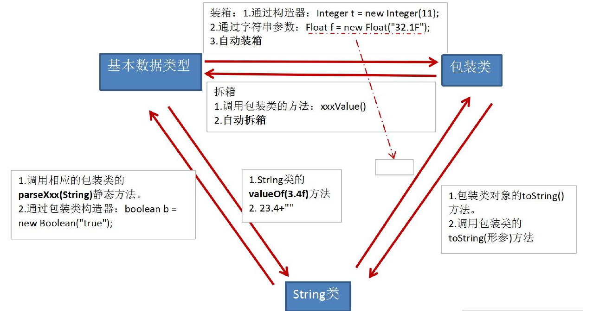

### 匿名对象

```java
new Person().shout();//可以使用匿名对象调用方法
```


### 匿名内部类

匿名内部类必须要继承一个父类或者实现一个接口，当然也仅能只继承一个父类或者实现一个接口

匿名内部类不能是抽象类，所以它必须实现父类中的所有抽象方法


* 匿名内部类中是**不能定义构造函数**的

* 匿名内部类中不**能存在任何的静态成员变量和静态方法**

* 匿名内部类为局部内部类，所以局部内部类的所有限制同样对匿名内部类生效

* 匿名内部类不能是抽象的，它必须要实现继承的类或者实现的接口的所有抽象方法
* 既然匿名内部类没有构造器，如何初始化？——**使用代码块！**


```java
new 父类构造器（参数列表）|实现接口（）  
    {  
     //匿名内部类的类体部分
```

```java
public abstract class Bird {
    private String name;

    public String getName() {
        return name;
    }

    public void setName(String name) {
        this.name = name;
    }
    
    public abstract int fly();
}

public class Test {
    
    public void test(Bird bird){
        System.out.println(bird.getName() + "能够飞 " + bird.fly() + "米");
    }
    
    public static void main(String[] args) {
        Test test = new Test();
        test.test(new Bird() {
            
            public int fly() {
                return 10000;
            }
            
            public String getName() {
                return "大雁";
            }
        });
    }
}
------------------
Output：
大雁能够飞 10000米
-----------------------------------
//上面的匿名内部类相当于
public class WildGoose extends Bird{
    public int fly() {
        return 10000;
    }
    
    public String getName() {
        return "大雁";
    }
}

WildGoose wildGoose = new WildGoose();
test.test(wildGoose);
-----------------------------------
Java详解匿名内部类
https://blog.51cto.com/u_15760883/5610456
```

test方法接受一个Bird类型的参数，但是一个抽象方法是没有办法new的，所以先用匿名内部类创建一个Bird实例


### 异常

unchecked and checked

unchecked: 不需要被处理

checked: 需要被处理


#### 类型

* Error

  Java虚拟机无法解决的严重问题。如：JVM系统内部错误、资源耗尽等严重情况。比如：StackOverflowError和OOM。一般不编写针对性的代码进行处理。

* Exception

  分为**编译时异常**和**运行时异常**

  **运行时异常**

  * 是指编译器不要求强制处置的异常。一般是指编程时的逻辑错误，是程序员应该积极避免其出现的异常。java.lang.RuntimeException类及它的子类都是运行时异常。
  * 对于这类异常，**可以不作处理**，因为这类异常很普遍，若全处理可能会对程序的可读性和运行效率产生影响

  **编译时异常**

  * 是指编译器要求必须处置的异常。即程序在运行时由于外界因素造成的一般性异常。**编译器要求Java程序必须捕获或声明所有编译时异常。**
  * 对于这类异常，如果程序不处理，可能会带来意想不到的结果

  ​    其它因编程错误或偶然的外在因素导致的一般性问题，可以使用针对性的代码进行处理。例如：

  1. 空指针访问
  2. 试图读取不存在的文件
  3. 网络连接中断
  4. 数组角标越界

#### 异常的处理


Java 程序的执行过程中如出现异常，会生成一个异常类对象。该异常对象将被提交给 Java 运行时系统，这个过程称为抛出( throw）异常

**异常对象的生成**

1. 由虚拟机自动生成：程序运行过程中，虚拟机检测到程序发生了问题，如果在当前代码中没有找到相应的处理程序，**就会在后台自动创建一个对应异常类的实例对象并抛出**——自动抛出
2. 由开发人员手动创建：Exception exception = new ClassCastException();——创建好的异常对象不抛出对程序没有任何影响，和创建一个普通对象一样

**异常处理机制一**

1. 如果一个方法内抛出异常，该异常对象会被抛给**调用者方法中**处理。如果异常没有在调用者方法中处理，它继续被抛给这个调用方法的**上层方法**。这个过程将一直继续下去，直到异常被处理。这一过程称为捕获(catch)异常
2. 如果一个异常回到main()方法，并且main()也不处理，则程序运行终止。
3. 程序员通常只能处理Exception，而对Error无能为力


**异常处理机制二**

声明抛出异常

如果一个方法(中的语句执行时)可能生成某种异常，但是并不能确定如何处理这种异常，则此方法应**显示地**声明抛出异常，表明该方法将不对这些异常进行处理，而由该方法的**调用者**负责处理


重写方法不能抛出比被重写方法范围更大的异常类型。在多态的情况下，对methodA()方法的调用-异常的**捕获**按父类声明的异常处理


**异常的捕获流程**


**捕获异常的有关信息**

* getMessage() 获取异常信息，返回字符串
* printStackTrace()  获取异常类名和异常信息，以及异常出现在程序中的位置。返回值void。


**注意**

1. RuntimeException类或是它的子类，这些类的异常的特点是：即使没有使用try和catch捕获，Java自己也能获，并且编译通过( 但运行时会发生异常使得程序运行终止 )
2. 如果抛出的异常是IOException等类型的非运行时异常，则必须捕获，否则编译错误。也就是说，我们必须处理**编译时异常**，将异常进行捕捉，转化为运行时异常


#### 手动抛出异常

Java异常类对象除在程序执行过程中出现异常时由系统自动生成并抛出，也可根据需要使用人工创建并抛出。

* 首先要生成异常类对象，然后通过throw语句实现抛出操作(提交给Java运行环境)

  ```java
  IOException e = new IOException(); 
  throw e;
  ```

  

* 可以抛出的异常必须是Throwable或其子类的实例。下面的语句在编译时将会产生语法错误

  ```java
  throw new String("want to throw");
  ```


#### 用户自定义异常类

* 一般地，用户自定义异常类都是**RuntimeException的子类**

* 自定义异常类通常需要编写几个**重载的构造器**

* 自定义异常需要提供**serialVersionUID**

* 自定义的异常通过throw抛出。
* 自定义异常最重要的是异常类的名字，当异常出现时，可以根据名字判断异常类型

用户自定义异常类MyException，用于描述数据取值范围错误信息。用户自己的异常类必须继承现有的异常类


### 注解(Annotations)

注解：元数据的一种形式


## 高级应用


## 各种工具类

### Arrays

java.util.Arrays类即为操作数组的工具类，包含了用来操作数组（比如排序和搜索）的各种方法。

java.util is a packet

Arrays 是这个包下的一个类

常用接口


### Object

所有Java类的根父类

如果在类的声明中未使用 extends 关键字指明其父类 则默认父类为 java lang Object 类

以c++的观点，这个类相当于提前把所有类的拷贝构造，赋值构造，重载给写好了


* ==

  引用类型比较引用 （是否指向**同一个对象**） ：只有指向**同一个对象**时才返回 true

* equal

  Object类中equal的定义

  ```java
  public boolean equal(Object obj){
      return （this == obj);
  }
  ```

  **如何重写equals方法**

  ```java
  //注意，实际开发中，也不会这样写，用getClass()
  class User{
      String name;
      int age;
      
     public boolean equal(Object obj){
      	if（this == obj) return true;
      	if(obj instanceof User){//为了使下面这条语句合法
              User u = (User)obj;
              return this.age == u.age && this.name.equals(u.name);
          }
         return false;
  	}
  }
  
  ```

  

  只能比较**引用类型**，其作用与==相同，比较是否指向同一个对象 。

  格式:obj1.equals(obj2)

  特例：当用equals()方法进行比较时，对类File、String、Date及包装类（Wrapper Class）来说，**是比较类型及内容而不考虑引用的是否是同一个对象；**
  原因：在这些类中**重写**了Object类的equals()方法。

  当自定义使用 equals() 时可以重写 。 用于比较两个对象的 内容 是否都相等

* ==和equal的区别

  1
  == 既可以比较基本类型也可以比较引用类型。**对于基本类型就是比较值，对于引用类型就是比较内存地址**
  2
  equals 的话，它是**属于 java.lang.Object 类里面的方法**，如果该方法没有被重写过默认也是==；我们可以到 String等类的 equals 方法是被重写过的，而且 String 类在日常开发中用的比较多，久而久之，形成了 equals 是比较值的错误观点。
  3
  具体 要看自定义类里有没有 重写 Object 的 equals 方法来 判断。
  4
  通常情况下，重写 equals 方法，会比较类中的相应属性是否都相等。


* tostring

  在Object类中定义，其返回值是String类型，返回类名和它的引用地址

  在进行String与其它类型数据的连接操作时，自动调用toString()方法

  基本类型数据转换为String类型时，调用了对应包装类的toString()方法

  ```java
  int a=10; 
  System.out.println(“a=”+a);
  ```

  

  

  ```java
  Date now=new Date();
  System.out.println(“now=”+now); 相当于
  System.out.println(“now=”+now.toString());
  ```


### FileInputStream

FileInputStream类的成员方法read()的功能是每次从相应的(本地为ASCII码编码格式)文件中读取一个字节，并转换成0~255之间的int型整数返回，到达文件末尾时则返回-1

```java
FileInputStream in = new FileInputStream("atguigushk.txt"); 
int b;
b = in.read();
while (b != -1) {
    System.out.print((char) b);
    b = in.read();
}
in.close();
```


## 设计模式

设计模式是在大量的实践中总结和理论化之后优选的代码结构、编程风格、以及解决问题的思考方式。设计模免去我们自己再思考和摸索。就像是经典的棋谱，不同的棋局，我们用不同的棋谱。”套路”

### 单例模式(Singleton）

所谓类的单例设计模式，就是采取一定的方法保证在整个的软件系统中，对某个类**只能存在一个对象实例**，并且该类只提供一个取得其对象实例的方法。如果我们要让类在一个虚拟机中只能产生一个对象，我们首先必须将类的**构造器的访问权限设置为private**，这样，就不能用new操作符在类的外部产生类的对象了，但在类内部仍可以产生该类的对象。因为在类的外部开始还无法得到类的对象，只能**调用该类的某个静态方法**以返回类内部创建的对象，静态方法只能访问类中的静态成员变量，所以，指向类内部产生的**该类对象的变量也必须定义成静态的**。

#### 饿汉式

```java
class Singleton{
    // 1.私有化构造器
	private Singleton() {}
	// 2.内部提供一个当前类的实例
	// 4.此实例也必须静态化
	private static Singleton single = new Singleton();
	// 3.提供公共的静态的方法，返回当前类的对象
	public static Singleton getInstance(){return single;}
```

#### 懒汉式

```java
class Singleton{
    // 1.私有化构造器
	private Singleton() {}
	// 2.内部提供一个当前类的实例
	// 4.此实例也必须静态化
	private static Singleton single;
	// 3.提供公共的静态的方法，返回当前类的对象
    public static Singleton getInstance(){
        if(single == null) {single = new Singleton(); }
		return single;
	}
}
//懒汉式暂时还存在线程安全问题，讲到多线程时，可修复
```

```
饿汉式：    
*      坏处：对象加载时间过长。
*      好处：饿汉式是线程安全的
*   
懒汉式：好处：延迟对象的创建。
*      目前的写法坏处：线程不安全。--->多线程时，仍可能创建多个对象
```

#### 例子

**java.lang.Runtime**


#### 应用场景

* 网站的计数器，一般也是单例模式实现，否则难以同步。
* 应用程序的日志应用，一般都使用单例模式实现，这一般是由于共享的日志文件一直处于打开状态，因为只能有一个实例去操作，否则内容不好追加。
* 数据库连接池的设计一般也是采用单例模式，因为数据库连接是一种数据库资源。
* 项目中，读取配置文件的类，一般也只有一个对象。没有必要每次使用配置文件数据，都生成一个对象去读取。
* Application 也是单例的典型应用
* Windows的Task Manager (任务管理器)就是很典型的单例模式
* Windows的Recycle Bin (回收站)也是典型的单例应用。在整个系统运行过程中，回收站一直维护着仅有的一个实例。

#### 总结

**单例模式的优点**
由于单例模式只生成一个实例，减少了系统性能开销，当一个对象的产生需要比较多的资源时，如读取配置、产生其他依赖对象时，则可以通过在应用启动时直接产生一个单例对象，然后永久驻留内存的方式来解决。

### 模板方法模式（TemplateMethod）

抽象类体现的就是一种模板模式的设计，抽象类作为多个子类的通用模板，子类在抽象类的基础上进行扩展、改造，但子类总体上会保留抽象类的行为方式

* 当功能内部一部分实现是确定的，一部分实现是不确定的。这时可以把不确定的部分暴露出去，让子类去实现。
* 换句话说，在软件开发中实现一个算法时，整体步骤很固定、通用，这些步骤已经在父类中写好了。但是某些部分易变，易变部分可以抽象出来，供不同子类实现。这就是一种模板模式。

#### 例子


#### 应用

数据库访问的封装
Junit 单元测试
JavaWeb 的 Servlet 中关于 doGet/doPost 方法调用
Hibernate 中模板程序
Spring 中 JDBCTemlate 、 HibernateTemplate 等


### 代理模式（poxy）

代理模式是Java开发中使用较多的一种设计模式。代理设计就是为其他对象提供一种代理以控制对这个对象的访问

#### 例子


#### 应用

安全代理：屏蔽对真实角色的直接访问
远程代理：通过代理类处理远程方法调用（RMI）
延迟加载：先加载轻量级的代理对象，真正需要再加载真实对象

#### 分类

静态代理（静态定义代理类）
动态代理（动态生成代理类）

* JDK自带的动态代理，需要反射等知识


# Java高级

## 多线程

一个Java应用程序java.exe，其实至少有三个线程：main()主线程，gc()垃圾回收线程，异常处理线程。当然如果发生异常，会影响主线程

Java语言的JVM允许程序运行多个线程，它通过java.lang.Thread类来体现


### 锁

锁保持一个**持有计数器 (hold count)** 来跟踪对 lock 方法的嵌套调用，退出的时候，持有计数变为0。线程释放锁

例如，下面的图中， transfer 方法调用 getTotalBalance 方法， **这也会封锁 bankLock 对象**， 此时 bankLock对象的持有计数为 2。 当 getTotalBalance 方法退出的时候， 持有计数变回 l。 当 transfer 方法退出的时候， 持有计数变为0。 线程释放锁

**ReentrantLock类（可重入锁）**


上面的代码中每一个bankLock对象都有一个**自己的**ReentrantLock对象，所以如果两个线程访问不同的对象，这两个线程不会相互阻塞


### 条件对象（条件变量）

**方法：await和signalall**

为什么叫“条件”变量？主要是要搭配条件（while循环）

还是上面的例子，如果要完成转账操作，可以用锁来实现，但是账户中余额不足怎么办？此时线程已经获取了锁，别的线程没办法添加余额！——需要条件变量


一个锁对象可以有一个或多个相关的条件对象。你可以用newCondition方法获得一个条件对象。习惯上给每一个条件对象命名为可以反映它所表达的条件的名字。例如，在此设置一个条件对象来表达“余额充足”条件


### synchronized关键字

铺垫

Java中的每一个对象都有一个内部锁，如果一个方法使用synchronized声明，那么这个对象的锁将保护整个方法，如下图所示


### 同步阻塞

语法如下


下面的语句，lock对象被创建，仅仅为了使用该对象的锁


案例


### 监视器

监视器是只包含私有域的类

每个监视器对象都有一个相关的锁

使用该锁对所有的方法进行加锁，换句话说，如果客户端调用 obj.method(), 那么 obj对象的锁是在方法调用开始时自动获得，并且当方法返回时自动释放该锁

该锁可以有任意多个相关条件

Java设计者以不是很精确的方式采用了监视器概念，Java中的每一个对象有一个内部的锁和内部的条件。如果一个方法用synchronized关键字声明，那么，它**表现的就像是一个监视器方法**。通过调用wait/notifyAll/notify来**访问条件变量**。


### Thread类的特性

* 每个线程都是通过某个特定Thread对象的run()方法来完成操作的，经常**把run()方法的主体称为线程体**
* 通过该Thread对象的**start()方法来启动这个线程，而非直接调用run()**

### Thread构造器


### 创建线程

原理：

```java
public class Thread extends Object implements Runnable
```

**方法一：继承Thread类的方式**

1)	定义子类继承Thread类
2)	子类中**重写**Thread类中的run方法
3)	创建Thread**子类**对象，即创建了线程对象
4)	调用线程对象start方法：启动线程，调用run方法


1.	如果自己手动调用run()方法，那么就只是普通方法（正常的函数调用），没有启动多线程模式。
2.	run()方法由JVM调用，什么时候调用，执行的过程控制都有操作系统的CPU调度决定。
3.	**想要启动多线程，必须调用start方法**
4.	一个线程对象只能调用一次start()方法启动，如果重复调用了，则将抛出以上的异常“IllegalThreadStateException”


**方法二：实现Runnable接口**

1)	定义子类，**实现**Runnable接口
2)	子类中**重写**Runnable接口中的run方法
3)	通过Thread类含参构造器创建线程对象
4)	将Runnable接口的子类对象作为实际参数传递给Thread类的构造器中
5)	调用Thread类的start方法：开启线程，调用Runnable子类接口的run方法

```java
class myRun implements Runnable{
    static int num = 0;
    myRun(){
        super();
    }
    @Override
    public void run() {
        System.out.println("t" + num + " is running");
    }
}

public class Main {
    public static void main(String[] args) {
        Thread tm = new Thread(new myRun());
        tm.start();
    }
}
```


**比较：继承方式和实现方式的联系与区别**


### Thread类方法


### Java的线程调度

* 同优先级线程组成先进先出队列（先到先服务），使用时间片策略
* 对高优先级，使用优先调度的抢占式策略

* 线程的优先级等级
  * MAX_PRIORITY：10
  * MIN _PRIORITY：1
  * NORM_PRIORITY：5
* 涉及的方法
  * getPriority() ：返回线程优先值
  * setPriority(int newPriority) ：改变线程的优先级
* 说明
  * 线程创建时继承父线程的优先级
  * 低优先级只是获得调度的概率低，并非一定是在高优先级线程之后才被调用

**Java中的线程分为两类：一种是守护线程，一种是用户线程**

* 它们在几乎每个方面都是相同的，唯一的区别是判断JVM何时离开
* 守护线程是用来服务用户线程的，通过在start()方法前调用
* thread.setDaemon(true)可以把一个用户线程变成一个守护线程
* Java垃圾回收就是一个典型的守护线程
* 若JVM中都是守护线程，当前JVM将退出
* 形象理解：兔死狗烹，鸟尽弓藏


### Java中的线程生命周期


**注意**

**yield()只是把线程从运行态变为就绪态，而不是从运行态变成阻塞态**

**yield()是静态方法，属于Thread类，所以在Thread子类中要调用这个方法，就必须按照下面的方式**

```
 Thread.yield();
```


### 线程同步

#### 同步问题


**问题的原因：**
当多条语句在操作同一个线程共享数据时，一个线程对多条语句只执行了一部分，还没有执行完，另一个线程参与进来执行。导致共享数据的错误。

**解决办法：**
对多条操作共享数据的语句，只能让一个线程都执行完，在执行过程中，其他线程不可以参与执行。

#### 解决方法


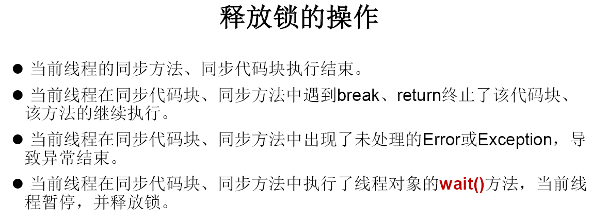


 **使用同步方法解决实现Runnable接口的线程安全问题**

**关于同步方法的总结：**

*  **同步方法仍然涉及到同步监视器，只是不需要我们显式的声明。**
*  **非静态的同步方法，同步监视器是：this**
*     **静态的同步方法，同步监视器是：当前类本身**

对**synchronized**方法的理解：

synchronized就是加锁，本质就是看这个锁有没有被使用！

```java


class Window3 implements Runnable {

    private int ticket = 100;

    @Override
    public void run() {
        while (true) {

            show();
        }
    }

    private synchronized void show(){//同步监视器：this
        //synchronized (this){

            if (ticket > 0) {

                try {
                    Thread.sleep(100);
                } catch (InterruptedException e) {
                    e.printStackTrace();
                }

                System.out.println(Thread.currentThread().getName() + ":卖票，票号为：" + ticket);

                ticket--;
            }
        //}
    }
}


public class WindowTest3 {
    public static void main(String[] args) {
        Window3 w = new Window3();

        Thread t1 = new Thread(w);
        Thread t2 = new Thread(w);
        Thread t3 = new Thread(w);

        t1.setName("窗口1");
        t2.setName("窗口2");
        t3.setName("窗口3");

        t1.start();
        t2.start();
        t3.start();
    }

}

```

**使用同步代码块解决同步问题**

```java

class Window1 implements Runnable{

    private int ticket = 100;
//    Object obj = new Object();
//    Dog dog = new Dog();    注意类的成员可以作为锁！！！,所有对象都可以作为锁
    @Override
    public void run() {
//        Object obj = new Object();
        while(true){
         synchronized (this){//此时的this:唯一的Window1的对象   //方式二：synchronized (dog) 

                if (ticket > 0) {

                    try {
                        Thread.sleep(100);
                    } catch (InterruptedException e) {
                        e.printStackTrace();
                    }

                    System.out.println(Thread.currentThread().getName() + ":卖票，票号为：" + ticket);


                    ticket--;
                } else {
                    System.out.println(Thread.currentThread().getName() + "退出");
                    break;
                }
            }
        }
    }
}


public class WindowTest1 {
    public static void main(String[] args) {
        Window1 w = new Window1();

        Thread t1 = new Thread(w);
        Thread t2 = new Thread(w);
        Thread t3 = new Thread(w);

        t1.setName("窗口1");
        t2.setName("窗口2");
        t3.setName("窗口3");

        t1.start();
        t2.start();
        t3.start();
    }

}


class Dog{

}
```


```java
//Program of synchronized method by using annonymous class  
class Table{  
 synchronized void printTable(int n){//synchronized method  
   for(int i=1;i<=5;i++){  
     System.out.println(n*i);  
     try{  
      Thread.sleep(400);  
     }catch(Exception e){System.out.println(e);}  
   }  
  
 }  
}  
  
public class TestSynchronization3{  
	public static void main(String args[]){  
		final Table obj = new Table();//only one object  
  
		Thread t1=new Thread(){  
			public void run(){  
				obj.printTable(5);  
			}   
        };
		Thread t2=new Thread(){  
			public void run(){  
				obj.printTable(100);  
			}  
        };
	t1.start();  
	t2.start();  
	}  
}  
```


#### 死锁的产生


#### 锁

* **Java中每一个对象都有一个内部锁，如果一个方法用synchronized关键字声明，那么对象的锁将保护整个方法。也就是说，要调用该方法，线程必须获得内部的对象锁**

  

* 从JDK 5.0开始，Java提供了更强大的线程同步机制——通过**显式定义同步锁**对象来实现同步。同步锁使用Lock对象充当

* java.util.concurrent.locks.Lock接口是控制多个线程对共享资源进行访问的工具。锁提供了对共享资源的独占访问，每次只能有一个线程对Lock对象加锁，线程开始访问共享资源之前应先获得Lock对象

* ReentrantLock 类实现了 Lock ，它拥有与 synchronized 相同的并发性和内存语义，在实现线程安全的控制中，比较常用的是ReentrantLock，可以显式加锁、释放锁

* wait、notifyAll以及notify方法是Object类的**final**方法

* 


**为什么？因为finally捕捉所有异常后，一定要释放锁**


#### synchronized VS Lock 

1.	Lock是显式锁（手动开启和关闭锁，别忘记关闭锁），synchronized是隐式锁，出了作用域自动释放
2.	Lock只有代码块锁，synchronized有代码块锁和方法锁
3.	使用Lock锁，JVM将花费较少的时间来调度线程，性能更好。并且具有更好的扩展性（提供更多的子类）

**优先使用顺序：**
Lock > 同步代码块(已经进入了方法体，分配了相应资源) > 同步方法（在方法体之外）


### 线程的通信


#### 生产者消费者问题


说明：

* wait()，notify()，notifyAll()三个方法必须使用在同步代码块或同步方法中。
* wait()，notify()，notifyAll()三个方法的**调用者**必须是同步代码块或同步方法中的**同步监视器**。否则，会出现IllegalMonitorStateException异常
* wait()，notify()，notifyAll()三个方法是定义在java.lang.**Object**类中


面试题：sleep() 和 wait()的异同？
* 相同点：一旦执行方法，都可以使得当前的线程进入阻塞状态

* 不同点：

  1）两个方法声明的位置不同：**Thread类中声明sleep() , Object类中声明wait()**

  2）调用的要求不同：sleep()可以在**任何**需要的场景下调用。 wait()必须使用在**同步代码块或同步方法**中

  3）关于是否释放同步监视器：如果两个方法都使用在同步代码块或同步方法中，sleep()不会释放锁，wait()会释放锁


### JDK5.0新增线程创建方式

**新增方式一：实现Callable接口**

* 与使用Runnable相比， Callable功能更强大些

* 相比run()方法，可以有返回值

* 方法可以抛出异常

* 支持泛型的返回值

* 需要借助FutureTask类，比如获取返回结果

  Future接口

  * 可以对具体Runnable、Callable任务的执行结果进行取消、查询是否完成、获取结果等
  * FutrueTask是Futrue接口的唯一的实现
  * FutureTask 同时实现了Runnable, Future接口。它既可以作为Runnable被线程执行，又可以作为Future得到Callable的返回值

```java
//1.创建一个实现Callable的实现类
class NumThread implements Callable{
    //2.实现call方法，将此线程需要执行的操作声明在call()中
    @Override
    public Object call() throws Exception {
        int sum = 0;
        for (int i = 1; i <= 100; i++) {
            if(i % 2 == 0){
                System.out.println(i);
                sum += i;
            }
        }
        return sum;
    }
}


public class ThreadNew {
    public static void main(String[] args) {
        //3.创建Callable接口实现类的对象
        NumThread numThread = new NumThread();
        //4.将此Callable接口实现类的对象作为传递到FutureTask构造器中，创建FutureTask的对象
        FutureTask futureTask = new FutureTask(numThread);
        //5.将FutureTask的对象作为参数传递到Thread类的构造器中，创建Thread对象，并调用start()
        new Thread(futureTask).start();

        try {
            //6.获取Callable中call方法的返回值
            //get()返回值即为FutureTask构造器参数Callable实现类重写的call()的返回值。
            Object sum = futureTask.get();
            System.out.println("总和为：" + sum);
        } catch (InterruptedException e) {
            e.printStackTrace();
        } catch (ExecutionException e) {
            e.printStackTrace();
        }
    }

}
```

**新增方式二：使用线程池**

* 背景：经常创建和销毁、使用量特别大的资源，比如并发情况下的线程，对性能影响很大
* 思路：提前创建好多个线程，放入线程池中，使用时直接获取，使用完放回池中。可以避免频繁创建销毁、实现重复利用。类似生活中的公共交通工具
* 好处：
  * 提高响应速度（减少了创建新线程的时间）
  * 降低资源消耗（重复利用线程池中线程，不需要每次都创建）
  * 便于线程管理
  * corePoolSize：核心池的大小
  * maximumPoolSize：最大线程数
  * keepAliveTime：线程没有任务时最多保持多长时间后会终止


好处：

1.提高响应速度（减少了创建新线程的时间）

2.降低资源消耗（重复利用线程池中线程，不需要每次都创建）

3.便于线程管理

*      corePoolSize：核心池的大小
*      maximumPoolSize：最大线程数
*      keepAliveTime：线程没有任务时最多保持多长时间后会终止

```java
class NumberThread implements Runnable{

    @Override
    public void run() {
        for(int i = 0;i <= 100;i++){
            if(i % 2 == 0){
                System.out.println(Thread.currentThread().getName() + ": " + i);
            }
        }
    }
}

class NumberThread1 implements Runnable{

    @Override
    public void run() {
        for(int i = 0;i <= 100;i++){
            if(i % 2 != 0){
                System.out.println(Thread.currentThread().getName() + ": " + i);
            }
        }
    }
}

public class ThreadPool {

    public static void main(String[] args) {
        //1. 提供指定线程数量的线程池
        ExecutorService service = Executors.newFixedThreadPool(10);
        ThreadPoolExecutor service1 = (ThreadPoolExecutor) service;
        //设置线程池的属性
//        System.out.println(service.getClass());
//        service1.setCorePoolSize(15);
//        service1.setKeepAliveTime();


        //2.执行指定的线程的操作。需要提供实现Runnable接口或Callable接口实现类的对象
        service.execute(new NumberThread());//适合适用于Runnable
        service.execute(new NumberThread1());//适合适用于Runnable

//        service.submit(Callable callable);//适合使用于Callable
        //3.关闭连接池
        service.shutdown();
    }

}
```


## Java常用类

### 字符串(String)

Java中的String没有重载[]，所以下面的写法错误，一定要用charAt

char c = s[1]；

#### String的不可变


#### String的常量池


Java中的String是**不可变**的，因为String作为函数参数传递时要保证实参不变

**String不可变的原因：字符数组被private修饰，而且String也没有提供可以修改字符数组的api，外界不可访问value[]，自然String就不能被修改。**

用构造函数生成String对象时，成员value指向数据在常量池中的地址


**String中运用了常量池技术**

java中的常量池技术，是为了方便快捷地创建某些对象而出现的，当需要一个对象时，就可以从池中取一个出来（如果池中没有则创建一个），则在需要重复创建相等变量时节省了很多时间。常量池其实**也就是一个内存空间**，不同于使用new关键字创建的对象所在的堆空间

**常量池中保存着编译时就已经确定的数据**

**常量池中的数据是只读的！！！**

**当我们使字面量进行创建字符串时，会在常量池中查找是否有相同值的字符串，如果有则会返回其引用，否则会创建新的字符串，并返回新字符串的引用**


关于常量池的更多信息，[点击这里](http://www.51gjie.com/java/111.html)

**一个栗子**


```java
输出：good best
```

因为String比较特别，是不可变型，ch数组是引用类型，引用类型传递的是地址，所以会改变


#### String的接口


#### 字符类型的转换


#### StringBuffer类

##### 基本知识


##### 常用方法

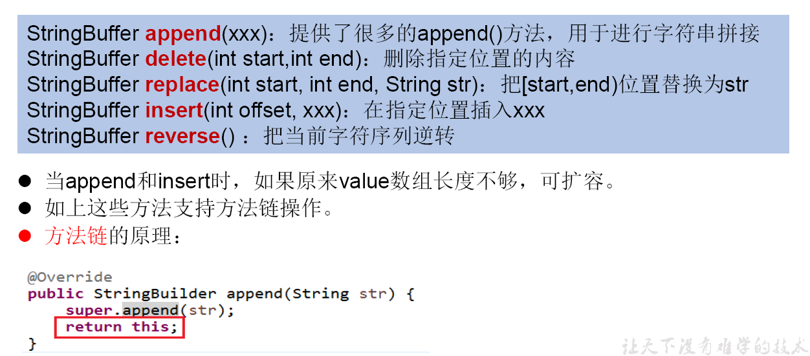


#### StringBuilder类

StringBuilder 和 StringBuffer 非常类似,均代表可变的字符序列 而且提供相关功能的方法也一样


#### 对比String，StringBuffer，StringBuilder


**String 与 StringBuffer的不同**

String的长度是不可变的，StringBuffer的长度是可变的。如果你对字符串中的内容经常进行操作，特别是内容要修改时，那么使用StringBuffer，如果最后需要String，那么使用StringBuffer的toString()方法


### 时间日期API（JDK 8 之前）

UTC(Coordinated Universal Time)
GMT(Greenwich Mean Time)
CST(Central Standard Time)


```java


public class Main {
    public static void main(String[] args) {
        Date date = new Date();
        SimpleDateFormat formater = new SimpleDateFormat();
        System.out.println(date);
        System.out.println(formater.format(date));
        SimpleDateFormat formater2 = new SimpleDateFormat("yyyy年MM月dd日 EEE HH:mm:ss");
        try{
            Date data2 = formater2.parse("2002年10月22日 星期三 08:08:08");
            System.out.println(data2);
        }
        catch (ParseException e){
            e.printStackTrace();
        }

    }
}
//output
Mon Feb 06 09:49:18 HKT 2023
2023/2/6 09:49
Tue Oct 22 08:08:08 HKT 2002
```


### 时间日期API（JDK 8 之后）

**JDK 8之前日期时间API存在的问题**

可变性：像日期和时间这样的类应该是不可变的
偏移性：Date 中的年份是从 1900 开始的，而月份都从 0 开始
格式化：格式化只对Date 有用， Calendar 则不行
此外，它们也**不是线程安全**的；不能处理闰秒等


​	

**几个栗子**


### Java比较器


在Java中经常会涉及到对象数组的排序问题，那么就涉及到对象之间的比较问题


Java实现对象排序的方式有两种：

* 自然排序：java.lang.Comparable
* 定制排序：java.util.Comparator


#### 自然排序


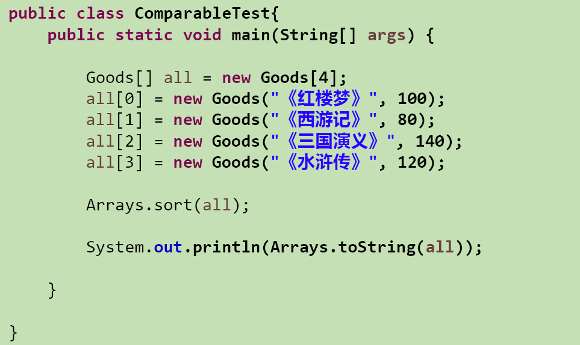


#### 定制排序


### System类

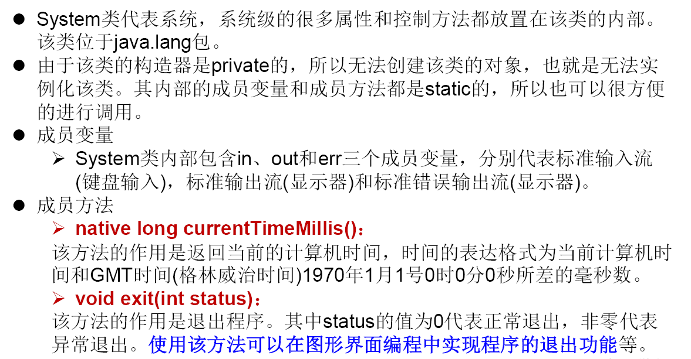


### Math类


### BigInteger与BigDecimal


## 枚举类和注解


### 枚举类

#### 基本


#### 自定义枚举类

1.	**私有化**类的构造器，保证不能在类的外部创建其对象（类似单例设计模式）
2.	在类的内部创建枚举类的实例。声明为：**public static final**
3.	对象如果有实例变量（属性），应该声明为 **private final**，并在**构造器中初始化**


#### 使用enum定义枚举类


#### 枚举类的方法


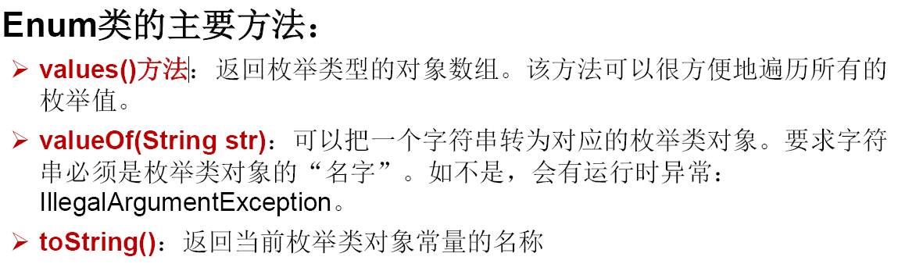


### 注解（Annotation）

#### 概述


#### 示例


#### 自定义注解


#### 元注解


**上面括号内的写法说明RetentionPolicy.SOURCE有默认值**


#### 利用反射来获取注解信息


#### JDK8中注解新特性

**可重复注解和可用于类型的注解**


## Java集合

Java集合就像容器，可以**动态的**把多个对象的引用放入容器中

如果实例化时，没有指明泛型的类型。默认类型为java.lang.Object类型

### 使用场景

JavaScript Object Notation (JSON) is a standard text-based format for representing structured data based on JavaScript object syntax. It is commonly used for **transmitting data in web applications** 


### 集合框架总览

Java 集合可分为 Collection 和 Map 两种体系

Collection**接口**：单列数据，定义了存取一组对象的方法的集合

* List：元素有序、可重复的集合

* Set：元素无序、不可重复的集合

Map**接口**：双列数据，保存具有映射关系“key-value对”的集合


### Collection接口方法

**概览**


* Collection 接口是 List、Set 和 Queue 接口的父接口，该接口里定义的方法既可用于操作 Set 集合，也可用于操作 List 和 Queue 集合
* JDK不提供此接口的任何直接实现，而是提供更具体的**子接口**(如：Set和List)实现
* 在 Java5 之前，Java 集合会丢失容器中所有对象的数据类型，把所有对象都当成 Object 类型处理；从 JDK 5.0 增加了泛型以后，Java 集合可以记住容器中对象的数据类型。

**方法**

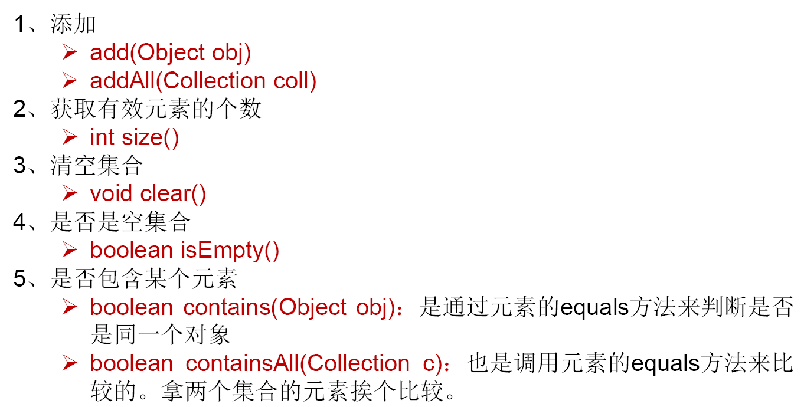


### Iterator迭代器接口

Iterator 对象称为迭代器 (设计模式的一种 )，主要用于**遍历 Collection** 集合中的元素。

Collection接口继承了java.lang.Iterable**接口**，该接口有一个iterator()方法，那么所有实现了Collection接口的集合类都有一个iterator()方法，用以返回一个实现了Iterator接口的对象

Iterator **仅用于遍历集合**，Iterator 本身并不提供承装对象的能力。如果需要创建Iterator 对象，则必须有一个被迭代的集合

集合对象每次调用iterator()方法都得到**一个全新的迭代器对象**，**默认游标都在集合的第一个元素之前**


### Collection子接口：List

* 鉴于Java中数组用来存储数据的局限性，我们通常使用List替代数组
* List集合类中元素**有序、且可重复**，集合中的每个元素都有其对应的顺序索引
* List容器中的元素都对应一个整数型的**序号**记载其在容器中的位置，可以根据序号存取容器中的元素
* JDK API中List接口的实现类常用的有：ArrayList、LinkedList和Vector。


#### **List实现类之一： ArrayList**

* ArrayList 是 List 接口的典型实现类、主要实现类
* 本质上，ArrayList是对象引用的一个”变长”数组
* ArrayList的JDK1.8之前与之后的实现区别？
  * JDK1.7：ArrayList像**饿汉式**，直接创建一个初始容量为10的数组
  * JDK1.8：ArrayList像**懒汉式**，一开始创建一个长度为0的数组，当添加第一个元素时再创建一个始容量为10的数组
* Arrays.asList(…) 方法返回的 List 集合，既不是ArrayList 实例，也不是Vector 实例。Arrays.asList(…)  返回值是一个固定长度的 List 集合


#### **List实现类之二： LinkedList**

对于**频繁的插入或删除**元素的操作，建议使用LinkedList 类，效率较高

新增方法：

* void addFirst(Object obj)
* void addLast(Object obj)
* Object getFirst()
* Object getLast()
* Object removeFirst()
* Object removeLast()


#### **List实现类之三： Vector**


* Vector 是一个古老的集合，JDK1.0就有了。大多数操作与ArrayList相同，区别之处在于Vector是**线程安全**的
* 在各种list中**，最好把ArrayList作为缺省选择。当插入、删除频繁时，使用LinkedList；Vector总是比ArrayList慢，所以尽量避免使用**
* 新增方法：
  * void addElement(Object obj)
  * void insertElementAt(Object obj,int index)
  * void setElementAt(Object obj,int index)
  * void removeElement(Object obj)
  * void removeAllElements()


### 各种实现类的比较


### Collection子接口：Set

* Set接口是Collection的子接口，set接口没有提供额外的方法
* Set 集合不允许包含相同的元素，如果试把两个相同的元素加入同一个Set 集合中，则添加操作失败
* Set 判断两个对象是否相同不是使用 == 运算符，而是根据 equals() 方法


#### **Set实现类之一： HashSet**

* HashSet 是 Set 接口的典型实现，大多数时候使用 Set 集合时都使用这个实现类
* HashSet 按 Hash 算法来存储集合中的元素，因此具有很好的存取、查找、删除性能
* HashSet 具有以下特点：
  * **不能保证元素的排列顺序**
  * **HashSet 不是线程安全的**
  * **集合元素可以是 null**
* HashSet 集合判断两个元素相等的标准：两个对象通过 hashCode() 方法比较相等，并且两个对象的 equals() 方法返回值也相等
* 对于存放在Set容器中的**对象**，**对应的类一定要重写equals()和hashCode(Object obj)方法**，**以实现对象相等规则。即：“相等的对象必须具有相等的散列码”。**


**向HashSet中添加元素的过程：**

* 当向 HashSet 集合中存入一个元素时，HashSet **会调用该对象的 hashCode() 方法**来得到该对象的 hashCode 值，然后根据 hashCode 值，通过某种散列函数决定该对象在 HashSet 底层数组中的存储位置。（这个散列函数会与底层数组的长度相计算得到在数组中的下标，并且这种散列函数计算还尽可能保证能均匀存储元素，越是散列分布，该散列函数设计的越好）
* 如果两个元素的hashCode()值相等，会再继续调用equals方法，如果equals方法结果为true，添加失败；如果为false，那么会保存该元素，但是该数组的位置已经有元素了，那么会通过**链表**的方式继续链接。

```
我们向HashSet中添加元素a,首先调用元素a所在类的hashCode()方法，计算元素a的哈希值，
此哈希值接着通过某种算法计算出在HashSet底层数组中的存放位置（即为：索引位置），判断
数组此位置上是否已经有元素：
    如果此位置上没有其他元素，则元素a添加成功。 --->情况1
    如果此位置上有其他元素b(或以链表形式存在的多个元素），则比较元素a与元素b的hash值：
        如果hash值不相同，则元素a添加成功。--->情况2
        如果hash值相同，进而需要调用元素a所在类的equals()方法：
               equals()返回true,元素a添加失败
               equals()返回false,则元素a添加成功。--->情况3

对于添加成功的情况2和情况3而言：元素a 与已经存在指定索引位置上数据以链表的方式存储。
jdk 7 :元素a放到数组中，指向原来的元素。
jdk 8 :原来的元素在数组中，指向元素a
总结：七上八下(指针向上指还是向下指)
```


**重写hashCode() 方法的基本原则**

* 在程序运行时，同一个对象多次调用 hashCode() 方法应该返回相同的值
* 当两个对象的 equals() 方法比较返回 true 时，这两个对象的 hashCode()方法的返回值也应相等
* 对象中用作 equals() 方法比较的 Field，都应该用来计算 hashCode 值

**以自定义的Customer类为例，何时需要重写equals()？**

* 当一个类有自己特有的“逻辑相等”概念,当改写equals()的时候，总是要改写hashCode()，根据一个类的equals方法（改写后），两个截然不同的实例有可能在逻辑上是相等的，但是，根据Object.hashCode()方法，它们仅仅是两个对象
* 因此，违反了“**相等（equal）的对象必须具有相等的散列码**”
* 结论：复写equals方法的时候一般都需要同时复写hashCode方法。通常参与计算hashCode的对象的属性也应该参与到equals()中进行计算

**以Eclipse/IDEA为例，在自定义类中可以调用工具自动重写equals和hashCode。问题：为什么用Eclipse/IDEA复写hashCode方法，有31这个数字？**

* 选择系数的时候要选择尽量大的系数。因为如果计算出来的hash地址越大，所谓的 “冲突”就越少，查找起来效率也会提高。（减少冲突）
* 并且31只占用5bits,相乘造成数据溢出的概率较小
* 31可以 由i*31== (i<<5)-1来表示,现在很多虚拟机里面都有做相关优化。（提高算法效率）
* 31是一个素数，素数作用就是如果我用一个数字来乘以这个素数，那么最终出来的结果只能被素数本身和被乘数还有1来整除！(减少冲突)


#### Set实现类之二：LinkedHashSet

* LinkedHashSet 是 HashSet 的子类
* LinkedHashSet 根据元素的 hashCode 值来决定元素的存储位置，但它同时使用双向链表维护元素的次序，这使得元素看起来是以**插入顺序**保存的
* LinkedHashSet插入性能略低于 HashSet，但在迭代访问 Set 里的全部元素时有很好的性能
* LinkedHashSet 不允许集合元素重复
* 保证在遍历map元素时，可以按照添加的顺序实现遍历


#### Set实现类之三：TreeSet

* TreeSet 是 SortedSet 接口的实现类，TreeSet 可以确保集合元素处于**排序状态**
* TreeSet底层使用**红黑树**结构存储数据
* 新增的方法如下： (了解)
  	Comparator comparator()
  	Object first()
  	Object last()
  	Object lower(Object e)
  	Object higher(Object e)
  	SortedSet subSet(fromElement, toElement)
  	SortedSet headSet(toElement)
  	SortedSet tailSet(fromElement)
* TreeSet 两种排序方法：**自然排序和定制排序**。默认情况下，TreeSet 采用自然排序


**自然排序**

* 自然排序：TreeSet 会调用集合元素的 compareTo(Object obj) 方法来比较元素之间的大小关系，然后将集合元素按升序(默认情况)排列
* **如果试图把一个对象添加到 TreeSet 时，则该对象的类必须实现 Comparable接口**
  	实现 Comparable 的类必须**实现 compareTo(Object obj) 方法**，两个对象即通过compareTo(Object obj) 方法的返回值来比较大小
* Comparable 的典型实现：
  	BigDecimal、BigInteger 以及所有的数值型对应的包装类：按它们对应的数值大小进行比较
  	Character：按字符的 unicode值来进行比较
  	Boolean：true 对应的包装类实例大于 false 对应的包装类实例
  	String：按字符串中字符的 unicode 值进行比较
  	Date、Time：后边的时间、日期比前面的时间、日期大

* 向 TreeSet 中添加元素时，只有第一个元素无须比较compareTo()方法，后面添加的所有元素都会调用compareTo()方法进行比较。
* **因为只有相同类的两个实例才会比较大小，所以向 TreeSet 中添加的应该是同一个类的对象**
* 对于 TreeSet 集合而言，它判断两个对象是否相等的唯一标准是：两个对象通过 compareTo(Object obj) 方法比较返回值
* 当需要把一个对象放入 TreeSet 中，重写该对象对应的 equals() 方法时，应保证该方法与 compareTo(Object obj) 方法有一致的结果：如果两个对象通过equals() 方法比较返回 true，则通过 compareTo(Object obj) 方法比较应返回 0。否则，让人难以理解

**定制排序**

* TreeSet的自然排序要求元素所属的类实现Comparable接口，如果元素所属的类**没有实现**Comparable接口，或**不希望按照升序**(默认情况)的方式排列元素或希望按照其它属性大小进行排序，则考虑使用定制排序。定制排序，通过Comparator接口来实现。需要重写compare(T o1,T o2)方法
* 利用int compare(T o1,T o2)方法，比较o1和o2的大小：如果方法返回正整数，则表示o1大于o2；如果返回0，表示相等；返回负整数，表示o1小于o2
* 要实现定制排序，**需要将实现Comparator接口的实例作为形参传递给TreeSet的构造器**
* 此时，仍然只能向TreeSet中添加类型相同的对象。否则发生ClassCastException异常
* **使用定制排序判断两个元素相等的标准是：通过Comparator比较两个元素返回了0**

example


### Map接口方法


* Map与Collection并列存在。用于保存具有**映射关系**的数据:key-value
* Map 中的 key 和 value 都可以是任何引用类型的数据
* Map 中的 **key 用Set来存放，不允许重复**，即同一个Map 对象所对应的类，**须重写hashCode()和equals()方法**
* 常用String类作为Map的“键”
* key 和 value 之间存在单向一对一关系，即通过指定的key 总能找到唯一的、确定的 value
* Map接口的常用实现类：HashMap、TreeMap、LinkedHashMap和Properties。其中，**HashMap是 Map 接口使用频率最高的实现类**


#### **Map实现类之一： HashMap**

* HashMap是 Map 接口使用频率最高的实现类
* 允许使用null键和null值，与HashSet一样，不保证映射的顺序
* 所有的key构成的集合是Set:无序的、不可重复的。所以，**key所在的类要重写：equals()和hashCode()**
* 所有的value构成的集合是Collection:无序的、可以重复的。所以，**value所在的类要重写：equals()**
* **一个key-value构成一个entry**
* 所有的entry构成的集合是Set:无序的、不可重复的
* **HashMap 判断两个 key 相等的标准是**：两个 key 通过 equals() 方法返回 true， hashCode 值也相等
* **HashMap 判断两个 value相等的标准是**：两个 value 通过 equals() 方法返回 true


**HashMap源码中的重要常量**

DEFAULT_INITIAL_CAPACITY : HashMap的默认容量，16
MAXIMUM_CAPACITY ： HashMap的最大支持容量，2^30
DEFAULT_LOAD_FACTOR：HashMap的默认加载因子
TREEIFY_THRESHOLD：Bucket中链表长度大于该默认值，转化为红黑树UNTREEIFY_THRESHOLD：Bucket中红黑树存储的Node小于该默认值，转化为链表MIN_TREEIFY_CAPACITY：桶中的Node被树化时最小的hash表容量。（当桶中Node的数量大到需要变红黑树时，若hash表容量小于MIN_TREEIFY_CAPACITY时，此时应执resiz扩容操作这个MIN_TREEIFY_CAPACITY的值至少是TREEIFY_THRESHOLD的4倍）
table：存储元素的数组，总是2的n次幂
entrySet：存储具体元素的集
size：HashMap中存储的键值对的数量
modCount：HashMap扩容和结构改变的次数。
threshold：扩容的临界值，=容量*填充因子
loadFactor：填充因子


**HahMap存储过程的分析**

* HashMap的内部存储结构其实是**数组和链表**的结合。当实例化一个HashMap时，系统会创建一个长度为Capacity的Entry数组，这个长度在哈希表中被称为容量(Capacity)，在这个数组中可以存放元素的位置我们称之为“桶”(bucket)，每个bucket都有自己的索引，系统可以根据索引快速的查找bucket中的元素

* 每个bucket中存储一个元素，即**一个Entry对象**，但每一个Entry对象可以带一个引用变量，用于指向下一个元素，因此，在一个桶中，就有可能生成一个Entry链。而且新添加的元素作为链表的head
  **添加元素的过程：**

  向HashMap中添加entry1(key，value)，需要首先计算entry1中key的哈希值(**根据key所在类的hashCode()计算得到**)，此哈希值**经过处理**以后，得到在底层Entry[]数组中要存储的位置i。如果位置i上没有元素，则entry1直接添加成功。如果位置i上已经存在entry2(或还有链表存在的entry3，entry4)，则需要通过循环的方法，依次比较entry1中key和其他的entry。如果彼此hash值**不同**，则直接添加成功。如果hash值不同，**继续**比较二者是否equals。如果返回值为true，**则使用entry1的value去替换equals为true的entry的value**。

  如果遍历一遍以后，发现所有的equals返回都为false,则entry1仍可添加成功。entry1指向原有的entry元素

  
  
  首先，调用key1所在**类的hashCode()**计算key1哈希值，此哈希值经过**某种算法计算**以后，得到在Entry数组中的存放位置。
  *      如果此位置上的数据为空，此时的key1-value1添加成功。 ----情况1
  *      如果此位置上的数据不为空，(意味着此位置上存在一个或多个数据(以链表形式存在)),比较key1和已经存在的一个或多个数据的哈希值：
  *              如果key1的哈希值与已经存在的数据的哈希值都不相同，此时key1-value1添加成功。----情况2
  *      如果key1的哈希值和已经存在的某一个数据(key2-value2)的哈希值相同，继续比较：调用key1所在类的equals(key2)方法，比较：
         *                      如果equals()返回false:此时key1-value1添加成功。----情况3
         *      如果equals()返回true:使用value1替换value2。
  *       补充：关于情况2和情况3：此时key1-value1和原来的数据以链表的方式存储。
  
  

**HashMap的扩容**

当HashMap中的元素越来越多的时候，hash冲突的几率也就越来越高，因为数组的长度是固定的。所以为了提高查询的效率，就要对HashMap的数组进行扩容，而在HashMap数组扩容之后，**最消耗性能的点就出现了：原数组中的数据必须重新计算其在新数组中的位置，并放进去，这就是resize**


**HashMap什么时候进行扩容呢？**

当HashMap中的元素个数超过**数组大小** ( **数组总大小length**, 不是数组中个数size) loadFactor 时 ， 就 会 进 行 数 组 扩 容 ， loadFactor 的默认值(DEFAULT_LOAD_FACTOR)为0.75，这是一个折中的取值。也就是说，默认情况下，数组大小(DEFAULT_INITIAL_CAPACITY)为16，那么当HashMap中元素个数超过16\*0.75=12（这个值就是代码中的threshold值，也叫做临界值）的时候，就把数组的大小扩展为 2*16=32，即扩大一倍，**然后重新计算每个元素在数组中的位置**，而这是一个非常消耗性能的操作，所以如果我们已经预知HashMap中元素的个数，那么**预设元素个数能够有效提高HashMap的性能**

当HashMap中的其中一个链的对象个数如果达到了8个，此时如果capacity没有达到64，那么HashMap会先扩容解决，如果已经达到了64，那么这个链会变成树，结点类型由Node变成TreeNode类型。当然，如果当映射关系被移除后，下次resize方法时判断树的结点个数低于6个，也会把树再转为链表


**HashMap的存储结构：JDK 1.8**

* HashMap的内部存储结构其实是**数组+链表+树**的结合。当实例化一个HashMap时，会初始化initialCapacity和loadFactor，在put第一对映射关系时，系统会创建一个长度为initialCapacity的Node数组，这个长度在哈希表中被称为容量(Capacity)，在这个数组中可以存放元素的位置我们称之为 “桶”(bucket)，每个bucket都有自己的索引，系统可以根据索引快速的查找bucket中的元素
* 每个bucket中存储一个元素，即一个Node对象，但每一个Node对象可以带一个引用变量next，用于指向下一个元素，因此，在一个桶中，就有可能生成一个Node链。也可能是一个一个TreeNode对象，每一个TreeNode对象可以有两个叶子结点left和right，因此，在一个桶中，就有可能生成一个TreeNode树。而新添加的元素作为链表的last，或树的叶子结点


**关于映射关系的key是否可以修改？answer：不要修改**

映射关系存储到HashMap中会存储key的hash值，这样就不用在每次查找时重新计算每一个Entry或Node（TreeNode）的hash值了，因此如果已经put到Map中的映射关系，再修改key的属性，而这个属性又参与hashcode值的计算，那么会导致匹配不上


**总结：JDK1.8相较于之前的变化**

1.	HashMap map = new HashMap(); //默认情况下，先不创建长度为16的数组, 当首次调用map.put()时，再创建长度为16的数组
3.	数组为Node类型，在jdk7中称为Entry类型
4.	形成链表结构时，新添加的key-value对在链表的**尾部**（七上八下）（jdk7:新的元素指向旧的元素。jdk8：旧的元素指向新的元素）
5.	当数组指定**索引位置的链表长度**>8时，且map中的数组的长度> 64时，此索引位置上的所有key-value对使用红黑树进行存储


**负载因子值的大小，对HashMap有什么影响**

* 负载因子的大小决定了HashMap的数据密度
* **负载因子越大密度越大，发生碰撞的几率越高**，数组中的链表越容易长,造成查询或插入时的比较次数增多，性能会下降
* **负载因子越小，就越容易触发扩容**，数据密度也越小，意味着发生碰撞的几率越小，数组中的链表也就越短，查询和插入时比较的次数也越小，性能会更高。但是会浪费一定的内容空间。而且经常扩容也会影响性能，建议初始化预设大一点的空间
* 按照其他语言的参考及研究经验，会考虑将负载因子设置为0.7~0.75，此时平均检索长度接近于常数


#### Map实现类之二：LinkedHashMap

* LinkedHashMap 是 HashMap 的子类
* 在HashMap存储结构的基础上，使用了一对**双向链表**来记录添加元素的顺序
* 与LinkedHashSet类似，LinkedHashMap 可以维护 Map 的迭代顺序：迭代顺序与 Key-Value 对的插入顺序一致


#### Map实现类之三：TreeMap

* TreeMap存储 Key-Value 对时，需要根据 key-value 对进行排序。 TreeMap 可以保证所有的 Key-Value 对处于**有序**状态
* TreeMap底层使用**红黑树**结构存储数据
* TreeMap 的 **Key 的排序**：
  	自然排序：TreeMap 的所有的 Key 必须实现 Comparable 接口，而且所有的 Key 应该是同一个类的对象，否则将会抛出 ClasssCastException
  	定制排序：创建 TreeMap 时，传入一个 Comparator 对象，该对象负责对TreeMap 中的所有 key 进行排序。**此时不需要 Map 的 Key 实现Comparable 接口**
* TreeMap判断两个key相等的标准：两个key通过compareTo()方法或者compare()方法返回0


#### Map实现类之四：Hashtable

* Hashtable是个古老的 Map 实现类，JDK1.0就提供了。不同于HashMap， Hashtable是线程安全的
* Hashtable实现原理和HashMap相同。**底层都使用哈希表结构**，查询速度快，很多情况下可以互用
* 与HashMap不同，Hashtable 不允许使用 null 作为 key 和 value
* 与HashMap一样，Hashtable 也不能保证其中 Key-Value 对的顺序
* Hashtable判断两个key相等、两个value相等的标准，与HashMap一致


#### Map实现类之五：Properties

* Properties 类是 Hashtable 的子类，常用来处理**配置文件**。key和value都是String类型
* 由于属性文件里的 key、value 都是字符串类型，所以 Properties 里的 key和 value **都是字符串类型**
* 存取数据时，建议使用setProperty(String key,String value)方法和getProperty(String key)方法


### Collection工具类

**类比：操作数组的工具类：Arrays**

* Collections 是一个操作 Set、List 和 Map 等集合的工具类
* Collections 中提供了一系列静态的方法对集合元素进行排序、查询和修改等操作，还提供了对集合对象设置不可变、对集合对象实现同步控制等方法

* 排序操作：（**均为static方法）**
  	reverse(List)：反转 List 中元素的顺序
  	shuffle(List)：对 List 集合元素进行随机排序
  	sort(List)：根据元素的自然顺序对指定 List 集合元素按升序排序
  	sort(List，Comparator)：根据指定的 Comparator 产生的顺序对 List 集合元素进行排序
  	swap(List，int， int)：将指定 list 集合中的 i 处元素和 j 处元素进行交换


#### Collections常用方法


## 泛型

那么为什么要有泛型呢，直接Object不是也可以存储数据吗？


### 集合中的泛型


### 自定义泛型


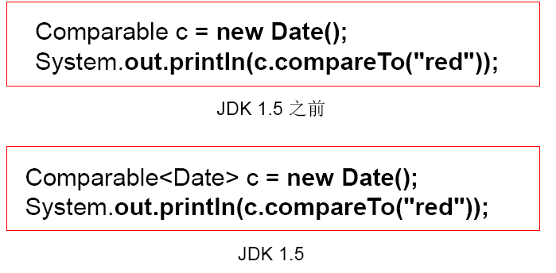

体会：使用泛型的主要优点是能够在编译时而不是在运行时检测错误


#### 泛型类和泛型接口

1. 泛型类可能有多个参数，此时应将多个参数一起放在尖括号内。比如：<E1,E2,E3>

2.	泛型类的构造器如下：public GenericClass(){}。
  而下面是错误的：public GenericClass<E>(){}
  
3. 实例化后，操作原来泛型位置的结构必须与指定的泛型类型一致。

4. 泛型不同的引用不能相互赋值。

5. 尽管在编译时ArrayList<String>和ArrayList<Integer>是两种类型，但是，在运行时只有一个ArrayList被加载到JVM中。

6. 泛型如果不指定，将被擦除，泛型对应的类型均按照Object处理，但不等价于Object。经验：泛型要使用一路都用。要不用，一路都不要用。

7. 如果泛型结构是一个接口或抽象类，则不可创建泛型类的对象。

8. jdk1.7，泛型的简化操作：ArrayList<Fruit> flist = new ArrayList<>();

9. 泛型的指定中不能使用基本数据类型，可以使用包装类替换

10. **泛型不同的引用不能相互赋值**

11. 在类/接口上声明的泛型，在本类或本接口中即代表某种类型，可以作为非静态属性的类型、非静态方法的参数类型、非静态方法的返回值类型。**但在静态方法中不能使用类的泛型**

12. **泛型方法，可以声明为静态的**。原因：**泛型参数是在调用方法时确定的**，并非在实例化类时确定

    ```java
    public static <E>  List<E> copyFromArrayToList(E[] arr){
            ArrayList<E> list = new ArrayList<>();
            for(E e : arr){
                list.add(e);
            }
            return list;
    }
    ```

    

13. 异常类不能是泛型的

14. 不能使用new E[]。但是可以：E[] elements = (E[])new Object[capacity];
   参考：ArrayList源码中声明：Object[] elementData，而非泛型参数类型数组。

15. 父类有泛型，子类可以选择保留泛型也可以选择指定泛型类型：
    * 子类不保留父类的泛型：按需实现
      	没有类型 擦除
      	具体类型
    * 子类保留父类的泛型：泛型子类
      	全部保留
      	部分保留
    * 结论：子类必须是“富二代”，子类除了指定或保留父类的泛型，还可以增加自己的泛型


#### 泛型方法

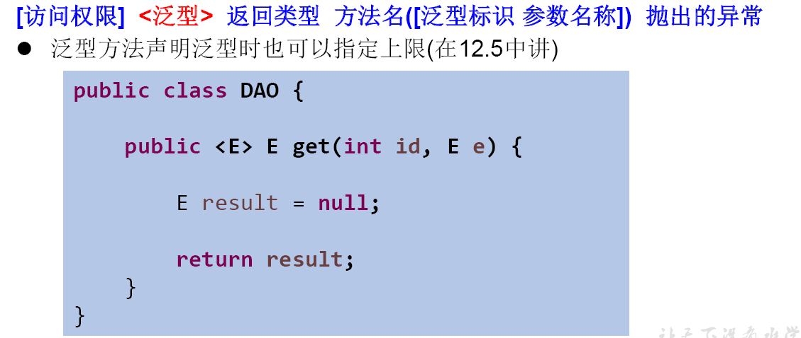


### 继承中的泛型

如果B是A的一个子类型（子类或者子接口），而G是具有泛型声明的类或接口，**G<B>并不是G<A>的子类型**！
比如：String是Object的子类，但是List<String >并不是List<Object>的子类

**类A是类B的父类，A<G> 是 B<G> 的父类**


### 通配符

1. 使用类型通配符：？
  比如：List<?>，Map<?,?>
  List<?>是List<String>、List<Object>等各种泛型List的父类。

2. **读取List<?>的对象list中的元素时，永远是安全的**，因为不管list的真实类型是什么，它包含的都是Object。

3. 写入list中的元素时，不行。因为我们不知道c的元素类型，我们不能向其中添加对象。

  * 唯一的例外是null，它是所有类型的成员。

4.	**将任意元素加入到其中不是类型安全的**：Collection<?> c = new ArrayList<String>();
   c.add(new Object()); // 编译时错误

   因为我们不知道c的元素类型，我们不能向其中添加对象。**add方法有类型参数E作为集合的元素类型。我们传给add的任何参数都必须是一个未知类型的子类。**因为我们不知道那是什么类型，所以我们无法传任何东西进去。

5.	唯一的例外的是null，它是所有类型的成员

6. **类A是类B的父类，G<A>和G<B>是没有关系的，二者共同的父类是：G<?>**

7. 另一方面，我们可以调用get()方法并使用其返回值。返回值是一个未知的类型，但是我们知道，它总是一个Object。


**通配符的使用限制**


**有限制的通配符**


因为不知道list的类型，而调用list.add方法时，传入其中的类型要是**未知类型的子类**，我们不知道这是上面类型，不能传进去任何东西

**泛型嵌套**


## IO流

### 基本知识

#### File 类的使用

* java.io.File类：文件和文件目录路径的抽象表示形式，与平台无关
* File 能新建、删除、重命名文件和目录，**但 File 不能访问文件内容本身**。**如果需要访问文件内容本身，则需要使用输入/输出流**
* 想要在Java程序中表示一个真实存在的**文件或目录**，那么必须有一个File对象，但是Java程序中的一个File对象，可能没有一个真实存在的文件或目录
* File对象可以作为参数传递给流的构造器

#### 常用构造器

* **public File(String pathname）**
  以pathname 为路径创建 File 对象，可以是**绝对路径或者相对路径** ，如果pathname 是相对路径，则默认的当前路径在系统属性 user.dir 中存储
* **public File(String parent,String child)**
  以parent为父路径，child为子路径创建File对象 
* **public File(File parent,String child)**
  根据一个父File对象和子文件路径创建File对象

#### 路径分隔符

路径分隔符和系统有关：windows和DOS系统默认使用“\”来表示，UNIX和URL使用“/”来表示

Java程序支持跨平台运行，因此路径分隔符要慎用
为了解决这个隐患，File类提供了一个常量：
public  static final String separator。根据操作系统，动态的提供分隔符

```java
File file1 = new File("d:\\atguigu\\info.txt");
File file2 = new File("d:" + File.separator + "atguigu" + File.separator + "info.txt"); File file3 = new File("d:/atguigu");
```

#### 常用方法

```java
//获取
public String getAbsolutePath()：获取绝对路径
public String getPath() ：获取路径
public String getName() ：获取名称
public String getParent()：获取上层文件目录路径。若无，返回null
public long length() ：获取文件长度（即：字节数）。不能获取目录的长度。
public long lastModified() ：获取最后一次的修改时间，毫秒值
public String[] list() ：获取指定目录下的所有文件或者文件目录的名称数组
public File[] listFiles() ：获取指定目录下的所有文件或者文件目录的File数组
//重命名
public boolean renameTo(File dest):把文件重命名为指定的文件路径
//判断
public boolean isDirectory()：判断是否是文件目录
public boolean isFile() ：判断是否是文件
public boolean exists() ：判断是否存在
public boolean canRead() ：判断是否可读
public boolean canWrite() ：判断是否可写
public boolean isHidden() ：判断是否隐藏
//创建
public boolean createNewFile() ：创建文件。若文件存在，则不创建，返回false
public boolean mkdir() ：创建文件目录。如果此文件目录存在，就不创建了。如果此文件目录的上层目录不存在，也不创建。
public boolean mkdirs() ：创建文件目录。如果上层文件目录不存在，一并创建
    
注意事项：如果你创建文件或者文件目录没有写盘符路径，那么，默认在项目路径下。
    
//删除
public boolean delete()：删除文件或者文件夹
删除注意事项：
Java中的删除不走回收站。
要删除一个文件目录，请注意该文件目录内不能包含文件或者文件目录
```


#### 流的分类

* 按操作数据单位不同分为：字节流(8 bit)，字符流(16 bit)
* 按数据流的流向不同分为：输入流，输出流
* 按流的角色的不同分为：节点流，处理流


1.	Java的IO流共涉及40多个类，实际上非常规则，都是从如下4个抽象基类派生的。
2.	由这四个类**派生出来的子类名称**都是以其**父类名作为子类名后缀**。


**InputStream & Reader**

* InputStream 和 Reader 是所有输入流的基类
* InputStream（典型实现：FileInputStream）
  	int read()
  	int read(byte[] b)
  	int read(byte[] b, int off, int len)
* Reader（典型实现：FileReader）
  	int read()
  	int read(char [] c)
  	int read(char [] c, int off, int len)
* **程序中打开的文件 IO 资源不属于内存里的资源，垃圾回收机制无法回收该资源，所以应该显式关闭文件 IO 资源**
* FileInputStream 从文件系统中的某个文件中获得输入字节。FileInputStream用于读取非文本数据之类的**原始字节流**。要读取**字符流**，需要使用 FileReader


**InputStream**

* int read()
  从输入流中读取数据的下一个**字节**。返回0 到255 范围内的int 字节值。如果因为已经到达流末尾而没有可用的字节，则返回值-1
* int read(byte[] b)
  从此输入流中将最多 b.length 个**字节**的数据读入一个 byte 数组中。如果因为已经到达流末尾而没有可用的字节，则返回值 -1。否则以整数形式返回实际读取的字节数
* int read(byte[] b, int off,int len)
  将输入流中最多 len 个数据**字节**读入 byte 数组。尝试读取 len 个字节，但读取的字节也可能小于该值。以整数形式返回实际读取的字节数。如果因为流位于文件末尾而没有可用的字节，则返回值-1
* public void close() throws IOException
  关闭此输入流并释放与该流关联的所有系统资源

**Reader**

* int read()
  读取单个**字符**。作为整数读取的字符，范围在 0 到 65535 之间 (0x00-0xffff)（2个字节的Unicode码），如已到达流的末尾，则返回-1

* int read(char[] cbuf)
  将字符读入数组。如果已到达流的末尾，则返回 -1。否则返回本次读取的**字符数**

* int read(char[] cbuf,int off,int len)
  将字符读入数组的某一部分。存到数组cbuf中，从off处开始存储，最多读len个字符。如果已到达流的末尾则返回-1。否则返回本次读取的字符数

* public void close() throws IOException

  关闭此输入流并释放与该流关联的所有系统资源

**OutputStream & Writer**

* OutputStream 和 Writer 也非常相似：
  	void write(int b/int c);
  	void write(byte[] b/char[] cbuf);
  	void write(byte[] b/char[] buff, int off, int len);
  	void flush();
  	void close(); 需要先刷新，再关闭此流
* 因为字符流直接以字符作为操作单位，所以 Writer 可以用字符串来替换字符数组，即以 String 对象作为参数
  	void write(String str);
  	void write(String str, int off, int len);
* FileOutputStream 从文件系统中的某个文件中获得输出字节。FileOutputStream用于写出非文本数据之类的原始字节流。要写出字符流，需要使用 FileWriter


**OutputStream**

* void write(int b)
  将**指定的字节**写入此输出流。write 的常规协定是：向输出流写入一个字节。要写入的字节是参数b的**八个低位**。b 的24 个高位将被忽略。即写入0~255范围的
* void write(byte[] b)
  将b.length 个字节从指定的byte 数组写入此输出流。write(b) 的常规协定是：应该与调用write(b, 0, b.length) 的效果完全相同
* void write(byte[] b,int off,int len)
  将指定byte 数组中从偏移量off 开始的len 个字节写入此输出流
* public void flush()throws IOException
  刷新此输出流并强制写出所有缓冲的输出字节，调用此方法指示应将这些字节立即写入它们预期的目标
* public void close() throws IOException
  关闭此输出流并释放与该流关联的所有系统资源。


**Writer**

* void write(int c)
  写入单个字符。要写入的字符包含在给定整数值的 16 个低位中，16 高位被忽略。 即写入0 到65535 之间的Unicode码
* void write(char[] cbuf)
  写入字符数组
* void write(char[] cbuf,int off,int len)
  写入字符数组的某一部分。从off开始，写入len个字符
* void write(String str)
  写入字符串
* void write(String str,int off,int len)
  写入字符串的某一部分
* void flush()
  刷新该流的缓冲，则立即将它们写入预期目标
* public void close() throws IOException
  关闭此输出流并释放与该流关联的所有系统资源。


### 文件流（节点流）


* 定义文件路径时，注意：可以用“/”或者“\\”
* 在**写入**一个文件时，如果使用构造器FileOutputStream(file)，则目录下有同名文件将被覆盖
* 如果使用构造器**FileOutputStream(file,true)**，则目录下的同名文件**不会被覆盖，在文件内容末尾追加内容**
* 在**读取**文件时，必须保证该文件已存在，否则报异常
* 字节流操作字节，比如：.mp3，.avi，.rmvb，mp4，.jpg，.doc，.ppt
* 字符流操作字符，只能操作普通文本文件。最常见的文本文件：.txt，.java，.c，.cpp 等语言的源代码。尤其注意.doc,excel,ppt这些不是文本文件。


### 缓冲流

为了提高数据读写的速度，Java API提供了带缓冲功能的流类，在使用这些流类时，会创建一个内部缓冲区数组，缺省使用8192个字节(8Kb)的缓冲区


缓冲流要“套接”在相应的节点流之上，根据数据操作单位可以把缓冲流分为：

* BufferedInputStream 和 BufferedOutputStream
* BufferedReader 和 BufferedWriter


1. 当读取数据时，数据按块读入缓冲区，**其后的读操作则直接访问缓冲区**
2. 当使用BufferedInputStream读取**字节**文件时，BufferedInputStream会一次性从文件中读取8192个(8Kb)，存在缓冲区中，直到缓冲区装满了，才重新从文件中读取下一个8192个字节数组
3. 向流中写入字节时，不会直接写到文件，**先写到缓冲区中直到缓冲区写满**， BufferedOutputStream才会把缓冲区中的数据一次性写到文件里。使用方法flush()可以强制将缓冲区的内容全部写入输出流
4. **关闭流的顺序和打开流的顺序相反**。只要关闭最外层流即可，关闭最外层流也会相应关闭内层节点流
5. flush()方法的使用：手动将buffer中内容写入文件
6. **如果是带缓冲区的流对象的close()方法，不但会关闭流**，还会在关闭流之前刷新缓冲区，关闭后不能再写出


### 转换流

**InputStreamReader**

* 实现将**字节**的输入流按指定字符集**转换为字符**的输入流

* 需要和InputStream“套接”


**OutputStreamWriter**

* 实现将字符的输出流按指定字符集转换为字节的输出流
* 需要和OutputStream“套接”


### 多种流的复合使用案例


### 字符编码

* ASCII：美国标准信息交换码：用一个字节的7位可以表示
* ISO8859-1：拉丁码表。欧洲码表：用一个字节的8位表示
* GB2312：中国的中文编码表。最多两个字节编码所有字符
* GBK：中国的中文编码表升级，融合了更多的中文文字符号。最多两个字节编码
* Unicode：国际标准码，融合了目前人类使用的所有字符。为每个字符分配唯一的字符码。所有的文字都用**两个字节**来表示
* UTF-8：变长的编码方式，可用1-4个字节来表示一个字符


* Unicode不完美，这里就有三个问题
  * 英文字母只用一个字节表示就够了，第二个问题是如何才能区别Unicode和ASCII？
  * 计算机怎么知道两个字节表示一个符号，而不是分别表示两个符号呢？
  * 如果和GBK等双字节编码方式一样，用最高位是1或0表示两个字节和一个字节，就少了很多值无法用于表示字符，不够表示所有字符
* 面向传输的众多 UTF（UCS Transfer Format）标准出现了，顾名思义，UTF-8就是每次8个位传输数据，而UTF-16就是每次16个位。这是为传输而设计的编码，并使编码无国界，这样就可以显示全世界上所有文化的字符了
* Unicode**只是定义了一个庞大的、全球通用的字符集**，并为每个字符规定了唯一确定的**编号**，**具体存储成什么样的字节流，取决于字符编码方案。**推荐的Unicode编码是UTF-8和UTF-16


编码：字符串->字节数组
解码：字节数组->字符串
转换流的编码应用

* 可以将字符按指定编码格式存储
* 可以对文本数据按指定编码格式来解读
* 指定编码表的动作由构造器完成


### 标准输入输出流

* System.in和System.out分别代表了系统标准的输入和输出设备
* 默认输入设备是：键盘，输出设备是：显示器
* System.in的类型是InputStream
* System.out的类型是PrintStream，其是OutputStream的子类FilterOutputStream 的子类
* 重定向：通过**System类**的setIn，setOut方法对默认设备进行变
  	public static void setIn(InputStream in)
  	public static void setOut(PrintStream out)

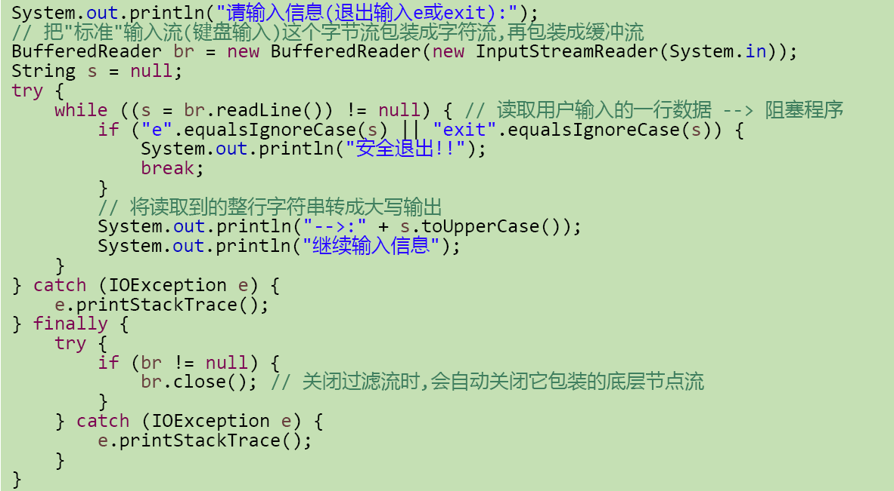

### 打印流

实现将基本数据类型的数据格式**转化为字节/字符串**输出

**打印流：PrintStream和PrintWriter**

* 提供了一系列重载的print()和println()方法，用于多种数据类型的输出
* PrintStream和PrintWriter的输出不会抛出IOException异常
* PrintStream和PrintWriter有自动flush功能
* PrintStream 打印的所有字符**都使用平台的默认字符编码转换为字节**。在需要写入字符而不是写入字节的情况下，应该使用 PrintWriter 类
* **System.out返回的是PrintStream的实例**


### 数据流

* 为了方便地操作Java语言的基本数据类型和String的数据，可以使用数据流

* 数据流有两个类：(用于读取和写出基本数据类型、String类的数据）

  	**DataInputStream 和 DataOutputStream**
  	**分别“套接”在 InputStream 和 OutputStream 子类的流上**


### 对象流

**ObjectInputStream 和 OjbectOutputSteam**

* 用于存储和读取**基本数据类型**数据或**对象**的处理流。它的强大之处就是可以把 Java 中的对象写入到数据源中，也能把对象从数据源中还原回来
* 序列化： 用 ObjectOutputStream 类 保存 基本类型数据或对象的机制
  反序列化： 用 ObjectInputStream 类 读取 基本类型数据或对象的机制
* ObjectOutputStream 和 ObjectInputStream 不能序列化 static 和 transient 修饰的成员变量

* 对象序列化机制允许把内存中的Java对象转换成平台无关的二进制流，从而允许把这种二进制流持久地保存在磁盘上，或通过网络将这种二进制流传输到另一个网络节点。//当其它程序获取了这种二进制流，就可以恢复成原来的Java对象
* 序列化的好处在于可将任何**实现了Serializable接口的对象**转化为字节数据，使其在保存和传输时可被还原
* 序列化是 RMI（Remote Method Invoke – 远程方法调用）过程的参数和返回值都必须实现的机制，而 RMI 是 JavaEE 的基础。因此序列化机制是JavaEE 平台的基础
* 如果需要让某个对象支持序列化机制，则必须让对象所属的类及其属性是可序列化的，为了让某个类是可序列化的，**该类必须实现如下两个接口之一**。否则，会抛出NotSerializableException异常
  	Serializable
  	Externalizable

**对象的序列化**

* 凡是实现**Serializable接口**的类都有一个表示序列化版本标识符的静态变量：
  	private static final long serialVersionUID;
  	serialVersionUID用来表明类的不同版本间的兼容性。简言之，其目的是以序列化对象进行版本控制，有关各版本反序列化时是否兼容。
  	如果类没有显示定义这个静态常量，它的值是Java运行时环境根据类的内部细节自动生成的。**若类的实例变量做了修改，serialVersionUID 可能发生变化。故建议，显式声明**
* 简单来说，**Java的序列化机制是通过在运行时判断类的serialVersionUID来验证版本一致性的**。在进行反序列化时，JVM会把传来的字节流中的serialVersionUID与本地相应实体类的serialVersionUID进行比较，如果相同就认为是一致的，可以进行反序列化，否则就会出现序列化版本不一致的异常(InvalidCastException)


**使用对象流序列化对象**

* 若某个类实现了 Serializable 接口，该类的对象就是可序列化的：
  	创建一个 ObjectOutputStream
  	调用 ObjectOutputStream 对象的 writeObject(对象) 方法输出可序列化对象
  	注意写出一次，操作flush()一次
* 反序列化
  	创建一个 ObjectInputStream
  	调用 readObject() 方法读取流中的对象
* 强调：如果某个类的属性不是基本数据类型或 String  类型，而是另一个引用类型，那么这个引用类型必须是可序列化的，否则拥有该类型的Field 的类也不能序列化


**谈谈你对java.io.Serializable接口的理解，我们知道它用于序列化，是空方法接口，还有其它认识吗？**

* 实现了Serializable接口的对象，可将它们转换成一系列字节，并可在以后完全恢复回原来的样子。**这一过程亦可通过网络进行。这意味着序列化机制能自动补偿操作系统间的差异。**换句话说，可以先在Windows机器上创建一个对象，对其序列化，然后通过网络发给一台Unix机器，然后在那里准确无误地重新“装配”。不必关心数据在不同机器上如何表示，也不必关心字节的顺序或者其他任何细节
* 由于**大部分作为参数的类如String、Integer等都实现了java.io.Serializable的接口**，也可以利用多态的性质，作为参数使接口更灵活。


### 随机存取文件流

**RandomAccessFile 类**

* RandomAccessFile 声明在java.io包下，但直接继承于java.lang.Object类。并且它实现了DataInput、DataOutput这两个接口，也就意味着这个类既可以读也可以写
* RandomAccessFile 类**支持 “随机访问” 的方式，程序可以直接跳到文件的任意地方来读、写文件**
  	支持只访问文件的部分内容
  	可以向已存在的文件后追加内容
* RandomAccessFile 对象包含一个记录指针，用以标示当前读写处的位置。 RandomAccessFile 类对象可以自由移动记录指针：
  	long getFilePointer()：获取文件记录指针的当前位置
  	void seek(long pos)：将文件记录指针定位到 pos 位置

* 构造器
  public RandomAccessFile(File file , String mode)
  public RandomAccessFile(String name, String mode)
* 创建 RandomAccessFile 类实例需要指定一个 mode 参数，该参数指定 RandomAccessFile 的访问模式：
  r：以只读方式打开
  rw ：打开以便读取和写入
  rwd： 打开以便读取和 写入；同步文件内容的更新
  rws ：打开以便读取和 写入； 同步文件内容和元数据的更新
* 如果模式为只读 r 。则不会创建文件，而是会去读取一个已经存在的文件，如果读取的文件不存在则会出现异常。 如果模式为 rw 读写。如果文件不存在则会去创建文件，如果存在则不会创建。

我们可以用RandomAccessFile这个类，来实现一个**多线程断点下载**的功能，用过下载工具的朋友们都知道，下载前都会建立两个临时文件，一个是与被下载文件大小相同的空文件，另一个是记录文件指针的位置文件，每次暂停的时候，都会保存上一次的指针，然后断点下载的时候，会继续从上一次的地方下载，从而实现断点下载或上传的功能


### 两套NIO

Java NIO (New IO，Non-Blocking IO)是从Java 1.4版本开始引入的一套新的IO API，可以替代标准的Java IO API。NIO与原来的IO有同样的作用和目的，但是使用的方式完全不同，**NIO支持面向缓冲区的(IO是面向流的)、基于通道的IO操作**。**NIO将以更加高效的方式进行文件的读写操作**。


随着 JDK 7 的发布，Java对NIO进行了极大的扩展，增强了对文件处理和文件系统特性的支持，以至于我们称他们为 NIO.2。因为 NIO 提供的一些功能，NIO已经成为文件处理中越来越重要的部分。


## 网络编程

#### 基础知识

联网的底层细节被隐藏在 Java 的本机安装系统里，由 JVM 进行控制。并且 Java 实现了一个跨平台的网络库，程序员面对的是一个统一的网络编程环境

**端口号：**

公认端口：0~1023。被预先定义的服务通信占用（如：HTTP占用端口80，FTP占用端口21，Telnet占用端口23）

注册端口：1024~49151。分配给用户进程或应用程序。（如：Tomcat占用端口8080，MySQL占用端口3306，Oracle占用端口1521等）

动态/私有端口：49152~65535

**Sokect：**

端口号与IP地址的组合得出一个网络套接字：Socket

**Windows下的本机host（主机）：**

在 C:\Windows\System32\drivers\etc\host ，里面储存着IP地址到域名的映射


### InetAddress

InetAddress类主要表示IP地址，两个子类：Inet4Address、Inet6Address

InetAddress 类对象含有一个 Internet 主机地址的域名和IP 地址：www.google.com 和 8.8.8.8


* InetAddress类**没有提供公共的构造器**，而是提供了如下几个**静态方法**来获取InetAddress实例
  	public static InetAddress getLocalHost()
  	public static InetAddress getByName(String host)
* InetAddress提供了如下几个常用的方法
  	public String getHostAddress()：返回 IP 地址字符串（以文本表现形式）
  	public String getHostName()：获取此 IP 地址的主机名
  	public boolean isReachable(int timeout)：测试是否可以达到该地址


### Socket 套接字

**分类**
流套接字（ stream socket ）：使用 TCP 提供可依赖的字节流服务
数据报套接字（ datagram socket ）：使用 UDP 提供“尽力而为”的数据报服务

**组成**

源目的IP地址，源目的端口号——四元组

**构造器和方法**

可以看出，通过套接字发送信息实际上就是向文件写入数据，文件包含在流中

每个套接字都和对应的输入输出流相关联


### TCP网络编程

**注意，客户端和服务端有各自的输入输出流**


* 创建Socket：根据指定服务端的 IP 地址或端口号构造 Socket 类对象。若服务器端响应，则建立客户端到服务器的通信线路。若连接失败，会出现异常
* 打开连接到Socket 的输入/出流：使用 getInputStream()方法获得输入流，使用getOutputStream()方法获得输出流，进行数据传输
* 按照一定的协议对Socket  进行读/写操作：通过输入流读取服务器放入线路的信息（但不能读取自己放入线路的信息），通过输出流将信息写入线程
* 关闭Socket：断开客户端到服务器的连接，释放线路


1. 客户端创建Socket对象

   * 客户端程序可以使用Socket类创建对象，**创建的同时会自动向服务器方发起连接**。

     Socket的构造器是：
     	`Socket(String host,int port)throws UnknownHostException,IOException`：向服务器(域名是host。端口号为port)发起TCP连接，若成功，则创建Socket对象，否则抛出异常。
     	`Socket(InetAddress address,int port)throws IOException`：根据InetAddress对象所表示的IP地址以及端口号port发起连接

   * 客户端建立socketAtClient对象的过程就是向服务器发出套接字连接请求

     ```java
     Socket s = new Socket(“192.168.40.165”,9999); 
     OutputStream out = s.getOutputStream(); 
     out.write(" hello".getBytes());
     s.close();
     ```

   * **服务器程序的工作过程包含以下四个基本的步骤**

     1. 调用 ServerSocket(int port) ：创建一个服务器端套接字，并绑定到指定端口上。用于监听客户端的请求
     2. 调用 accept()：监听连接请求，如果客户端请求连接，则接受连接，返回通信套接字对象
     3. 调用 该Socket类对象的 getOutputStream() 和 getInputStream ()：获取输出流和输入流，开始网络数据的发送和接收
     4. 关闭ServerSocket和Socket对象：客户端访问结束，关闭通信套接字

2. 服务器建立 ServerSocket 对象

   * ServerSocket 对象负责等待客户端请求建立套接字连接，类似邮局某个窗口中的业务员。也就是说，**服务器必须事先建立一个等待客户请求建立套接字连接的ServerSocket对象（欢迎套接字）**

   * 所谓“接收”客户的套接字请求，就是accept()方法会返回一个 Socket 对象

     ```java
     ServerSocket ss = new ServerSocket(9999);
     Socket s = ss.accept ();
     InputStream in = s.getInputStream();
     byte[] buf = new byte[1024];
     int num = in.read(buf);
     String str = new String(buf,0,num);
     System.out.println(s.getInetAddress().toString()+”:”+str);
     s.close();
     ss.close();
     ```

     


### UDP网络编程

* 类 DatagramSocket 和 DatagramPacket 实现了基于 UDP 协议网络程序
* UDP数据报通过数据报套接字 DatagramSocket 发送和接收，系统不保证UDP数据报一定能够安全送到目的地，也不能确定什么时候可以抵达
* DatagramPacket 对象封装了UDP数据报，在数据报中包含了`发送端的IP地址和端口号以及接收端的IP地址和端口号`
* UDP协议中**每个数据报都给出了完整的地址信息，因此无须建立发送方和接收方的连接**。如同发快递包裹一样


**常用方法**


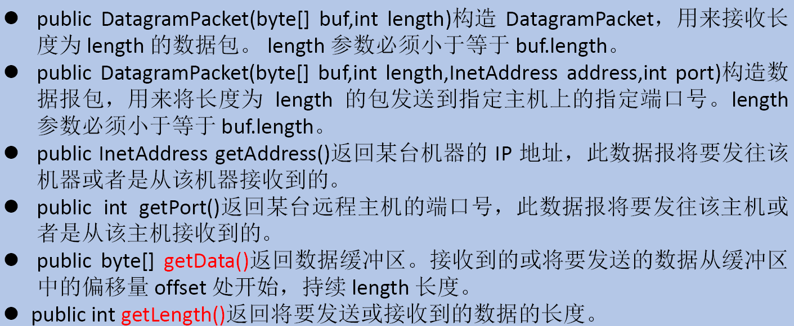


**UDP通信流程**

1.	DatagramSocket与DatagramPacket
2.	建立发送端，接收端
3.	建立数据包
4.	调用Socket的发送、接收方法
5.	关闭Socket

* **发送端**

  

* **接收端**

  


### URL编程

**URL类**

URL的基本结构由5部分组成：
`<传输协议>://<主机名>:<端口号>/<文件名>#片段名?参数列表`

* 例如:
  http://192.168.1.100:8080/helloworld/index.jsp#a?username=shkstart&password=123
* \#片段名：即锚点，例如看小说，直接定位到章节
* 参数列表格式：参数名=参数值&参数名=参数值....


**URL类构造器**

* 为了表示URL，java.net 中实现了类 URL。我们可以通过下面的构造器来初始化一个 URL 对象：
  	public URL (String spec)：通过一个表示URL地址的字符串可以构造一个URL对象。例如：URL url = new URL ("http://www. atguigu.com/");
  	public URL(URL context, String spec)：通过基 URL 和相对 URL 构造一个 URL 对象。例如：URL downloadUrl = new URL(url, “download.html")
  	public URL(String protocol, String host, String file); 例如：new URL("http","www.atguigu.com", “download. html");
  	public URL(String protocol, String host, int port, String file); 例如: URL gamelan = new URL("http", "www.atguigu.com", 80, “download.html");

* URL类的构造器都声明抛出非运行时异常，必须要对这一异常进行处理，通常是用 try-catch 语句进行捕获。

  一 个 URL 对象生成后，其**属性是不能被改变的**，但可以通过它给定的方法来获取这些属性：
  public String getProtocol ( ) 获取该 URL 的协议名
  public String getHost ( ) 获取 该 URL 的主机名
  public String getPort ( ) 获取 该 URL 的端口号
  public String getPath ( ) 获取 该 URL 的文件路径
  public String getFile ( ) 获取 该 URL 的文件名
  public String getQuery ( ) 获取 该 URL 的查询名

  


**针对HTTP 协议的 URLConnection 类**

* URL 的方法 openStream ()()：能从网络上读取数据
* 若希望输出数据，例如向服务器端的 CGI （Common GatewayInterface），是用户浏览器和服务器端的应用程序进行连接的接口）程序发送一些数据，则必须先与 URL 建立连接，然后才能对其进行读写，此时需要使用URLConnection 
* URLConnection ：表示到 URL 所引用的远程对象的连接。当与一个 URL 建立连接时，首先要在一个 URL 对象上通过方法 openConnection () 生成对应的 URLConnection对象。如果连接过程失败，将产生 IOException
  * URL netchinaren = new URL ("http://www.atguigu.com/index.shtml");
  * URLConnectonn u = netchinaren.openConnection ( );

* 通过URLConnection对象获取的输入流和输出流，即可以与现有的CGI程序进行交互
  	public Object getContent( ) throws IOException
  	public int getContentLength( )
  	public String getContentType( )
  	public long getDate( )
  	public long getLastModified( )
  	**public InputStream getInputStream( )throws IOException**
  	public OutputSteram getOutputStream( )throws IOException

**URI、URL和URN的区别**

URI ，uniform resource identifier，统一资源标识符，用来唯一的标识一个资源

URL， uniform resource locator，统一资源定位符，它是一种具体的URI，即URL可以用来标识一个资源，而且还指明了如何locate这个资源

URN，uniform resource name，统一资源命名，是通过名字来标识资源，比如mailto:java-net@java.sun.com

URI是以一种抽象的，高层次概念定义统一资源标识，而URL和URN则是具体的资源标识的方式。URL和URN都是一种URI。在Java的URI中，一个URI实例可以代表绝对的，也可以是相对的，只要它符合URI的语法规则。而URL类则不仅符合语义，还包含了定位该资源的信息，因此它不能是相对的


## Java的反射机制

### 概述

java.lang.reflect

* Reflection（反射）是被视为**动态语言**的关键，反射机制允许程序在执行期借助于**Reflection API**取得任何类的内部信息，并能直接操作任意对象的内部属性及方法
* 加载完类之后，在**堆内存的方法区**中就产生了一个Class类型的对象（一个类只有一个Class对象），这个对象就包含了完整的类的结构信息。我们可以通过这个对象看到类的结构。这个对象就像一面镜子，透过这个镜子看到类的结构，所以，我们形象的称之为：反射。


* Java反射机制提供的功能
  	在运行时判断任意一个对象所属的类
  	在运行时构造任意一个类的对象
  	在运行时判断任意一个类所具有的成员变量和方法
  	在运行时获取泛型信息
  	在运行时调用任意一个对象的成员变量和方法
  	在运行时处理注解
  	生成动态代理

* 反射相关的主要API

  	**java.lang.Class**:代表一个类
  	java.lang.reflect.Method:代表类的方法
  	java.lang.reflect.Field:代表类的成员变量
  	java.lang.reflect.Constructor:代表类的构造器
  	… …


### Class类

#### 介绍

在**Object 类**中定义了以下的方法，此方法将被所有子类继承：`public final Class getClass`
以上的方法返回值的类型是一个Class 类，此类是 Java 反射的源头，实际上所谓反射从程序的运行结果来看也很好理解，即：可以通过对象反射求出类的名称


对象照镜子后可以得到的信息：某个类的属性、方法和构造器、某个类到底实现了哪些接口。对于每个类而言，JRE 都为其保留一个不变的 Class 类型的对象。一个 Class 对象包含了特定某个结构(class/interface/enum/annotation/primitive type/void/[])的有关信息
	**Class本身也是一个类**
	Class 对象只能由系统建立对象
	一个加载的类在 JVM 中只会有一个Class实例
	一个Class对象对应的是一个加载到JVM中的一个.class文件
	每个类的实例都会记得自己是由哪个 Class 实例所生成
	通过Class可以完整地得到一个类中的所有被加载的结构
	Class类是Reflection的根源，针对任何你想动态加载、运行的类，唯有先获得相应的Class对象

```java
 public void test2(){

        for(int i = 0;i < 100;i++){
            int num = new Random().nextInt(3);//0,1,2
            String classPath = "";
            switch(num){
                case 0:
                    classPath = "java.util.Date";
                    break;
                case 1:
                    classPath = "java.lang.Object";
                    break;
                case 2:
                    classPath = "com.atguigu.java.Person";
                    break;
            }

            try {
                Object obj = getInstance(classPath);
                System.out.println(obj);
            } catch (Exception e) {
                e.printStackTrace();
            }
        }
    }

    /*
    创建一个指定类的对象。
    classPath:指定类的全类名
     */
    public Object getInstance(String classPath) throws Exception {
       Class clazz =  Class.forName(classPath);
       return clazz.newInstance();
    }
```


####Class类的常用方法


一个栗子

```java
String str = "test4.Person";
Class clazz = Class.forName(str);
Object obj = clazz.newInstance();
Field field = clazz.getField("name");
field.set(obj, "Peter");
Object name = field.get(obj);
System.out.println(name);
//注：test4.Person是test4包下的Person类
```


#### 如何获取Class的实例

1. 前提： 若已知具体的类，通过类的 class 属性获取， 该 方法最为 安全可靠，
   程序性能最高
   实例 `Class clazz1 = Person.class;`
2. 前提： 已知某个类的实例，调用该实例的 getClass 方法 获取 Class 对象
   实例 `Person p1 = new Person();`
           `Class clazz2 = p1.getClass();`
3. 前提： 已知一个类的全类名，且该类在类路径下， 可 通过 Class 类的静态方法 forName 获取，可能抛出 ClassNotFoundException
   实例 `Class clazz3 = Class.forName("com.atguigu.java.Person");`
4. 其他方式 
   ClassLoadercl = this.getClass getClassLoader
   Class clazz4 =cl.loadClass 类的全类名

#### 拥有Class对象

（1）	class：外部类，成员(成员内部类，静态内部类)，局部内部类，匿名内部类
（2）	interface：接口
（3）    []：数组

（4）	enum：枚举
（5）	annotation：注解@interface
（6）	primitive type：基本数据类型
（7）	void


### 类的加载过程

当程序主动使用某个类时，如果该类还未被加载到内存中，则系统会通过如下三个步骤来对该类进行初始化


* 加载：将class文件字节码内容加载到内存中，并将这些静态数据转换成方法区的运行时数据结构，然后生成一个代表这个类的java.lang.Class对象，作为方法区中类数据的访问入口（即引用地址）。所有需要访问和使用类数据只能通过这个Class对象。这个加载的过程需要`类加载器`参与
* 链接：将Java类的二进制代码合并到JVM的运行状态之中的过程。
  	验证：确保加载的类信息符合JVM规范，例如：以cafe开头，没有安全方面的问题
  	准备：正式**为类变量（static）分配内存**并设置类变量**默认初始值**的阶段，这些内存都将在方法区中进行分配。
  	解析：虚拟机**常量池**内的符号引用（常量名）替换为直接引用（地址）的过程
* 初始化
  	执行**类构造器<clinit>()**方法的过程。**类构造器<clinit>()方法是由编译期自动收集类中所有类变量的赋值动作和静态代码块中的语句合并产生的**。（类构造器是构造类信息的，不是构造该类对象的构造器）
  	当初始化一个类的时候，如果发现其父类还没有进行初始化，则需要先触发其父类的初始化
  	虚拟机会保证一个类的<clinit>()方法在多线程环境中被正确加锁和同步


#### **什么时候发生类的初始化？**

* 类的主动引用（一定会发生类的初始化）
  	当虚拟机启动，先初始化main方法所在的类
  	new一个类的对象
  	调用类的静态成员（除了final常量）和静态方法
  	使用java.lang.reflect包的方法对类进行反射调用
  	当初始化一个类，如果其父类没有被初始化，则先会初始化它的父类
* 类的被动引用（不会发生类的初始化）
  	当访问一个静态域时，只有真正声明这个域的类才会被初始化
  	当通过子类引用父类的静态变量，不会导致子类初始化
  	通过数组定义类引用，不会触发此类的初始化
  	引用常量不会触发此类的初始化（常量在链接阶段就存入调用类的常量池中了）


#### 类加载器的作用

* 类加载的作用： 将 class 文件字节码内容加载到内存中，并将这些静态数据转换成方法区的运行时数据结构 然后在堆中生成一个代表这个**类**的 java lang Class 对象，作为方法区中**类数据**的访问入口
* 类缓存： 标准的 JavaSE 类加载器可以按要求查找类，一旦某个类被加载到类加载器中它将维持加载缓存 一段时间 。不过 JVM 垃圾回收机制可以回收这些 Class 对象 

#### ClassLoader

类加载器作用是用来把类(class)装载进内存的。JVM 规范定义了如下类型的类的加载器

> ```
> 引导类加载器主要负责加载java的核心类库，无法加载自定义类
> ```


```java
//1.获取一个系统类加载器
ClassLoader classloader = ClassLoader.getSystemClassLoader();
System.out.println(classloader);
//2.获取系统类加载器的父类加载器，即扩展类加载器
classloader = classloader.getParent();
System.out.println(classloader);
//3.获取扩展类加载器的父类加载器，即引导类加载器
classloader = classloader.getParent();
System.out.println(classloader);
//4.测试当前类由哪个类加载器进行加载
classloader = Class.forName("exer2.ClassloaderDemo").getClassLoader();
System.out.println(classloader);
//5.测试JDK提供的Object类由哪个类加载器加载
classloader = Class.forName("java.lang.Object").getClassLoader();
System.out.println(classloader);
//*6.关于类加载器的一个主要方法：getResourceAsStream(String str):获取类路径下的指定文件的输入流
InputStream in = null;
in = this.getClass().getClassLoader().getResourceAsStream("exer2\\test.properties");
System.out.println(in);
```


### 创建运行时类的对象

#### 有了Class对象，能做什么？

创建类的对象： 调用 Class 对象的 `newInstance()` 方法
要求： 1）类必须有一个无参数的构造器
			 2）类的构造器的访问权限需要足够

难道没有无参的构造器就不能创建对象了吗？
不是！只要在操作的时候明确的调用类中的构造器，并将参数传递进去之后，才可以实例化操作。步骤如下：

1）	通过Class类的`getDeclaredConstructor(Class … parameterTypes)`取得本类的指定形参类型的构造器
2）	向构造器的形参中传递一个对象数组进去，里面包含了构造器中所需的各个参数
3）	通过Constructor实例化对象

```java
//1.根据全类名获取对应的Class对象
String name = “atguigu.java.Person";
Class clazz = null;
clazz = Class.forName(name);
//2.调用指定参数结构的构造器，生成Constructor的实例
Constructor con = clazz.getConstructor(String.class,Integer.class); 
//3.通过Constructor的实例创建对应类的对象，并初始化类属性
Person p2 = (Person) con.newInstance("Peter",20);
System.out.println(p2);


public void test1() throws IllegalAccessException, InstantiationException {

        Class<Person> clazz = Person.class;
        /*
        newInstance():调用此方法，创建对应的运行时类的对象。内部调用了运行时类的空参的构造器。

        要想此方法正常的创建运行时类的对象，要求：
        1.运行时类必须提供空参的构造器
        2.空参的构造器的访问权限得够。通常，设置为public。


        在javabean中要求提供一个public的空参构造器。原因：
        1.便于通过反射，创建运行时类的对象
        2.便于子类继承此运行时类时，默认调用super()时，保证父类有此构造器

         */
        Person obj = clazz.newInstance();
        System.out.println(obj);

}
```


### 获取运行时类的完整结构

Field（属性）、Method（方法）、Constructor、Superclass、Interface、Annotation

通过反射可以获取

1. 实现的全部接口

   ```java
   //确定此对象所表示的类或接口实现的接口
   public Class<?>[] getInterfaces();
   ```

2. 所继承的父类

   ```java
   //返回表示此Class所表示的实体（类、接口、基本类型）的父类的Class
   public Class<? Super T> getSuperclass();
   ```

3. 全部的构造器

   ```java
   //返回此Class对象所表示的类的所有public构造方法
   public Constructor<T>[] getConstructors();
   //返回此Class对象表示的类声明的所有构造方法
   public Constructor<T>[] getDeclaredConstructors();
   //Constructor类中：
   取得修饰符: public int getModifiers();
   取得方法名称: public String getName();
   取得参数的类型：public Class<?>[] getParameterTypes();
   ```

4. 全部的方法

   ```java
   //返回此Class对象所表示的类或接口的全部方法
   public Method[] getDeclaredMethods()
   //返回此Class对象所表示的类或接口的public的方法
   public Method[] getMethods()
   //Method类中：
   public Class<?> getReturnType()				取得全部的返回值
   public Class<?>[] getParameterTypes()		取得全部的参数
   public int getModifiers()					取得修饰符
   public Class<?>[] getExceptionTypes()		取得异常信息
   ```

5. 全部的Field

   ```java
   //返回此Class对象所表示的类或接口的public的Field
   public Field[] getFields()
   //返回此Class对象所表示的类或接口的全部Field
   public Field[] getDeclaredFields()
   //Field方法中：
   public int getModifiers()  					以整数形式返回此Field的修饰符
   public Class<?> getType()  					得到Field的属性类型
   public String getName()  					返回Field的名称。
   ```

6. Annotation相关

   ```java
   get Annotation(Class<T> annotationClass)
   getDeclaredAnnotations()
   ```

7. 泛型相关

   ```java
   //获取父类泛型类型
   Type getGenericSuperclass()
   //泛型类型：ParameterizedType
   //获取实际的泛型类型参数数组
   getActualTypeArguments()
   ```

8. 类所在的包

   ```java
   Package getPackage()
   ```

举个栗子

```java
public class ReflectionTest {

    /*

        不需要掌握
     */
    @Test
    public void testField() throws Exception {
        Class clazz = Person.class;

        //创建运行时类的对象
        Person p = (Person) clazz.newInstance();


        //获取指定的属性：要求运行时类中属性声明为public
        //通常不采用此方法
        Field id = clazz.getField("id");

        /*
        设置当前属性的值

        set():参数1：指明设置哪个对象的属性   参数2：将此属性值设置为多少
         */

        id.set(p,1001);

        /*
        获取当前属性的值
        get():参数1：获取哪个对象的当前属性值
         */
        int pId = (int) id.get(p);
        System.out.println(pId);


    }
    /*
    如何操作运行时类中的指定的属性 -- 需要掌握
     */
    @Test
    public void testField1() throws Exception {
        Class clazz = Person.class;

        //创建运行时类的对象
        Person p = (Person) clazz.newInstance();

        //1. getDeclaredField(String fieldName):获取运行时类中指定变量名的属性
        Field name = clazz.getDeclaredField("name");

        //2.保证当前属性是可访问的
        name.setAccessible(true);
        //3.获取、设置指定对象的此属性值
        name.set(p,"Tom");

        System.out.println(name.get(p));
    }

    /*
    如何操作运行时类中的指定的方法 -- 需要掌握
     */
    @Test
    public void testMethod() throws Exception {

        Class clazz = Person.class;

        //创建运行时类的对象
        Person p = (Person) clazz.newInstance();

        /*
        1.获取指定的某个方法
        getDeclaredMethod():参数1 ：指明获取的方法的名称  参数2：指明获取的方法的形参列表
         */
        Method show = clazz.getDeclaredMethod("show", String.class);
        //2.保证当前方法是可访问的
        show.setAccessible(true);

        /*
        3. 调用方法的invoke():参数1：方法的调用者  参数2：给方法形参赋值的实参
        invoke()的返回值即为对应类中调用的方法的返回值。
         */
        Object returnValue = show.invoke(p,"CHN"); //String nation = p.show("CHN");
        System.out.println(returnValue);

        System.out.println("*************如何调用静态方法*****************");

        // private static void showDesc()

        Method showDesc = clazz.getDeclaredMethod("showDesc");
        showDesc.setAccessible(true);
        //如果调用的运行时类中的方法没有返回值，则此invoke()返回null
//        Object returnVal = showDesc.invoke(null);
        Object returnVal = showDesc.invoke(Person.class);
        System.out.println(returnVal);//null

    }

    /*
    如何调用运行时类中的指定的构造器
     */
    @Test
    public void testConstructor() throws Exception {
        Class clazz = Person.class;

        //private Person(String name)
        /*
        1.获取指定的构造器
        getDeclaredConstructor():参数：指明构造器的参数列表
         */

        Constructor constructor = clazz.getDeclaredConstructor(String.class);

        //2.保证此构造器是可访问的
        constructor.setAccessible(true);

        //3.调用此构造器创建运行时类的对象
        Person per = (Person) constructor.newInstance("Tom");
        System.out.println(per);

    }

}
```


### 调用运行时类的指定结构

1. **调用指定方法**

   通过反射，调用类中的方法，通过Method类完成。步骤：

   1.	通过`Class`类的`getMethod(String name,Class…parameterTypes)`方法取得一个`Method`对象，并设置此方法操作时所需要的参数类型
   2.	之后使用`Object invoke(Object obj, Object[] args)`进行调用，并向方法中传递要设置的obj对象的参数信息

   关于`Object invoke(Object obj, Object …  args)`:

   1. Object 对应**原方法的返回值**，若原方法无返回值，此时返回null

   2. 若原方法若为静态方法，此时形参Object obj可为null

   3. 若原方法形参列表为空，则Object[] args为null

   4. 若原方法声明为private,则需要在调用此`invoke()`方法前，显式调用

      `Method`对象的`setAccessible(true)`方法，将可访问private的方法


2. **调用指定属性**

   在反射机制中，可以直接通过Field类操作类中的属性，通过Field类提供的set()和get()方法就可以完成设置和取得属性内容的操作。

   ```java
   //返回此Class对象表示的类或接口的指定的public的Field
   public Field getField(String name);
   //返回此Class对象表示的类或接口的指定的Field
   public Field getDeclaredField(String name);
   ```

   在Field中:

   ```java
   //取得指定对象obj上此Field的属性内容
   public Object get(Object obj);
   //设置指定对象obj上此Field的属性内容
   public void set(Object obj,Object value);
   ```

   **关于setAccessible方法的使用**

   * `Method`和`Field`、`Constructor`对象都有`setAccessible()`方法
   * `setAccessible`启动和禁用访问安全检查的开关
   * 参数值为true则指示反射的对象在使用时应该取消**Java语言访问检查**
     	提高反射的效率。如果代码中必须用反射，而该句代码需要频繁的被调用，那么请设置为true
     	使得原本无法访问的**私有成员也可以访问**
   * 参数值为false则指示反射的对象应该实施Java语言访问检查

举个栗子

```java
public void test2() throws Exception{
    Class clazz = Person.class;
    //1.通过反射，创建Person类的对象
    Constructor cons = clazz.getConstructor(String.class,int.class);
    Object obj = cons.newInstance("Tom", 12);
    Person p = (Person) obj;
    System.out.println(p.toString());
    //2.通过反射，调用对象指定的属性、方法
    //调用属性
    Field age = clazz.getDeclaredField("age");
    age.set(p,10);
    System.out.println(p.toString());

    //调用方法
    Method show = clazz.getDeclaredMethod("show");
    show.invoke(p);

    System.out.println("*******************************");

    //通过反射，可以调用Person类的私有结构的。比如：私有的构造器、方法、属性
    //调用私有的构造器
    Constructor cons1 = clazz.getDeclaredConstructor(String.class);
    cons1.setAccessible(true);
    Person p1 = (Person) cons1.newInstance("Jerry");
    System.out.println(p1);

    //调用私有的属性
    Field name = clazz.getDeclaredField("name");
    name.setAccessible(true);
    name.set(p1,"HanMeimei");
    System.out.println(p1);

    //调用私有的方法
    Method showNation = clazz.getDeclaredMethod("showNation", String.class);
    showNation.setAccessible(true);
    String nation = (String) showNation.invoke(p1,"中国");//相当于String nation = p1.showNation("中国")
    System.out.println(nation);
}
```

### 反射的应用：动态代理

#### 基本

* 代理设计模式的原理:
  使用一个代理将对象包装起来, 然后用该代理对象取代原始对象。任何对原始对象的调用都要通过代理。代理对象决定是否以及何时将方法调用转到原始对象上
  之前的代理机制的操作，属于静态代理，特征是代理类和目标对象的类都是在编译期间确定下来，不利于程序的扩展。同时，每一个代理类只能为一个接口服务，这样一来程序开发中必然产生过多的代理。**最好可以通过一个代理类完成全部的代理功能**

* 动态代理是指客户通过代理类来调用其它对象的方法，并且是在程序运行时根据需要**动态创建目标类的代理对象**
* 动态代理使用场合:
  	调试
  	远程方法调用
* 动态代理相比于静态代理的优点：抽象角色中（接口）声明的所有方法都被转移到调用处理器一个集中的方法中处理，这样，我们可以更加灵活和统一的处理众多的方法

#### Java动态代理相关API

* Proxy ：专门完成代理的操作类，是所有动态代理类的父类。通过此类为一个或多个接口动态地生成实现类

* 

#### 动态代理步骤

1. 创建一个实现接口`InvocationHandler`的类，它必须实现invoke方法，以完成代理的具体操作

   

2. 创建被代理的类以及接口

   

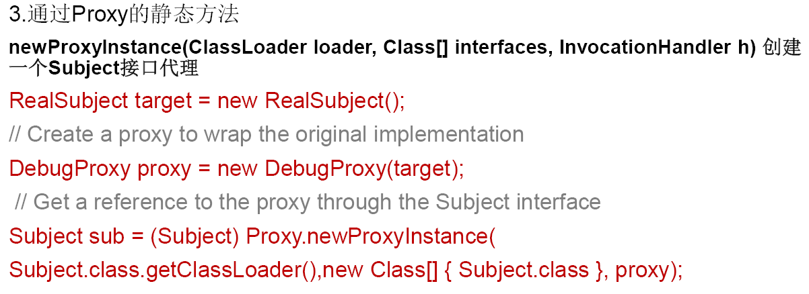


#### 动态代理与AOP (Aspect Orient Programming)

OOP（Object-Oriented Programing，面向对象编程）引入封装、继承和多态性等概念来建立一种对象层次结构，用以模拟公共行为的一个集合。当我们需要为分散的对象引入公共行为的时候，OOP则显得无能为力。也就是说，OOP允许你定义从上到下的关系，但并不适合定义从左到右的关系


```java
interface Human{

    String getBelief();

    void eat(String food);

}
//被代理类
class SuperMan implements Human{


    @Override
    public String getBelief() {
        return "I believe I can fly!";
    }

    @Override
    public void eat(String food) {
        System.out.println("我喜欢吃" + food);
    }
}

class HumanUtil{

    public void method1(){
        System.out.println("====================通用方法一====================");

    }

    public void method2(){
        System.out.println("====================通用方法二====================");
    }

}

/*
要想实现动态代理，需要解决的问题？
问题一：如何根据加载到内存中的被代理类，动态的创建一个代理类及其对象。
问题二：当通过代理类的对象调用方法a时，如何动态的去调用被代理类中的同名方法a。


 */

class ProxyFactory{
    //调用此方法，返回一个代理类的对象。解决问题一
    public static Object getProxyInstance(Object obj){//obj:被代理类的对象
        MyInvocationHandler handler = new MyInvocationHandler();

        handler.bind(obj);  //会调用handler中的invoke，把obj传入invoke的第一个参数，并自动获取obj的method

        return Proxy.newProxyInstance(obj.getClass().getClassLoader(),obj.getClass().getInterfaces(),handler);
    }

}

class MyInvocationHandler implements InvocationHandler{

    private Object obj;//需要使用被代理类的对象进行赋值

    public void bind(Object obj){
        this.obj = obj;
    }

    //当我们通过代理类的对象，调用方法a时，就会自动的调用如下的方法：invoke()
    //将被代理类要执行的方法a的功能就声明在invoke()中
    @Override
    public Object invoke(Object proxy, Method method, Object[] args) throws Throwable {

        HumanUtil util = new HumanUtil();
        util.method1();

        //method:即为代理类对象调用的方法，此方法也就作为了被代理类对象要调用的方法
        //obj:被代理类的对象
        Object returnValue = method.invoke(obj,args);

        util.method2();

        //上述方法的返回值就作为当前类中的invoke()的返回值。
        return returnValue;

    }
}

public class ProxyTest {

    public static void main(String[] args) {
        SuperMan superMan = new SuperMan();
        //proxyInstance:代理类的对象
        Human proxyInstance = (Human) ProxyFactory.getProxyInstance(superMan);
        //当通过代理类对象调用方法时，会自动的调用被代理类中同名的方法
        String belief = proxyInstance.getBelief();
        System.out.println(belief);
        proxyInstance.eat("四川麻辣烫");

        System.out.println("*****************************");

        NikeClothFactory nikeClothFactory = new NikeClothFactory();

        ClothFactory proxyClothFactory = (ClothFactory) ProxyFactory.getProxyInstance(nikeClothFactory);

        proxyClothFactory.produceCloth();

    }
}
```

```java
 * 静态代理举例
 *
 * 特点：代理类和被代理类在编译期间，就确定下来了。
interface ClothFactory{

    void produceCloth();

}

//代理类
class ProxyClothFactory implements ClothFactory{

    private ClothFactory factory;//用被代理类对象进行实例化

    public ProxyClothFactory(ClothFactory factory){
        this.factory = factory;
    }

    @Override
    public void produceCloth() {
        System.out.println("代理工厂做一些准备工作");

        factory.produceCloth();

        System.out.println("代理工厂做一些后续的收尾工作");

    }
}

//被代理类
class NikeClothFactory implements ClothFactory{

    @Override
    public void produceCloth() {
        System.out.println("Nike工厂生产一批运动服");
    }
}

public class StaticProxyTest {
    public static void main(String[] args) {
        //创建被代理类的对象
        ClothFactory nike = new NikeClothFactory();
        //创建代理类的对象
        ClothFactory proxyClothFactory = new ProxyClothFactory(nike);

        proxyClothFactory.produceCloth();

    }
}
```


* 使用Proxy生成一个动态代理时，往往并不会凭空产生一个动态代理，这样没有太大的意义。通常都是为指定的目标对象生成动态代理
* 这种动态代理在AOP中被称为AOP代理，AOP代理可代替目标对象，AOP代理包含了目标对象的全部方法。但AOP代理中的方法与目标对象的方法存在差异：**AOP代理里的方法可以在执行目标方法之前、之后插入一些通用处理**


### 补充：Property读取配置文件

```java
 public void test2() throws Exception {

        Properties pros =  new Properties();
        //此时的文件默认在当前的module下。
        //读取配置文件的方式一：
//        FileInputStream fis = new FileInputStream("jdbc.properties");
//        FileInputStream fis = new FileInputStream("src\\jdbc1.properties");
//        pros.load(fis);

        //读取配置文件的方式二：使用ClassLoader
        //配置文件默认识别为：当前module的src下
        ClassLoader classLoader = ClassLoaderTest.class.getClassLoader();
        InputStream is = classLoader.getResourceAsStream("jdbc1.properties");//可以看出装载器中有流
        pros.load(is);//从输入流中获取键值对

        String user = pros.getProperty("user");			//通过键获取值
        String password = pros.getProperty("password");	//通过键获取值
        System.out.println("user = " + user + ",password = " + password);
    }

jdbc文件：
   	user=\u5434\u98DE
	password=abc123
程序输出：
    user = 黄峰,password = abc123
```


## Java8新特性


### Lambda表达式

是一个`匿名函数`，我们可以把 Lambda 表达式理解为是 一段`可以传递的代码`

 Lambda 表达式中的参数类型都是由编译器推断得出的。Lambda 表达式中无需指定类型，程序依然可以编译，这是因为 `javac` 根据程序的上下文，在后台推断出了参数的类型。Lambda 表达式的类型依赖于上下文环境，是由编译器推断出来的。这就是所谓的 `类型推断`

#### 转换举例


#### 语法格式


### 函数式(Functional)接口

#### 基本

* 只包含**一个抽象方法**的接口，称为函数式接口
* 你可以通过 Lambda 表达式来创建该接口的对象。（若 Lambda 表达式抛出一个受检异常(即：非运行时异常)，那么该异常需要在目标接口的抽象方法上进行声明）
* 我们可以在一个接口上使用 **@FunctionalInterface** 注解，这样做可以检查它是否是一个函数式接口。同时 javadoc 也会包含一条声明，说明这个接口是一个函数式接口
* 在**java.util.function**包下定义了Java 8 的丰富的函数式接口

在Java8中，Lambda表达式就是一个**函数式接口的实例**。这就是Lambda表达式和函数式接口的关系。也就是说，只要一个对象是函数式接口的实例，那么该对象就可以用Lambda表达式来表示。所以以前用匿名实现类表示的现在都可以用Lambda表达式来写

#### 函数式接口举例

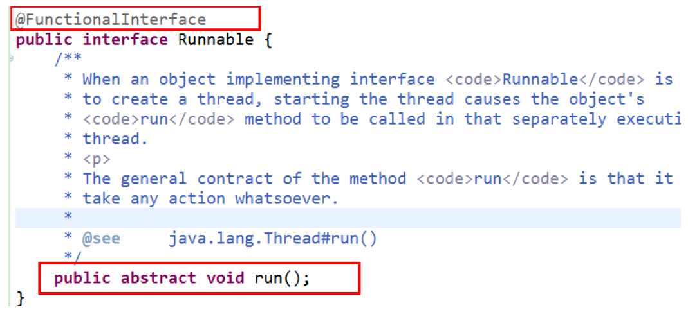


#### Java 内置四大核心函数式接口


#### 方法引用与构造器引用

* 当要传递给Lambda体的操作，已经有实现的方法了，可以使用方法引用
* 方法引用可以看做是Lambda表达式深层次的表达。换句话说，方法引用就是Lambda表达式，也就是函数式接口的一个实例，通过方法的名字来指向一个方法，可以认为是Lambda表达式的一个语法糖
* 要求：**实现接口的抽象方法的参数列表和返回值类型，必须与方法引用的方法的参数列表和返回值类型保持一致**
* 格式：使用操作符 “::” 将类(或对象) 与 方法名分隔开来
* 如下三种主要使用情况：
  	对象::实例方法名
  	类::静态方法名
  	类::实例方法名


##### 方法引用


##### 构造器引用

格式： ClassName::new 
与函数式接口相结合，自动与函数式接口中方法兼容。
可以把构造器引用赋值给定义的方法，要求**构造器参数列表要与接口中抽象方法的参数列表一致！且方法的返回值即为构造器对应类的对象。**


##### 数组引用


### Stream API

Stream API ( java.util.stream)

可以指定你希望对集合进行的操作，可以执行非常复杂的查找、过滤和映射数据等操作。 **使用Stream API 对集合数据进行操作，就类似于使用 SQL 执行的数据库查询**。也可以使用 Stream API 来并行执行操作

Stream 和 Collection 集合的区别：**Collection 是一种静态的内存数据结构**，而 Stream 是有关计算的。**前者是主要面向内存，存储在内存中，后者主要是面向 CPU，通过 CPU 实现计算**

集合讲的是数据，Stream讲的是计算

①	Stream 自己不会存储元素。
②	Stream 不会改变源对象。相反，他们会返回一个持有结果的新Stream
③	Stream 操作是延迟执行的。这意味着他们会等到需要结果的时候才执行

#### Stream操作步骤


#### 创建Stream的不同方式

1. 通过集合：

Java8 中的 Collection 接口被扩展，提供了两个获取流的方法：

`default Stream<E> stream()` : 返回一个顺序流
`default Stream<E> parallelStream()` : 返回一个并行流

2. 通过数组：

ava8 中的Arrays 的**静态**方法 stream() 可以获取数组流：

`static <T> Stream<T> stream(T[] array)`: 返回一个流

重载形式，能够处理对应基本类型的数组：

	public static IntStream stream(int[] array)
	public static LongStream stream(long[] array)
	public static DoubleStream stream(double[] array)

3. 通过Stream的of():

可以调用Stream类静态方法 of(), 通过显示值创建一个流。它可以接收任意数量的参数

`public static<T> Stream<T> of(T... values)` : 返回一个流

4. 创建无限流

可以使用静态方法 Stream.iterate() 和 Stream.generate()：创建无限流

public static<T> Stream<T> iterate(final T seed, final UnaryOperator<T> f)	迭代

public static<T> Stream<T> generate(Supplier<T> s)  	生成


#### Stream的中间操作


### Option类

* 为了解决空指针异常

* Optional<T> 类(java.util.Optional) 是一个容器类，它可以保存类型T的值，代表这个值存在。或者仅仅保存null，表示这个值不存在。原来用 null 表示一个值不存在，现在 Optional 可以更好的表达这个概念。并且可以避免空指针异常
* Optional类的Javadoc描述如下：这是一个可以为null的容器对象。如果值存在则isPresent()方法会返回true，调用get()方法会返回该对象。

* Optional提供很多有用的**方法**，这样我们就不用显式进行空值检测。
  * 创建Optional类对象的方法：
    	Optional.of(T t) : 创建一个 Optional 实例，t必须非空
    	Optional.empty() : 创建一个空的 Optional 实例
    	Optional.ofNullable(T t)：t可以为null
  * 判断Optional容器中是否包含对象：
    	boolean isPresent() : 判断是否包含对象
    	**void ifPresent(Consumer<? super T> consumer)** ：如果有值，就执行Consumer接口的实现代码，并且该值会作为参数传给它
  * 获取Optional容器的对象：
    	T get(): 如果调用对象包含值，返回该值，否则抛异常
    	T orElse(T other) ：如果有值则将其返回，否则返回指定的other对象
    	T orElseGet(Supplier<? extends T> other) ：如果有值则将其返回，否则返回由Supplier接口实现提供的对象
    	T orElseThrow(Supplier<? extends X> exceptionSupplier) ：如果有值则将其返回，否则抛出由Supplier接口实现提供的异常


