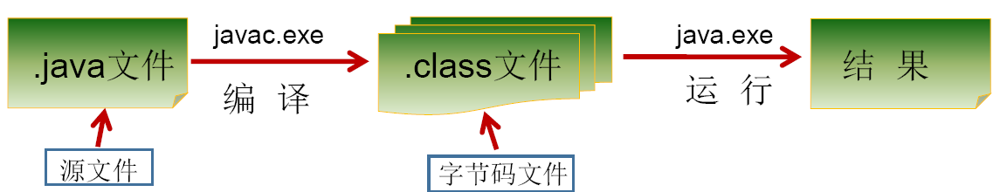
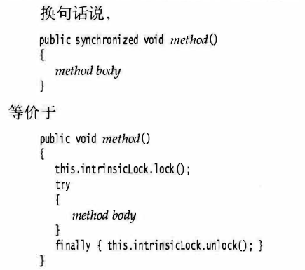
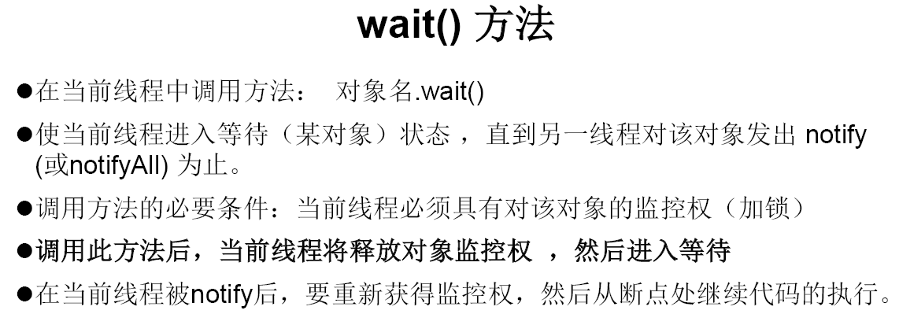

# Java基础

[toc]

## 基本常识

### 工程，模块，包和类

结构如下

* 工程
  * 模块
    * 包
      	* 类

**工程(project)**


**包(packet)**

在src文件下面右键创立package，package中有.java文件，各种类，接口

**类(class)**

在package底下就可以创建类了，我们在类里面写属性、方法

**模块(module)**

如果想要在这个工程的平行的再建立一个工程，可以右键打开我们的工程存放的文件夹，然后新建module就可以

**关系**

* 一个包下面的资源都是共享的（除非是private），不同包下的资源相互使用的时候，需要引入包

  引入包：import

* 不同的项目之间的资源是不共享的

### 各种文件

#### out 文件

存放javac编译后的字节码的

#### .idea文件

这个是编译的配置文件，编译的内容包括可以控制编译之后的类的位置，工作空间的相关配置，库的配置，编码配置和其他的插件配置等等。如果没有这个配置文件，程序就很难正常的跑起来，即使环境是配置良好的。

##基本语法

### 背景

####Java技术平台

1. Java SE （Java Standard Edition） 标准版

   支持面向**桌面级应用**（如Windows 下的应用程序）的 Java 平台，提供了完整的 Java 核
   心 API ，此版本以前称为 J2SE

2. Java EE    (Java Enterprise Edition) 企业版

   是为开发企业环境下的应用程序提供的一套解决方案。该技术体系中包含的技术如
   Servlet 、 Jsp 等，**主要针对于 Web 应用程序开发**。版本以前称为 J2EE

3. Java ME(Java Micro Edition) 小型版

   支持Java 程序运行在移动终端（手机、 PDA ）上的平台

#### 跨平台

因为JVM


#### 核心机制

1. Java 虚拟机 (Java Virtal Machine）

   

   

2. 垃圾收集机制 (Garbage Collection）

#### 环境配置


**简单而言，使用JDK 的开发工具完成的 java 程序，交给 JRE 去运行。**

* JDK (Java Development Kit）

   Java 开发工具包 包括了JRE

* JRE (Java Runtime Environment)

   Java 运行环境 包括JVM和各种库

  运行只要有JRE就行

* 环境变量 

  path： windows 系统执行命令时要搜寻的路径。正常来说，执行一个程序，需要进入程序所在的目录，设置环境变量，可以全局执行程序

  

  windows中的查找规则就是首先在当前目录中查找，没有，就在环境变量中查找

* Javac

  编译时使用

* Java

  运行时使用

* Javadoc 

  网页文档

###程序如何执行？

1. 把Java代码编写到.java文件中 (使用记事本)

   

2. 通过 javac 命令对该 java 文件进行编译 （使用命令行 + javac）

   切换文件目录

   

   注意：class的文件名要和代码中一致

   

   

3. 通过 java 命令对生成的 class 文件进行运行, 在这一步，可以通过cmd向main函数传参





### 文档注释（Java特有）

格式：/**
		@author 指定java程序的作者
		@version 指定源文件的版本
*/

注释内容可以被JDK提供的工具javadoc所解析，生成一套以网页文件形式体现的该程序的说明文档。单行多行注释不可以被javadoc解析

### 变量的分类


成员变量：在方法体外，类体内声明的变量

局部变量：在方法体内部声明的变量

成员变量是在对象创建以后存在于堆中，对象回收时，成员变量消失
局部变量是在方法被调用时存在于栈中，方法调执行结束，从栈中清除

成员变量：随对象的创建而创建，对象回收时，成员变量消失
局部变量：随着方法的调用被创建，方法执行结束后，从栈中清除

### Java命名规范

包名 ：多单词组成时所有字母都小写 xxxyyyzzz
类名、接口名 ：多单词组成时，所有单词的首字母大写 XxxYyyZzz
变量名、方法名 ：多单词组成时，第一个单词首字母小写，第二个单词开始每个单词首字母大写： xxxYyyZzz
常量名 ：所有字母都大写。多单词时每个单词用**下划线**连接 XXX_YYY_ZZZ

### 关键字和保留字

Java中的关键字都是小写的

保留字：goto和const

### 标识符

严格区分大小写，数字不能作为开头，不包含空格

### 基本数据类型

#### 整型和浮点型


java 的整型常量默认为 int 型，声明 long 型常量须后加‘ l’ 或‘ L’
Java 的浮点型常量默认为 double 型 声明 float 型常量，须后加‘ f’ 或‘ F’ 

#### 字符型

char：1字符 = 2字节

Java 中的所有字符都使用 Unicode 编码, 故一个字符可以存储一个字母，一个汉字，或其他书面语的一个字符

字符型变量的三种表现形式:

1. 字符常量是用单引号括起来的单个字符。 例如： char c1 = 'a'; char c2 = '中';
2. Java 中还允许使用转义字符‘ ‘\\’来 将其后的字符转变为特殊字符型常量。例如： char c3 = ‘ \n';
3. 直接使用 **Unicode** 值来表示字符型常量：'\uXXXX', 其中， '\uXXXX' 代表一个十六进制整数。如：\u000a 表示 \n ;

char类型是可以进行运算的。因为它都对应有Unicode码

#### 布尔型

1. 不可以使用0或非 0 的整数替代false和true，这点和C语言不同

2. 在编译之后都使用java虚拟机中的int数据类型来代替：true用1表示，false用0表示

### 数据类型转换

#### 自动类型转换

容量小的类型自动转换为容量大的数据类型。数据类型按容量大小排序为：


注意

1. 有多种类型的数据混合运算时，系统首先自动将所有数据转换成容量最大的那种数据类型，然后再进行计算
2. byte,short,char之间不会相互转换，他们三者在计算时首先转换为int类型
3. boolean类型不能与其它数据类型运算
4. **当把任何基本数据类型的值和字符串(String)进行连接运算时(+)，基本数据类型的值将自动转化为字符串(String)类型**

例子


#### 强制类型转换

* 将容量大的数据类型转换为容量小的数据类型，使用时要加上强制转换符：()，但可能造成精度降低或溢出,格外要注意

* 通常，字符串不能直接转换为基本类型，但通过基本类型对应的包装类则可以实现把字符串转换成基本类型
* boolean类型不可以转换为其它的数据类型


### 运算符

“+”除字符串相加功能外，还能把非字符串转换成字符串.例如：System.out.println(“5+5=”+5+5); //打印结果： 5+5=55 

#### instanceof 

检查是否是类的对象

```java
if("ellie" instanceof String)
            System.out.println("YES");
else
            System.out.println("No");
```

#### 逻辑运算符


* “&”和“&&”的区别：
  单&时，左边无论真假，右边都进行运算；
  双&时，如果左边为真，右边参与运算，如果左边为假，那么右边不参与运算。

#### 位运算符

**位运算是直接对整数的二进制进行的运算**


右移和无符号右移的区别：


### 数组

* 数组一旦初始化，其长度是不可变的

* 每个数组都有一个属性length指明它的长度，例如：a.length 指明数组a的长度(元素个数)

* 数组是引用类型，它的元素相当于类的成员变量，因此数组一经分配空间，其中的每个元素也被按照成员变量同样的方式被隐式初始化

* 对于基本数据类型而言，默认初始化值各有不同
  对于引用数据类型而言，默认初始化值为null (注意与0不同)

* 比如 int[] arr = new int{3,4,5}; 这里arr就是指向堆区中分配3，4，5元素的首地址的指针

  

#### 声明方式

type var [] 或 type[] var

注意：Java 语言中声明数组时不能指定其长度 数组中元素的数 例如： int a[5]; 非法

#### 初始化

* 动态初始化

  数组声明且为数组元素分配空间 与 赋值的操作 分开进行

  ```java
  int[] arr = new int[3];
  arr[0] = 3;
  arr[1] = 9;
  arr[2] = 8;
  ```

  

* 静态初始化

  在定义数组的同时就为数组元素分配空间并赋值

  ```java
  int arr[] = new int[]{3, 9, 8};
  int[] arr = {3,9,8};
  String names[] = {"ellie", "joel"};
  ```

#### 二维数组

内存解析


* 动态初始化 

  **int\[][] arr = new int \[3][2];**

  定义了名称为arr的二维数组
  二维数组中有3个一维数组
  每一个一维数组中有2个元素
  一维数组的名称分别为arr[0], arr[1], arr[2]
  给第一个一维数组1脚标位赋值为78写法是：arr\[0][1] = 78;

  **int\[][] arr = new int\[3][];**

  二维数组中有3个一维数组
  每个一维数组都是默认初始化值null (注意：区别于格式1）可以对这个三个一维数组分别进行初始化

  arr[0] = new int[3];    arr[1] = new int[1];   arr[2] = new int[2];

  **int\[][] arr = new int\[][3];  //非法**

* 静态初始化

  **int\[][] arr = new int\[][]{{3,8,2},{2,7},{9,0,1,6}};**

  定义一个名称为arr的二维数组，二维数组中有三个一维数组每一个一维数组中具体元素也都已初始化
  第一个一维数组 arr[0] = {3,8,2};
  第二个一维数组 arr[1] = {2,7};
  第三个一维数组 arr[2] = {9,0,1,6};
  第三个一维数组的长度表示方式：arr[2].length

  * **注意特殊写法情况：int[] x,y[]; x是一维数组，y是二维数组。**
  * **Java中多维数组不必都是规则矩阵形式**

#### 数组中的常见异常


**编译时，不报错**

### 零碎

* 一个源文件中最多只能有一个public类。其它类的个数不限，如果源文件包含一个public类，则文件名必须按该类名命名

* Java中定义成员变量时采用合法的 前向引用

  ```java
  public class Test{
  	int num1 = 12;
  	int num2 = num1 + 2;
  }
  错误形式：
  public class Test{
  	int num2 = num1 + 2
  	int num1 = 12;
  }
  
  ```

  

* switch( 表达式）中 表达式的值 必须 是下述几种类型之一： byte short char int 枚举 (jdk String (jdk 7.0)

  case 子句中的值必须是常量

  ```Java
  String season = "summer";
  switch (season){
              case "spring":
                  System.out.println("Ellie");
                  break;
              case "summer":
                  System.out.println("Joel");
                  break;
              default:
                  System.out.println("Wolf");
   }
  ```

  

* 什么是Unicode？

  一种编码，将世界上所有的符号都纳入其中。每一个符号都给予一个独一无二的编码，使用 Unicode 没有乱码的问题

* 为什么会产生乱码？

  乱码：世界上存在着多种编码方式，**同一个二进制数字可以被解释成不同的符号**。因此，要想打开一个文本文件，就必须知道它的编码方式，否则用错误的编码方式解读，就会出现乱码 。

* UTF_8

  互联网上使用最广的**一种 Unicode 的实现方式**，变长的编码方式。它可以使用 1-6 个字节表示一个符号，根据不同的符号而变化字节长度。


## 面向对象

### 基本概念

#### 属性（成员变量）

修饰符 数据 类型 属性 名 = 初始化值 ;

在方法体外，类体内声明的变量

```java
private int age;
```


**在堆或静态域中！！！**

前面可以有修饰符

#### 局部变量

在方法体内部声明的变量

栈区或静态区域内

**前面没有修饰符**

#### 方法（函数）

行 为：对应类中的成员方法（方法就是函数）

方法前面有修饰符

##### 可变参数形参

```java
public static void test(int a ,String…books);//基本语法

public class OOPTest {//例子
    public static void main(String[] args) {
        String[] arr = {"ellie", "joel"};
        test(arr);
        test("joel","ellie");
        test(new String[]{"joel", "ellie"});
    }
    public static void test(String...arg){
        for (int i = 0; i != arg.length; ++i){
            System.out.println(arg[i]);
        }
    }
}
```

可变参数方法的使用与方法参数部分使用数组是一致的

方法的参数部分有可变形参，需要放在形参声明的最后

##### 参数传递

Java里方法的参数传递方式只有一种： 值传递

* 形参是基本数据类型：将实参基本数据类型变量的“数据值”传递给形参

* 形参是引用数据类型：将实参引用数据类型变量的“地址值”传递给形参


**Java里的方法不能独立存在，所有的方法必须定义在类里**


### 类的基本语法格式

堆区：此内存区域的唯一目的就是**存放对象实例**，虚拟机规范中的描述是：所有的
对象实例**以及数组**都要在堆上分配

栈区：自动释放

方法区：用于存储已被虚拟机加载的类信息 、 常量 、 静态变量 、 即时编译器编译后的代码等数据 


### 对象的内存解析


### 类与类之间的关系

1. 依赖关系（Dependency）

   对象之间最弱的一种关联方式，是临时性的关联。代码中一般指由局部变量、函数参数、返回值建立的对于其他对象的调用关系。 

   

2. 关联关系（Association）

   对象之间一种引用关系，比如客户类与订单类之间的关系。这种关系通常使用类的属性表达。

   关联表示类之间的“持久”关系，这种关系一般表示一种重要的业务之间的关系，需要保存的，或者说需要“持久化”的，或者说需要保存到数据库中的。

   

3. 聚合（Aggregation）

   聚合（关联关系的一种）：表示has - a的关系。

   ```java
   Class Car{
       private Engine engine;//引擎 
       private Tyre[] tyres;//轮胎 
   }
   ```

   

4. 组合（Composite） 

   表示contains - a的关系，是一种强烈的包含关系。组合类负责被组合类的生命周期。

   ```java
   class Window{ 
       private Menu menu;//菜单 
       private Slider slider;//滑动条 
       private Panel panel;//工作区
   }
   ```

   

5. 继承（Generalization，又称为泛化，is-a 的关系） 

   

   

### 封装继承多态

#### 封装

隐藏细节，使用方法来访问数据

**四种访问权限修饰符以及权限（类成员前面的）**


四种权限都可以用来修饰类的内部结构：属性，方法，构造器和内部类

修饰类的话，只能使用：default或者public

#### 继承

**基本知识**

* 子类中继承了父类的方法和变量，但是不能访问父类中的私有成员变量和方法
* Java中不允许多重继承


**Overwrite（方法的重写）**

* 定义

  在子类中可以根据需要对从父类中继承来的方法进行改造，也称为方法的重置、覆盖。在程序执行时，子类的方法将**覆盖**父类的方法

* 要求

  1.	子类重写的方法必须和父类被重写的方法具有相同的方法名称、参数列表
  2.	子类重写的方法的返回值类型不能大于父类被重写的方法的返回值类型（返回值类型更严格）
  3.	子类重写的方法使用的访问权限不能小于父类被重写的方法的访问权限（访问权限更宽松）
  	子类不能重写父类中声明为private权限的方法
  4.	子类方法抛出的异常不能大于父类被重写方法的异常

* 注意

  子类与父类中同名同参数的方法必须同时声明为非static的(即为重写)，或者同时声明为static的（不是重写）。**因为static方法是属于类的**，子类无法覆盖父类的方法。


**注意**

```java
public Circle(double radius, String color, double weight) {
   super(color, weight);
   this.radius = radius;
}
```

要把子类特有的属性放在构造器参数的前面

#### 多态

多态性：父类的引用指向子类的对象

Java**引用变量**有两个类型：**编译时类型**和**运行时类型**。编译时类型由声明该变量时使用的类型决定，运行时类型由实际赋给该变量的对象决定。简称：编译时，看左边；运行时，看右边

若编译时类型和运行时类型不一致，就出现了对象的多态性

**成员变量不具有多态性！**

一个例子：比如有继承关系：Animal - Wolf - BabyWolf

```java
Creature[] arr = new Creature[]{new Animal(), new Wolf(), new Animal(), new BabyWolf()};
        for(int i = 0; i < arr.length; ++i){
            if(arr[i] instanceof BabyWolf){
                System.out.println("No." + i + " is a BabyWolf");
            }
            else if(arr[i] instanceof Wolf){
                System.out.println("No." + i + " is a Wolf");
            }
            else
                System.out.println("No." + i + " is a Animal");
        }
```


**虚拟方法调用**


**重载和重写**


**对象类型转换**

Java对象的强制类型转换称为造型

* 从子类到父类的类型转换可以自动进行
  从父类到子类的类型转换必须通过造型(强制类型转换)实现
  无继承关系的引用类型间的转换是非法的
  在造型前可以使用instanceof操作符测试一个对象的类型

**和c++一模一样！**

必看的图


* 若子类重写了父类**方法**，就意味着子类里定义的方法彻底覆盖了父类里的同名方法，系统将不可能把父类里的方法转移到子类中

* 对于**实例变量**则不存在这样的现象，即使子类里定义了与父类完全相同的实例变量，这个实例变量依然不可能覆盖父类中定义的实例变量

### 构造器 (Constructor)

* 不能被 static 、 final 、 synchronized 、 abstract 、 native 修饰，不能有return 语句返回值

* 前面有修饰符
* 默认构造器的修饰符和所属类的修饰符一致
* 一旦显示提供构造器，系统不再提供默认构造器
* 可以创建多个重载的构造器
* 父类的构造器不能被子类继承

语法格式：

```java
public class Animal {
	private int legs;
	//构造器
	public Animal() {
    	legs = 4;
	}
	public void setLegs( int i )
		legs = i;
	}
	public int getLegs() {
		return legs;
	}
}
```

**JavaBean**

一种Java语言写成的可重用组件

所谓javaBean，是指符合如下标准的Java类：

1. 类是公共的
2. 有一个无参的公共的构造器
3. 有属性，且有对应的get、set方法

**UML类图**


#### 关键字this

* 它在方法内部使用，即这个方法所属对象的引用

* 它在构造器内部使用，表示该构造器正在初始化的对象

* 使用 this 访问属性和方法时，如果在本类中未找到，会从父类中查找

* **this可以作为一个 类中构造器相互调用的特殊格式**

  "this(形参列表)"必须声明在类的构造器的首行！

  在类的一个构造器中，最多只能声明一个"this(形参列表)"

  

#### 构造器调用顺序综合

```java
package com.atguigu.java3;
//总结：由父及子，静态先行
class Root{
	static{
		System.out.println("Root的静态初始化块");
	}
	{
		System.out.println("Root的普通初始化块");
	}
	public Root(){
		super();
		System.out.println("Root的无参数的构造器");
	}
}
class Mid extends Root{
	static{
		System.out.println("Mid的静态初始化块");
	}
	{
		System.out.println("Mid的普通初始化块");
	}
	public Mid(){
		super();
		System.out.println("Mid的无参数的构造器");
	}
	public Mid(String msg){
		//通过this调用同一类中重载的构造器
		this();
		System.out.println("Mid的带参数构造器，其参数值："
			+ msg);
	}
}
class Leaf extends Mid{
	static{
		System.out.println("Leaf的静态初始化块");
	}
	{
		System.out.println("Leaf的普通初始化块");
	}	
	public Leaf(){
		//通过super调用父类中有一个字符串参数的构造器
		super("尚硅谷");
		System.out.println("Leaf的构造器");
	}
}
public class LeafTest{
	public static void main(String[] args){
		new Leaf(); 
		System.out.println();
		new Leaf();
	}
}

//输出
Root的静态初始化块
Mid的静态初始化块
Leaf的静态初始化块
Root的普通初始化块
Root的无参数的构造器
Mid的普通初始化块
Mid的无参数的构造器
Mid的带参数构造器，其参数值：尚硅谷
Leaf的普通初始化块
Leaf的构造器

Root的普通初始化块
Root的无参数的构造器
Mid的普通初始化块
Mid的无参数的构造器
Mid的带参数构造器，其参数值：尚硅谷
Leaf的普通初始化块
Leaf的构造器


```

静态代码块和数据在编译的时候就完成执行了，NEW是运行时执行的，意味着运行时和静态代码块没关系

```java
package com.atguigu.java3;

class Father {
   static {
      System.out.println("11111111111");
   }
   {
      System.out.println("22222222222");
   }

   public Father() {
      System.out.println("33333333333");

   }

}

public class Son extends Father {
   static {
      System.out.println("44444444444");
   }
   {
      System.out.println("55555555555");
   }
   public Son() {
      System.out.println("66666666666");
   }


   public static void main(String[] args) { // 由父及子 静态先行
      System.out.println("77777777777");
      System.out.println("************************");
      new Son();
      System.out.println("************************");
      new Son();
      System.out.println("************************");
      new Father();
   }

}
//输出
11111111111
44444444444
77777777777
************************
22222222222
33333333333
55555555555
66666666666
************************
22222222222
33333333333
55555555555
66666666666
************************
22222222222
33333333333
```


### 代码块 (Code Blocks)

对 Java的类或对象进行初始化

#### 分类

一个类中代码块若有修饰符，则只能被static修饰，称为**静态代码块(static block)**，没有使用static修饰的，为**非静态代码块**

* 静态代码块：用static 修饰的代码块

  1.	可以有**输出**语句。
  2.	可以对类的属性、类的声明进行**初始化**操作。
  3.	不可以对非静态的属性初始化。即：**不可以调用非静态的属性和方法。**
  4.	若有多个静态的代码块，那么按照从**上到下**的顺序依次执行。
  5.	静态代码块的执行要**先于非静态代码块**。
  6.	静态代码块随着**类**的加载而加载，且只执行一次。

  

* 非静态代码块：没有static修饰的代码块

  1.	可以有**输出**语句。
  2.	可以对类的属性、类的声明进行**初始化**操作。
  3.	除了调用非静态的结构外，**还可以**调用静态的变量或方法。
  4.	若有多个非静态的代码块，那么按照**从上到下**的顺序依次执行。
  5.	每次创建对象的时候，**都会**执行一次。且**先于构造器执行。**

  

**上图可以看出代码块优先于构造器！！！**

**static代码块通常用于初始化static的属性**

```java
class Person {
	public static int total;
	static {
		total = 100;
	}
	…… //其它属性或方法声明
}
```


### 接口 (interface）

#### 基本介绍

问：为什么要接口？

**因为Java中没有多重继承！**

一方面，有时必须从几个类中派生出一个子类，继承它们所有的属性和方法。但是，Java不支持多重继承。有了接口，就可以得到多重继承的效果

另一方面，有时必须从几个类中抽取出一些共同的行为特征，而它们之间又没有is-a的关系，仅仅是具有相同的行为特征而已。例如：鼠标、键盘、打印机、扫描仪、摄像头、充电器、MP3机、手机、数码相机、移动硬盘等都支持USB连接

接口就是规范，定义的是一组规则，体现了现实世界中“如果你是/要...则必须能...”的思想。继承是一个"是不是"的关系，而接口实现则是 "能不能" 的关系


**定义**

接口(interface)是抽象方法和常量值定义的集合

**接口的特点**

核心：

**接口和类是并列关系，或者可以理解为一种特殊的类。**从本质上讲，接口是一种特殊的抽象类，这种抽象类中只包含常量和方法的定义(JDK7.0及之前)，而没有变量和方法的实现

**接口和实现类不是继承关系，但类似继承关系**

1. 用interface来定义。

2. 接口中的所有**成员变量**都默认是由**public** static final修饰的。

3. 接口中的所有**抽象方法**都默认是由**public** abstract修饰的。

4. 接口中没有构造器。

5. 接口采用多继承机制。

6. 一个类可以实现多个接口，接口也可以继承其它接口

7. 实现接口的类中必须提供接口中所有方法的具体实现内容，方可实例化。否则，仍为抽象类

8. 接口的主要用途就是被 实现类 实现（面向接口编程）

9. 接口与实现类之间存在多态性

10. 与继承关系类似，接口与实现类之间存在多态性

11. **接口中不能有函数体，除非default**

    ```java
    interface Father{
    	public void help();
    }
    interface Father{
    	default public void help(){
            sout("....");
        }
    }	
    
    ```

    


定义Java类的语法格式：先写extends，后写implements

```java
class SubClass extends SuperClass implements InterfaceA{}
```


#### 	接口和抽象类的对比


**注意上述代码是如何解决菱形继承问题的**

**注意.super和.this是每个类的成员（除了object）！**

#### Java 8中接口的改进

Java 8中，你可以为接口添加**静态方法和默认方法**。从技术角度来说，这是完全合法的，只是它看起来违反了接口作为一个抽象定义的理念

**静态方法**：使用 **static** 关键字修饰。可以通过接口直接调用静态方法，并执行其方法体。我们经常在相互一起使用的类中使用静态方法。你可以在标准库中找到像Collection/Collections或者Path/Paths这样成对的接口和类

**默认方法**：默认方法使用 **default** 关键字修饰。可以通过实现类对象来调用。我们在已有的接口中提供新方法的同时，还保持了与旧版本代码的兼容性。比如：java 8 API中对Collection、List、Comparator等接口提供了丰富的默认方法。

**补充**：访问父类和接口的方法

```java
package com.atguigu.java1;

interface A {
   int x = 0;
}

class B {
   int x = 1;
}

class C extends B implements A {
   public void pX() {
      //编译不通过。因为x是不明确的
      // System.out.println(x);
      System.out.println(super.x);//1
      System.out.println(A.x);//0
      
   }

   public static void main(String[] args) {
      new C().pX();
   }
}
```


上面没有调用，也不能调用接口的构造器 （接口没有构造器)！new用在接口上不太一样，后面加花括号这种写法，**实际是new了一个实现接口的匿名类，并用那个匿名类构造出一个对象。开发人员需要在匿名类内部（花括号内）实现你那个接口**


```java

 public class InnerClassTest {
	/*
	 * 在局部内部类的方法中（比如：show）如果调用局部内部类所声明的方法(比如：method)中的局部变量(比如：num)的话,
	 * 要求此局部变量声明为final的。！！！！！！！！！显然不能改变num的值
	 * 
	 * jdk 7及之前版本：要求此局部变量显式的声明为final的
	 * jdk 8及之后的版本：可以省略final的声明
	 * 
	 */
	public void method(){
		//局部变量
		int num = 10;
		class AA{
			public void show(){
//				num = 20;
				System.out.println(num);
				
			}
		}
	}
}
```


### 内部类 (Inner Class）

#### 基本

在Java中，允许一个类的定义位于另一个类的内部，前者称为内部类，后者称为外部类

**分类**

成员内部类（static成员内部类和非static成员内部类）

局部内部类（不谈修饰符）、匿名内部类

**成员内部类作为类的成员的角色**

* 和外部类不同，Inner class还可以声明为private或protected；
* 可以调用外部类的结构
* Inner class 可以声明为static的，但此时就不能再使用外层类的非static的成员变量；

**成员内部类作为类的角色**

* 可以在内部定义属性、方法、构造器等结构
* 可以声明为abstract类 ，因此可以被其它的内部类继承
* 可以声明为final的
* 编译以后生成OuterClass$InnerClass.class字节码文件（也适用于局部内部类）

**注意**

1.	非static的成员内部类中的成员不能声明为static，只有在外部类或static的成员内部类中才可声明static成员
2.	外部类访问成员内部类的成员，需要“内部类.成员”或“内部类对象.成员”的方式
3.	成员内部类可以直接使用外部类的所有成员，**包括私有的数据**
4.	当想要在外部类的静态成员部分使用内部类时，可以考虑内部类声明为静态的
5.	外部类和内部类编译后形成各自的字节码文件


**看下面, 静态内部类用外部类名调用，非静态内部类用外部对象调用**


```java
class Person{
	
	String name = "小明";
	int age;
	
	public void eat(){
		System.out.println("人：吃饭");
	}
	
	
	//静态成员内部类
	static class Dog{
		String name;
		int age;
		
		public void show(){
			System.out.println("卡拉是条狗");
//			eat();
		}
		
	}
	//非静态成员内部类
	class Bird{
		String name = "杜鹃";
		
		public Bird(){
			
		}
		
		public void sing(){
			System.out.println("我是一只小小鸟");
			Person.this.eat();//调用外部类的非静态属性
			eat();
			System.out.println(age);
		}
		
		public void display(String name){
			System.out.println(name);//方法的形参
			System.out.println(this.name);//内部类的属性
			System.out.println(Person.this.name);//外部类的属性
		}
	}
	
public class InnerClassTest {
	public static void main(String[] args) {
		
		//创建Dog实例(静态的成员内部类):
		Person.Dog dog = new Person.Dog();
        //为什么不可以Person.Dog dog = new Person().new Dog()?因为Dog类是静态数据，意味着不能被对象访问,而需要通过类名访问
		dog.show();
		//创建Bird实例(非静态的成员内部类):
//		Person.Bird bird = new Person.Bird();//错误的
		Person p = new Person();
		Person.Bird bird = p.new Bird();
		bird.sing();
		
	}
}
```


#### 局部内部类


**如何使用局部内部类**

* 只能在声明它的方法或代码块中使用，而且是先声明后使用。除此之外的任何地方都不能使用该类
* 但是它的对象可以通过外部方法的返回值返回使用，返回值类型只能是局部内部类的父类或父接口类型

注意

1. 内部类仍然是一个独立的类，在编译之后内部类会被编译成独立的.class文件，但是前面冠以外部类的类名和$符号，以及数字编号。
2. 只能在声明它的方法或代码块中使用，而且是先声明后使用。除此之外的任何地方都不能使用该类。
3. 局部内部类可以使用外部类的成员，**包括私有的**。
4. 局部内部类可以使用外部方法的局部变量，**但是必须是final的**。由局部内部类和局部变量的声明周期不同所致。
5. 局部内部类和局部变量地位类似，**不能使用public,protected,缺省,private**
6. 局部内部类**不能使用static修饰，因此也不能包含静态成员**

#### 匿名内部类

匿名内部类不能定义任何静态成员、方法和类，只能创建匿名内部类的一个实例。**一个匿名内部类一定是在new的后面，用其隐含实现一个接口或实现一个类。**


匿名内部类的特点：

* 匿名内部类必须继承父类或实现接口
* 匿名内部类只能有一个对象
* 匿名内部类对象只能使用多态形式引用


### 各种关键字

#### packet，import

**packet:**

存在默认的包


package语句作为Java源文件的第一条语句，指明该文件中定义的类所在的包。(若缺省该语句，则指定为无包)。它的格式为：
package 顶层包名.子包名 

每"."一次，就是一层文件目录

同一个包下，接口，类的名称必须是唯一的


**上面这个包，每个点都是一层目录！！！**

包对应于文件系统的目录，package语句中，用 “.” 来指明包(目录)的层次；
包通常用小写单词标识。通常使用所在公司域名的倒置：com.atguigu.xxx


**包的作用**

1. 解决类命名冲突的问题
2. 控制访问权限
3. 包可以包含类和子包，划分项目层次，便于管理
4. 包帮助管理大型软件系统：将功能相近的类划分到同一个包中。比如：MVC的设计模式

**MVC(module view and controller)设计模式**

MVC是常用的设计模式之一，将整个程序分为三个层次：视图模型层，控制器层，与数据模型层


**import:**

import语句告诉编译器到哪里去寻找**类或接口**

语法格式：import 包名 . 类名


Tips

1. 声明在包的声明和类的声明之间
2. 举例：可以使用java.util.*的方式，一次性导入util包下所有的类或接口
3. 如果在代码中使用不同包下的同名的类。那么就需要使用类的全类名的方式指明调用的是哪个类
4. 如果已经导入java.a包下的类。那么如果需要使用a·包的子包下的类的话，仍然需要导入
5. import static组合的使用：调用指定类或接口下的静态的属性或方法

#### super

使用super来调用父类中的指定操作

* super可用于访问父类中定义的属性
* super可用于调用父类中定义的成员方法
* super可用于在子类构造器中调用父类的构造器


注意：

* 尤其当子父类出现同名成员时，可以用super表明调用的是父类中的成员
* **super的追溯不仅限于直接父类**
* super和this的用法相像，this代表本类对象的引用，super代表父类的内存空间的标识

**调用父类的构造器**

* 子类中所有的构造器默认都会访问父类中**空参数的构造器**

* 当父类中没有空参数的构造器时，子类的构造器必须通过this(参数列表)或者super(参数列表)语句指定调用本类或者父类中相应的构造器。同时，只能”二选一”，且必须放在构造器的首行
* 如果子类构造器中既未显式调用父类或本类的构造器，且父类中又没有无参的构造器，则编译出错


**子类对象实例化过程**

一句话概括，非常简单，就是正常函数的调用过程


上图中，箭头表示构造器之间的相互调用

#### native

使用 native 关键字说明这个方法是原生函数，也就是这个方法是**用 C/C++等非Java 语言实现**的，并且被编译成了 DLL，**由 java 去调用** 

#### static

可用 static 修饰 属性 、 方法 、 代码块 、 内部类

被修饰后的成员具备以下特点:

* 随着**类**的加载而加载
* 优先于对象存在
* 修饰的成员，被所有对象所共享
* 访问权限允许时，**不创建对象，就可以直接被类调用**

**类变量（class variable）**

类变量（类属性）由该类的所有实例共享


```java

```

内存解析**


注意：

* 在static方法内部只能访问类的static修饰的属性或方法，不能访问类的非static的结构
* 因为不需要实例就可以访问 static 方法，因此 static 方法内部不能有 this, 同理也不能有super
* static 修饰的方法不能被重写


#### main

由于 Java 虚拟机需要调用类的 main() 方法，所以该方法的访问权限必须是public，又因为 Java 虚拟机在执行 main() 方法时**不必创建对象**，所以该方法必须是 static 的，该方法接收一个 String 类型的数组参数，该数组中保存执行 **Java 命令**时传递给所运行的类的参数


#### final

在Java中声明**类、变量和方法**时，可使用关键字final来修饰,表示“最终的”

* final标记的类不能被继承

  ​		String类、System类、StringBuffer类

* final标记的方法不能被子类重写

  ​		比如：Object类中的getClass()

* final标记的变量(成员变量或局部变量)**即称为常量**。**名称大写，且只能被赋值一次**

  ​		final**标记的成员变量必须在声明时或在每个构造器中或代码块中显式赋值**，然后才能使用。
   	   final double MY_PI = 3.14;

* static final： 全局常量


#### abstract

一个类没有具体的实例，这样的类叫做抽象类

用abstract关键字来修饰一个类，这个类叫做抽象类

用abstract来修饰一个方法，该方法叫做抽象方法

```java
public abstract void talk();
```

含有抽象方法的类必须被声明为抽象类

抽象类不能被实例化。抽象类是用来被继承的，抽象类的子类必须重写父类的抽象方法，并提供方法体。若没有重写全部的抽象方法，仍为抽象类(类似c++)


Java允许类设计者指定：超类声明一个方法但不提供实现，该方法的实现由子类提供。

这样的方法称为抽象方法。有一个或更多抽象方法的类称为抽象类。


#### default

**为什么需要？**

当我们进行业务扩展时，需要在接口中新增方法。
如果新增的这个方法写成普通方法的话，那么需要在该接口所有的实现类中都重写这个方法。
如果新增的方法定义为`default`类型，就不需要在所有的实现类中全部重写该`default`方法，哪个实现类需要新增该方法，就在哪个实现类中进行实现。

**特点：**

- default方法可以有方法体
- 接口中的普通方法必须被实现类重写；
- **default方法可以不被实现类重写。**

**注意：**

- 如果一个实现类只实现了一个接口，那么可以不用重写接口中的默认方法
- 如果一个实现类实现了多个接口，并且这些接口中有两个接口的默认方法一样，那么就必须在实现类中重写
- 默认方法可以通过接口的实现对象直接调用，可以被接口的实现类重写

#### new

This code creates an anonymous inner class that extends or implements the class **or interface** "obj", and creates an instance of it, which is assigned to the variable "obj". 

```java
Object obj = new obj(){};
```

**Person.new = new Person**


### 静态变量和函数

#### 静态成员函数（静态方法）

只能访问静态成员变量，不然会报错

#### 为什么Integer.toString（）可以用？

因为toString（）方法是静态的，所以可以这样用，静态的方法属于类，而不属于对象

**类似于c++中的std::person::toString() ;**

而且，如果Person的age变量是静态的。所以下面的代码可以运行

```java
Person.age = 1;//c++中，则需要int Person::age = 1;
```


### 包装类（Wrapper）

为什么要包装类？Object是root类，但是基本数据类型独立于类体系，所以需要设计包装类，融入Object的继承体系（顺便一提，数组是引用数据类型，也属于Object继承体系中）

针对八种基本数据类型定义相应的引用类型—包装类（封装类）


**装箱**：把基本数据类型封装成包装类

```java
//通过包装类的构造器实现：
int i = 500;   Integer t = new Integer(i);
//还可以通过字符串参数构造包装类对象：
Float f = new Float(“4.56”);
Long l = new Long(“asdf”);  //NumberFormatException
```

**拆箱**：得包装类对象中包装的基本类型变量

```java
//调用包装类的.xxxValue()方法：
boolean b = bObj.booleanValue();
```

JDK1.5之后，支持自动装箱，自动拆箱。但类型必须匹配

**字符串转换成基本数据类型**

```java
//通过包装类的构造器实现：
int i = new Integer(“12”);
//通过包装类的parseXxx(String s)静态方法：
Float f = Float.parseFloat(“12.1”);

```

**基本数据类型转换成字符串**

```java
//调用字符串重载的valueOf()方法：
String fstr = String.valueOf(2.34f);
//or
String intStr = 5 + “”//这里调用了包装Integer的toString方法
```

**总结：基本类型、包装类与String类间的转换**


### 匿名对象

```java
new Person().shout();//可以使用匿名对象调用方法
```


### 匿名内部类

匿名内部类必须要继承一个父类或者实现一个接口，当然也仅能只继承一个父类或者实现一个接口

匿名内部类不能是抽象类，所以它必须实现父类中的所有抽象方法


* 匿名内部类中是**不能定义构造函数**的

* 匿名内部类中不**能存在任何的静态成员变量和静态方法**

* 匿名内部类为局部内部类，所以局部内部类的所有限制同样对匿名内部类生效

* 匿名内部类不能是抽象的，它必须要实现继承的类或者实现的接口的所有抽象方法
* 既然匿名内部类没有构造器，如何初始化？——**使用代码块！**


```java
new 父类构造器（参数列表）|实现接口（）  
    {  
     //匿名内部类的类体部分
```

```java
public abstract class Bird {
    private String name;

    public String getName() {
        return name;
    }

    public void setName(String name) {
        this.name = name;
    }
    
    public abstract int fly();
}

public class Test {
    
    public void test(Bird bird){
        System.out.println(bird.getName() + "能够飞 " + bird.fly() + "米");
    }
    
    public static void main(String[] args) {
        Test test = new Test();
        test.test(new Bird() {
            
            public int fly() {
                return 10000;
            }
            
            public String getName() {
                return "大雁";
            }
        });
    }
}
------------------
Output：
大雁能够飞 10000米
-----------------------------------
//上面的匿名内部类相当于
public class WildGoose extends Bird{
    public int fly() {
        return 10000;
    }
    
    public String getName() {
        return "大雁";
    }
}

WildGoose wildGoose = new WildGoose();
test.test(wildGoose);
-----------------------------------
Java详解匿名内部类
https://blog.51cto.com/u_15760883/5610456
```

test方法接受一个Bird类型的参数，但是一个抽象方法是没有办法new的，所以先用匿名内部类创建一个Bird实例


### 异常

unchecked and checked

unchecked: 不需要被处理

checked: 需要被处理


#### 类型

* Error

  Java虚拟机无法解决的严重问题。如：JVM系统内部错误、资源耗尽等严重情况。比如：StackOverflowError和OOM。一般不编写针对性的代码进行处理。

* Exception

  分为**编译时异常**和**运行时异常**

  **运行时异常**

  * 是指编译器不要求强制处置的异常。一般是指编程时的逻辑错误，是程序员应该积极避免其出现的异常。java.lang.RuntimeException类及它的子类都是运行时异常。
  * 对于这类异常，**可以不作处理**，因为这类异常很普遍，若全处理可能会对程序的可读性和运行效率产生影响

  **编译时异常**

  * 是指编译器要求必须处置的异常。即程序在运行时由于外界因素造成的一般性异常。**编译器要求Java程序必须捕获或声明所有编译时异常。**
  * 对于这类异常，如果程序不处理，可能会带来意想不到的结果

  ​    其它因编程错误或偶然的外在因素导致的一般性问题，可以使用针对性的代码进行处理。例如：

  1. 空指针访问
  2. 试图读取不存在的文件
  3. 网络连接中断
  4. 数组角标越界

#### 异常的处理


Java 程序的执行过程中如出现异常，会生成一个异常类对象。该异常对象将被提交给 Java 运行时系统，这个过程称为抛出( throw）异常

**异常对象的生成**

1. 由虚拟机自动生成：程序运行过程中，虚拟机检测到程序发生了问题，如果在当前代码中没有找到相应的处理程序，**就会在后台自动创建一个对应异常类的实例对象并抛出**——自动抛出
2. 由开发人员手动创建：Exception exception = new ClassCastException();——创建好的异常对象不抛出对程序没有任何影响，和创建一个普通对象一样

**异常处理机制一**

1. 如果一个方法内抛出异常，该异常对象会被抛给**调用者方法中**处理。如果异常没有在调用者方法中处理，它继续被抛给这个调用方法的**上层方法**。这个过程将一直继续下去，直到异常被处理。这一过程称为捕获(catch)异常
2. 如果一个异常回到main()方法，并且main()也不处理，则程序运行终止。
3. 程序员通常只能处理Exception，而对Error无能为力


**异常处理机制二**

声明抛出异常

如果一个方法(中的语句执行时)可能生成某种异常，但是并不能确定如何处理这种异常，则此方法应**显示地**声明抛出异常，表明该方法将不对这些异常进行处理，而由该方法的**调用者**负责处理


重写方法不能抛出比被重写方法范围更大的异常类型。在多态的情况下，对methodA()方法的调用-异常的**捕获**按父类声明的异常处理


**异常的捕获流程**


**捕获异常的有关信息**

* getMessage() 获取异常信息，返回字符串
* printStackTrace()  获取异常类名和异常信息，以及异常出现在程序中的位置。返回值void。


**注意**

1. RuntimeException类或是它的子类，这些类的异常的特点是：即使没有使用try和catch捕获，Java自己也能获，并且编译通过( 但运行时会发生异常使得程序运行终止 )
2. 如果抛出的异常是IOException等类型的非运行时异常，则必须捕获，否则编译错误。也就是说，我们必须处理**编译时异常**，将异常进行捕捉，转化为运行时异常


#### 手动抛出异常

Java异常类对象除在程序执行过程中出现异常时由系统自动生成并抛出，也可根据需要使用人工创建并抛出。

* 首先要生成异常类对象，然后通过throw语句实现抛出操作(提交给Java运行环境)

  ```java
  IOException e = new IOException(); 
  throw e;
  ```

  

* 可以抛出的异常必须是Throwable或其子类的实例。下面的语句在编译时将会产生语法错误

  ```java
  throw new String("want to throw");
  ```


#### 用户自定义异常类

* 一般地，用户自定义异常类都是**RuntimeException的子类**

* 自定义异常类通常需要编写几个**重载的构造器**

* 自定义异常需要提供**serialVersionUID**

* 自定义的异常通过throw抛出。
* 自定义异常最重要的是异常类的名字，当异常出现时，可以根据名字判断异常类型

用户自定义异常类MyException，用于描述数据取值范围错误信息。用户自己的异常类必须继承现有的异常类


### 注解(Annotations)

注解：元数据的一种形式


## 高级应用


## 各种工具类

### Arrays

java.util.Arrays类即为操作数组的工具类，包含了用来操作数组（比如排序和搜索）的各种方法。

java.util is a packet

Arrays 是这个包下的一个类

常用接口


### Object

所有Java类的根父类

如果在类的声明中未使用 extends 关键字指明其父类 则默认父类为 java lang Object 类

以c++的观点，这个类相当于提前把所有类的拷贝构造，赋值构造，重载给写好了


* ==

  引用类型比较引用 （是否指向**同一个对象**） ：只有指向**同一个对象**时才返回 true

* equal

  Object类中equal的定义

  ```java
  public boolean equal(Object obj){
      return （this == obj);
  }
  ```

  **如何重写equals方法**

  ```java
  //注意，实际开发中，也不会这样写，用getClass()
  class User{
      String name;
      int age;
      
     public boolean equal(Object obj){
      	if（this == obj) return true;
      	if(obj instanceof User){//为了使下面这条语句合法
              User u = (User)obj;
              return this.age == u.age && this.name.equals(u.name);
          }
         return false;
  	}
  }
  
  ```

  

  只能比较**引用类型**，其作用与==相同，比较是否指向同一个对象 。

  格式:obj1.equals(obj2)

  特例：当用equals()方法进行比较时，对类File、String、Date及包装类（Wrapper Class）来说，**是比较类型及内容而不考虑引用的是否是同一个对象；**
  原因：在这些类中**重写**了Object类的equals()方法。

  当自定义使用 equals() 时可以重写 。 用于比较两个对象的 内容 是否都相等

* ==和equal的区别

  1
  == 既可以比较基本类型也可以比较引用类型。**对于基本类型就是比较值，对于引用类型就是比较内存地址**
  2
  equals 的话，它是**属于 java.lang.Object 类里面的方法**，如果该方法没有被重写过默认也是==；我们可以到 String等类的 equals 方法是被重写过的，而且 String 类在日常开发中用的比较多，久而久之，形成了 equals 是比较值的错误观点。
  3
  具体 要看自定义类里有没有 重写 Object 的 equals 方法来 判断。
  4
  通常情况下，重写 equals 方法，会比较类中的相应属性是否都相等。


* tostring

  在Object类中定义，其返回值是String类型，返回类名和它的引用地址

  在进行String与其它类型数据的连接操作时，自动调用toString()方法

  基本类型数据转换为String类型时，调用了对应包装类的toString()方法

  ```java
  int a=10; 
  System.out.println(“a=”+a);
  ```

  

  

  ```java
  Date now=new Date();
  System.out.println(“now=”+now); 相当于
  System.out.println(“now=”+now.toString());
  ```


### FileInputStream

FileInputStream类的成员方法read()的功能是每次从相应的(本地为ASCII码编码格式)文件中读取一个字节，并转换成0~255之间的int型整数返回，到达文件末尾时则返回-1

```java
FileInputStream in = new FileInputStream("atguigushk.txt"); 
int b;
b = in.read();
while (b != -1) {
    System.out.print((char) b);
    b = in.read();
}
in.close();
```


## 设计模式

设计模式是在大量的实践中总结和理论化之后优选的代码结构、编程风格、以及解决问题的思考方式。设计模免去我们自己再思考和摸索。就像是经典的棋谱，不同的棋局，我们用不同的棋谱。”套路”

### 单例模式(Singleton）

所谓类的单例设计模式，就是采取一定的方法保证在整个的软件系统中，对某个类**只能存在一个对象实例**，并且该类只提供一个取得其对象实例的方法。如果我们要让类在一个虚拟机中只能产生一个对象，我们首先必须将类的**构造器的访问权限设置为private**，这样，就不能用new操作符在类的外部产生类的对象了，但在类内部仍可以产生该类的对象。因为在类的外部开始还无法得到类的对象，只能**调用该类的某个静态方法**以返回类内部创建的对象，静态方法只能访问类中的静态成员变量，所以，指向类内部产生的**该类对象的变量也必须定义成静态的**。

#### 饿汉式

```java
class Singleton{
    // 1.私有化构造器
	private Singleton() {}
	// 2.内部提供一个当前类的实例
	// 4.此实例也必须静态化
	private static Singleton single = new Singleton();
	// 3.提供公共的静态的方法，返回当前类的对象
	public static Singleton getInstance(){return single;}
```

#### 懒汉式

```java
class Singleton{
    // 1.私有化构造器
	private Singleton() {}
	// 2.内部提供一个当前类的实例
	// 4.此实例也必须静态化
	private static Singleton single;
	// 3.提供公共的静态的方法，返回当前类的对象
    public static Singleton getInstance(){
        if(single == null) {single = new Singleton(); }
		return single;
	}
}
//懒汉式暂时还存在线程安全问题，讲到多线程时，可修复
```

```
饿汉式：    
*      坏处：对象加载时间过长。
*      好处：饿汉式是线程安全的
*   
懒汉式：好处：延迟对象的创建。
*      目前的写法坏处：线程不安全。--->多线程时，仍可能创建多个对象
```

#### 例子

**java.lang.Runtime**


#### 应用场景

* 网站的计数器，一般也是单例模式实现，否则难以同步。
* 应用程序的日志应用，一般都使用单例模式实现，这一般是由于共享的日志文件一直处于打开状态，因为只能有一个实例去操作，否则内容不好追加。
* 数据库连接池的设计一般也是采用单例模式，因为数据库连接是一种数据库资源。
* 项目中，读取配置文件的类，一般也只有一个对象。没有必要每次使用配置文件数据，都生成一个对象去读取。
* Application 也是单例的典型应用
* Windows的Task Manager (任务管理器)就是很典型的单例模式
* Windows的Recycle Bin (回收站)也是典型的单例应用。在整个系统运行过程中，回收站一直维护着仅有的一个实例。

#### 总结

**单例模式的优点**
由于单例模式只生成一个实例，减少了系统性能开销，当一个对象的产生需要比较多的资源时，如读取配置、产生其他依赖对象时，则可以通过在应用启动时直接产生一个单例对象，然后永久驻留内存的方式来解决。

### 模板方法模式（TemplateMethod）

抽象类体现的就是一种模板模式的设计，抽象类作为多个子类的通用模板，子类在抽象类的基础上进行扩展、改造，但子类总体上会保留抽象类的行为方式

* 当功能内部一部分实现是确定的，一部分实现是不确定的。这时可以把不确定的部分暴露出去，让子类去实现。
* 换句话说，在软件开发中实现一个算法时，整体步骤很固定、通用，这些步骤已经在父类中写好了。但是某些部分易变，易变部分可以抽象出来，供不同子类实现。这就是一种模板模式。

#### 例子


#### 应用

数据库访问的封装
Junit 单元测试
JavaWeb 的 Servlet 中关于 doGet/doPost 方法调用
Hibernate 中模板程序
Spring 中 JDBCTemlate 、 HibernateTemplate 等


### 代理模式（poxy）

代理模式是Java开发中使用较多的一种设计模式。代理设计就是为其他对象提供一种代理以控制对这个对象的访问

#### 例子


#### 应用

安全代理：屏蔽对真实角色的直接访问
远程代理：通过代理类处理远程方法调用（RMI）
延迟加载：先加载轻量级的代理对象，真正需要再加载真实对象

#### 分类

静态代理（静态定义代理类）
动态代理（动态生成代理类）

* JDK自带的动态代理，需要反射等知识


# Java高级

## 多线程

一个Java应用程序java.exe，其实至少有三个线程：main()主线程，gc()垃圾回收线程，异常处理线程。当然如果发生异常，会影响主线程

Java语言的JVM允许程序运行多个线程，它通过java.lang.Thread类来体现


### 锁

锁保持一个**持有计数器 (hold count)** 来跟踪对 lock 方法的嵌套调用，退出的时候，持有计数变为0。线程释放锁

例如，下面的图中， transfer 方法调用 getTotalBalance 方法， **这也会封锁 bankLock 对象**， 此时 bankLock对象的持有计数为 2。 当 getTotalBalance 方法退出的时候， 持有计数变回 l。 当 transfer 方法退出的时候， 持有计数变为0。 线程释放锁

**ReentrantLock类（可重入锁）**


上面的代码中每一个bankLock对象都有一个**自己的**ReentrantLock对象，所以如果两个线程访问不同的对象，这两个线程不会相互阻塞


### 条件对象（条件变量）

**方法：await和signalall**

为什么叫“条件”变量？主要是要搭配条件（while循环）

还是上面的例子，如果要完成转账操作，可以用锁来实现，但是账户中余额不足怎么办？此时线程已经获取了锁，别的线程没办法添加余额！——需要条件变量


一个锁对象可以有一个或多个相关的条件对象。你可以用newCondition方法获得一个条件对象。习惯上给每一个条件对象命名为可以反映它所表达的条件的名字。例如，在此设置一个条件对象来表达“余额充足”条件


### synchronized关键字

铺垫

Java中的每一个对象都有一个内部锁，如果一个方法使用synchronized声明，那么这个对象的锁将保护整个方法，如下图所示


### Thread类的特性

* 每个线程都是通过某个特定Thread对象的run()方法来完成操作的，经常**把run()方法的主体称为线程体**
* 通过该Thread对象的**start()方法来启动这个线程，而非直接调用run()**

### Thread构造器


### 创建线程

原理：

```java
public class Thread extends Object implements Runnable
```

**方法一：继承Thread类的方式**

1)	定义子类继承Thread类
2)	子类中**重写**Thread类中的run方法
3)	创建Thread**子类**对象，即创建了线程对象
4)	调用线程对象start方法：启动线程，调用run方法


1.	如果自己手动调用run()方法，那么就只是普通方法（正常的函数调用），没有启动多线程模式。
2.	run()方法由JVM调用，什么时候调用，执行的过程控制都有操作系统的CPU调度决定。
3.	**想要启动多线程，必须调用start方法**
4.	一个线程对象只能调用一次start()方法启动，如果重复调用了，则将抛出以上的异常“IllegalThreadStateException”


**方法二：实现Runnable接口**

1)	定义子类，**实现**Runnable接口
2)	子类中**重写**Runnable接口中的run方法
3)	通过Thread类含参构造器创建线程对象
4)	将Runnable接口的子类对象作为实际参数传递给Thread类的构造器中
5)	调用Thread类的start方法：开启线程，调用Runnable子类接口的run方法

```java
class myRun implements Runnable{
    static int num = 0;
    myRun(){
        super();
    }
    @Override
    public void run() {
        System.out.println("t" + num + " is running");
    }
}

public class Main {
    public static void main(String[] args) {
        Thread tm = new Thread(new myRun());
        tm.start();
    }
}
```


**比较：继承方式和实现方式的联系与区别**


### Thread类方法


### Java的线程调度

* 同优先级线程组成先进先出队列（先到先服务），使用时间片策略
* 对高优先级，使用优先调度的抢占式策略

* 线程的优先级等级
  * MAX_PRIORITY：10
  * MIN _PRIORITY：1
  * NORM_PRIORITY：5
* 涉及的方法
  * getPriority() ：返回线程优先值
  * setPriority(int newPriority) ：改变线程的优先级
* 说明
  * 线程创建时继承父线程的优先级
  * 低优先级只是获得调度的概率低，并非一定是在高优先级线程之后才被调用

**Java中的线程分为两类：一种是守护线程，一种是用户线程**

* 它们在几乎每个方面都是相同的，唯一的区别是判断JVM何时离开
* 守护线程是用来服务用户线程的，通过在start()方法前调用
* thread.setDaemon(true)可以把一个用户线程变成一个守护线程
* Java垃圾回收就是一个典型的守护线程
* 若JVM中都是守护线程，当前JVM将退出
* 形象理解：兔死狗烹，鸟尽弓藏


### Java中的线程生命周期


**注意**

**yield()只是把线程从运行态变为就绪态，而不是从运行态变成阻塞态**

**yield()是静态方法，属于Thread类，所以在Thread子类中要调用这个方法，就必须按照下面的方式**

```
 Thread.yield();
```


### 线程同步

#### 同步问题


**问题的原因：**
当多条语句在操作同一个线程共享数据时，一个线程对多条语句只执行了一部分，还没有执行完，另一个线程参与进来执行。导致共享数据的错误。

**解决办法：**
对多条操作共享数据的语句，只能让一个线程都执行完，在执行过程中，其他线程不可以参与执行。

#### 解决方法


 **使用同步方法解决实现Runnable接口的线程安全问题**

**关于同步方法的总结：**

*  **同步方法仍然涉及到同步监视器，只是不需要我们显式的声明。**
*  **非静态的同步方法，同步监视器是：this**
*     **静态的同步方法，同步监视器是：当前类本身**

对**synchronized**方法的理解：

synchronized就是加锁，本质就是看这个锁有没有被使用！

```java


class Window3 implements Runnable {

    private int ticket = 100;

    @Override
    public void run() {
        while (true) {

            show();
        }
    }

    private synchronized void show(){//同步监视器：this
        //synchronized (this){

            if (ticket > 0) {

                try {
                    Thread.sleep(100);
                } catch (InterruptedException e) {
                    e.printStackTrace();
                }

                System.out.println(Thread.currentThread().getName() + ":卖票，票号为：" + ticket);

                ticket--;
            }
        //}
    }
}


public class WindowTest3 {
    public static void main(String[] args) {
        Window3 w = new Window3();

        Thread t1 = new Thread(w);
        Thread t2 = new Thread(w);
        Thread t3 = new Thread(w);

        t1.setName("窗口1");
        t2.setName("窗口2");
        t3.setName("窗口3");

        t1.start();
        t2.start();
        t3.start();
    }

}

```

**使用同步代码块解决同步问题**

```java

class Window1 implements Runnable{

    private int ticket = 100;
//    Object obj = new Object();
//    Dog dog = new Dog();    注意类的成员可以作为锁！！！
    @Override
    public void run() {
//        Object obj = new Object();
        while(true){
         synchronized (this){//此时的this:唯一的Window1的对象   //方式二：synchronized (dog) 

                if (ticket > 0) {

                    try {
                        Thread.sleep(100);
                    } catch (InterruptedException e) {
                        e.printStackTrace();
                    }

                    System.out.println(Thread.currentThread().getName() + ":卖票，票号为：" + ticket);


                    ticket--;
                } else {
                    System.out.println(Thread.currentThread().getName() + "退出");
                    break;
                }
            }
        }
    }
}


public class WindowTest1 {
    public static void main(String[] args) {
        Window1 w = new Window1();

        Thread t1 = new Thread(w);
        Thread t2 = new Thread(w);
        Thread t3 = new Thread(w);

        t1.setName("窗口1");
        t2.setName("窗口2");
        t3.setName("窗口3");

        t1.start();
        t2.start();
        t3.start();
    }

}


class Dog{

}
```


```java
//Program of synchronized method by using annonymous class  
class Table{  
 synchronized void printTable(int n){//synchronized method  
   for(int i=1;i<=5;i++){  
     System.out.println(n*i);  
     try{  
      Thread.sleep(400);  
     }catch(Exception e){System.out.println(e);}  
   }  
  
 }  
}  
  
public class TestSynchronization3{  
	public static void main(String args[]){  
		final Table obj = new Table();//only one object  
  
		Thread t1=new Thread(){  
			public void run(){  
				obj.printTable(5);  
			}   
        };
		Thread t2=new Thread(){  
			public void run(){  
				obj.printTable(100);  
			}  
        };
	t1.start();  
	t2.start();  
	}  
}  
```


#### 死锁的产生


#### 锁

* **Java中每一个对象都有一个内部锁，如果一个方法用synchronized关键字声明，那么对象的锁将保护整个方法。也就是说，要调用该方法，线程必须获得内部的对象锁**

  

* 从JDK 5.0开始，Java提供了更强大的线程同步机制——通过**显式定义同步锁**对象来实现同步。同步锁使用Lock对象充当

* java.util.concurrent.locks.Lock接口是控制多个线程对共享资源进行访问的工具。锁提供了对共享资源的独占访问，每次只能有一个线程对Lock对象加锁，线程开始访问共享资源之前应先获得Lock对象

* ReentrantLock 类实现了 Lock ，它拥有与 synchronized 相同的并发性和内存语义，在实现线程安全的控制中，比较常用的是ReentrantLock，可以显式加锁、释放锁

* wait、notifyAll以及notify方法是Object类的**final**方法

* 


**为什么？因为finally捕捉所有异常后，一定要释放锁**


#### synchronized VS Lock 

1.	Lock是显式锁（手动开启和关闭锁，别忘记关闭锁），synchronized是隐式锁，出了作用域自动释放
2.	Lock只有代码块锁，synchronized有代码块锁和方法锁
3.	使用Lock锁，JVM将花费较少的时间来调度线程，性能更好。并且具有更好的扩展性（提供更多的子类）

**优先使用顺序：**
Lock > 同步代码块(已经进入了方法体，分配了相应资源) > 同步方法（在方法体之外）


### 线程的通信





#### 生产者消费者问题


说明：

* wait()，notify()，notifyAll()三个方法必须使用在同步代码块或同步方法中。
* wait()，notify()，notifyAll()三个方法的**调用者**必须是同步代码块或同步方法中的**同步监视器**。否则，会出现IllegalMonitorStateException异常
* wait()，notify()，notifyAll()三个方法是定义在java.lang.**Object**类中


面试题：sleep() 和 wait()的异同？
* 相同点：一旦执行方法，都可以使得当前的线程进入阻塞状态

* 不同点：

  1）两个方法声明的位置不同：**Thread类中声明sleep() , Object类中声明wait()**

  2）调用的要求不同：sleep()可以在**任何**需要的场景下调用。 wait()必须使用在**同步代码块或同步方法**中

  3）关于是否释放同步监视器：如果两个方法都使用在同步代码块或同步方法中，sleep()不会释放锁，wait()会释放锁


### JDK5.0新增线程创建方式

**新增方式一：实现Callable接口**

* 与使用Runnable相比， Callable功能更强大些

* 相比run()方法，可以有返回值

* 方法可以抛出异常

* 支持泛型的返回值

* 需要借助FutureTask类，比如获取返回结果

  Future接口

  * 可以对具体Runnable、Callable任务的执行结果进行取消、查询是否完成、获取结果等
  * FutrueTask是Futrue接口的唯一的实现
  * FutureTask 同时实现了Runnable, Future接口。它既可以作为Runnable被线程执行，又可以作为Future得到Callable的返回值

**新增方式二：使用线程池**

* 背景：经常创建和销毁、使用量特别大的资源，比如并发情况下的线程，对性能影响很大
* 思路：提前创建好多个线程，放入线程池中，使用时直接获取，使用完放回池中。可以避免频繁创建销毁、实现重复利用。类似生活中的公共交通工具
* 好处：
  * 提高响应速度（减少了创建新线程的时间）
  * 降低资源消耗（重复利用线程池中线程，不需要每次都创建）
  * 便于线程管理
  * corePoolSize：核心池的大小
  * maximumPoolSize：最大线程数
  * keepAliveTime：线程没有任务时最多保持多长时间后会终止

